<!--
Copyright (c) 2025 ADBC Drivers Contributors

Licensed under the Apache License, Version 2.0 (the "License");
you may not use this file except in compliance with the License.
You may obtain a copy of the License at

        http://www.apache.org/licenses/LICENSE-2.0

Unless required by applicable law or agreed to in writing, software
distributed under the License is distributed on an "AS IS" BASIS,
WITHOUT WARRANTIES OR CONDITIONS OF ANY KIND, either express or implied.
See the License for the specific language governing permissions and
limitations under the License.
-->

# Databricks ADBC Driver: Direct Object Telemetry Design V3

## Executive Summary

This document outlines a **direct object telemetry design** for the Databricks ADBC driver. Each statement execution holds a `StatementTelemetryContext` object that is populated inline by driver code as operations happen, then exported to Databricks telemetry service on completion.

> **V3 replaces V2's Activity-based collection** (ActivityListener + MetricsAggregator + tag propagation) with direct object population. The export pipeline (TelemetryClient, Exporter, CircuitBreaker) is unchanged. See [Section 11: Alternatives Considered](#11-alternatives-considered) for why the Activity-based approach was replaced.

**Key Objectives:**
- Collect telemetry data with minimal complexity
- Export aggregated metrics to Databricks service
- Maintain server-side feature flag control
- Preserve backward compatibility with OpenTelemetry tracing

**Design Principles:**
- **Direct population**: Statement holds telemetry context, populated inline — no Activity tags, no listeners, no aggregators
- **Deterministic emission**: Exactly one telemetry event per statement — emitted on reader dispose (success) or catch block (error)
- **Non-blocking**: All export operations async and non-blocking
- **Privacy-first**: No PII or query data collected
- **Server-controlled**: Feature flag support for enable/disable

**Production Requirements** (from JDBC driver experience):
- **Feature flag caching**: Per-host caching to avoid rate limiting
- **Circuit breaker**: Protect against telemetry endpoint failures
- **Exception swallowing**: All telemetry exceptions caught with minimal logging
- **Per-host telemetry client**: One client per host to prevent rate limiting
- **Graceful shutdown**: Proper cleanup with reference counting

---

## Table of Contents

1. [Background & Motivation](#1-background--motivation)
2. [Architecture Overview](#2-architecture-overview)
3. [Core Components](#3-core-components)
    - 3.1 [FeatureFlagCache (Per-Host)](#31-featureflagcache-per-host)
    - 3.2 [TelemetryClientManager (Per-Host)](#32-telemetryclientmanager-per-host)
    - 3.3 [Circuit Breaker](#33-circuit-breaker)
    - 3.4 [StatementTelemetryContext Lifecycle](#34-statementtelemetrycontext-lifecycle)
    - 3.5 [Instrumentation Points](#35-instrumentation-points)
    - 3.6 [DatabricksTelemetryExporter](#36-databrickstelemetryexporter)
4. [Data Collection](#4-data-collection)
5. [Export Mechanism](#5-export-mechanism)
6. [Configuration](#6-configuration)
7. [Privacy & Compliance](#7-privacy--compliance)
8. [Error Handling](#8-error-handling)
    - 8.1 [Exception Swallowing Strategy](#81-exception-swallowing-strategy)
    - 8.2 [Terminal vs Retryable Exceptions](#82-terminal-vs-retryable-exceptions)
9. [Graceful Shutdown](#9-graceful-shutdown)
10. [Testing Strategy](#10-testing-strategy)
11. [Alternatives Considered](#11-alternatives-considered)
12. [Implementation Checklist](#12-implementation-checklist)
13. [Open Questions](#13-open-questions)
14. [References](#14-references)

---

## 1. Background & Motivation

### 1.1 Current State

The Databricks ADBC driver already has:
- ✅ **ActivitySource**: `DatabricksAdbcActivitySource`
- ✅ **Activity instrumentation**: Connection, statement execution, result fetching
- ✅ **W3C Trace Context**: Distributed tracing support
- ✅ **ActivityTrace utility**: Helper for creating activities

### 1.2 Design Opportunity

The driver needs to collect metrics (latency, result format, error info, etc.) per statement execution and export them to Databricks telemetry service. The key requirements are:
- Capture complete statement lifecycle data (execute → poll → read → dispose)
- Export one telemetry event per statement execution
- **Protocol-agnostic**: Support both Thrift (HiveServer2) and SEA (Statement Execution API) backends
- No impact on driver performance or correctness
- Server-side feature flag control

### 1.3 The Approach

**Direct object population** — each statement holds a `StatementTelemetryContext` that is populated inline:
- ✅ Statement creates context at execute time, populates fields as operations happen
- ✅ Context travels through the call stack via object references
- ✅ Emitted on statement completion (reader dispose or error catch)
- ✅ Exported via shared per-host TelemetryClient
- ✅ **Protocol-agnostic**: Same `StatementTelemetryContext` works for both Thrift and SEA backends
- ✅ Activity/ActivitySource infrastructure remains for OpenTelemetry tracing (unchanged)

---

## 2. Architecture Overview

### 2.1 High-Level Architecture

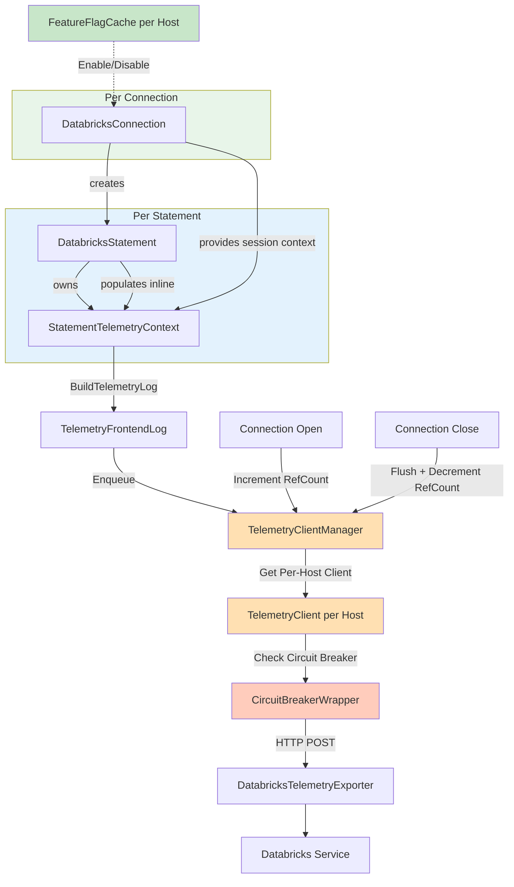

**Key Components:**
1. **StatementTelemetryContext** (per-statement): Holds all telemetry data, populated inline by driver code
2. **TelemetrySessionContext** (per-connection): Frozen session-level data shared with all statements
3. **FeatureFlagCache** (per-host): Caches feature flags with reference counting
4. **TelemetryClientManager** (per-host): Manages one telemetry client per host with reference counting
5. **CircuitBreakerWrapper** (per-host): Protects against failing telemetry endpoint
6. **DatabricksTelemetryExporter** (per-host): Exports to Databricks service

### 2.2 Data Flow

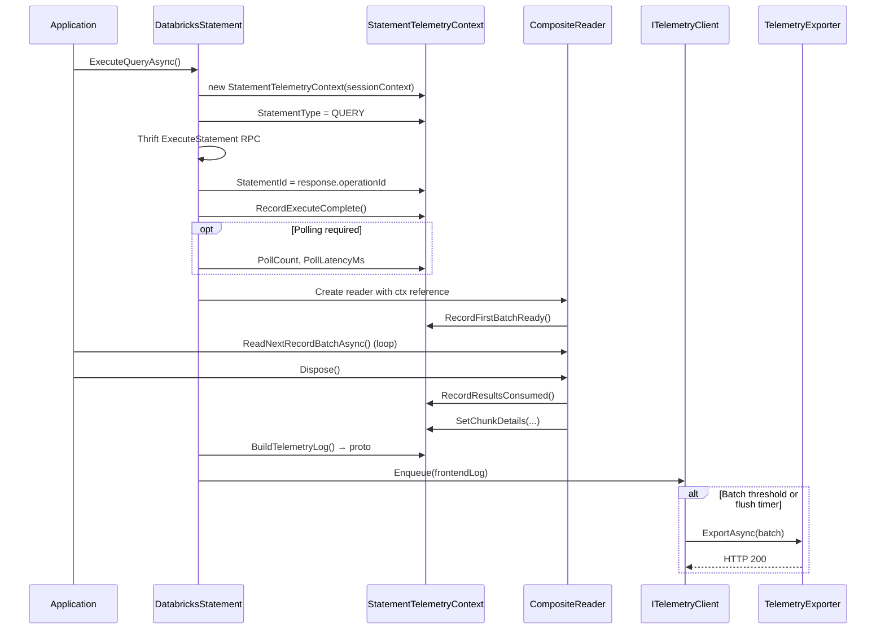

### 2.3 Component Ownership

| Component | Level | Responsibility |
|-----------|-------|----------------|
| **StatementTelemetryContext** | Per-statement | Holds all telemetry data, populated inline by driver code |
| **TelemetrySessionContext** | Per-connection | Frozen session-level data (session ID, auth, system config) |
| **ITelemetryClient** | Per-host (shared) | Batches protos from all connections, manages flush timer |
| **CircuitBreakerExporter** | Per-host (shared) | Protects against endpoint failures |
| **DatabricksTelemetryExporter** | Per-host (shared) | HTTP POST to `/telemetry-ext` |
| **TelemetryClientManager** | Global singleton | Manages per-host clients with reference counting |

**Key concepts (V3):**
- No `ActivityListener` — telemetry data is populated directly on `StatementTelemetryContext`
- No tag propagation needed (context is passed as object reference)
- No operation name matching needed (fields set directly)
- Exactly one emit per statement (reader dispose or error catch)

---

## 3. Core Components

### 3.1 FeatureFlagCache (Per-Host)

**Purpose**: Cache **all** feature flag values at the host level to avoid repeated API calls and rate limiting. This is a generic cache that can be used for any driver configuration controlled by server-side feature flags, not just telemetry.

**Location**: `AdbcDrivers.Databricks.FeatureFlagCache` (note: not in Telemetry namespace - this is a general-purpose component)

#### Rationale
- **Generic feature flag support**: Cache returns all flags, allowing any driver feature to be controlled server-side
- **Per-host caching**: Feature flags cached by host (not per connection) to prevent rate limiting
- **Reference counting**: Tracks number of connections per host for proper cleanup
- **Server-controlled TTL**: Refresh interval controlled by server-provided `ttl_seconds` (default: 15 minutes)
- **Background refresh**: Scheduled refresh at server-specified intervals
- **Thread-safe**: Uses ConcurrentDictionary for concurrent access from multiple connections

#### Configuration Priority Order

Feature flags are integrated directly into the existing ADBC driver property parsing logic as an **extra layer** in the property value resolution. The priority order is:

```
1. User-specified properties (highest priority)
2. Feature flags from server
3. Driver default values (lowest priority)
```

**Integration Approach**: Feature flags are merged into the `Properties` dictionary at connection initialization time. This means:
- The existing `Properties.TryGetValue()` pattern continues to work unchanged
- Feature flags are transparently available as properties
- No changes needed to existing property parsing code

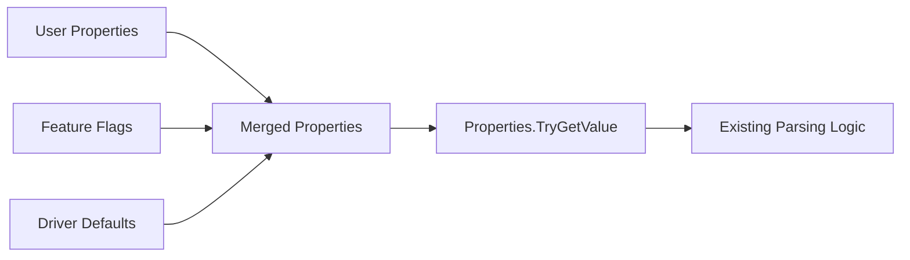

**Merge Logic** (in `DatabricksConnection` initialization):
```csharp
// Current flow:
// 1. User properties from connection string/config
// 2. Environment properties from DATABRICKS_CONFIG_FILE

// New flow with feature flags:
// 1. User properties from connection string/config (highest priority)
// 2. Feature flags from server (middle priority)
// 3. Environment properties / driver defaults (lowest priority)

private Dictionary<string, string> MergePropertiesWithFeatureFlags(
    Dictionary<string, string> userProperties,
    IReadOnlyDictionary<string, string> featureFlags)
{
    var merged = new Dictionary<string, string>(StringComparer.OrdinalIgnoreCase);

    // Start with feature flags as base (lower priority)
    foreach (var flag in featureFlags)
    {
        // Map feature flag names to property names if needed
        string propertyName = MapFeatureFlagToPropertyName(flag.Key);
        if (propertyName != null)
        {
            merged[propertyName] = flag.Value;
        }
    }

    // Override with user properties (higher priority)
    foreach (var prop in userProperties)
    {
        merged[prop.Key] = prop.Value;
    }

    return merged;
}
```

**Feature Flag to Property Name Mapping**:
```csharp
// Feature flags have long names, map to driver property names
private static readonly Dictionary<string, string> FeatureFlagToPropertyMap = new()
{
    ["databricks.partnerplatform.clientConfigsFeatureFlags.enableTelemetryForAdbc"] = "telemetry.enabled",
    ["databricks.partnerplatform.clientConfigsFeatureFlags.enableCloudFetch"] = "cloudfetch.enabled",
    // ... more mappings
};
```

This approach:
- **Preserves existing code**: All `Properties.TryGetValue()` calls work unchanged
- **Transparent integration**: Feature flags appear as regular properties after merge
- **Clear priority**: User settings always win over server flags
- **Single merge point**: Feature flag integration happens once at connection initialization
- **Fresh values per connection**: Each new connection uses the latest cached feature flag values

#### Per-Connection Property Resolution

Each new connection applies property merging with the **latest** cached feature flag values:

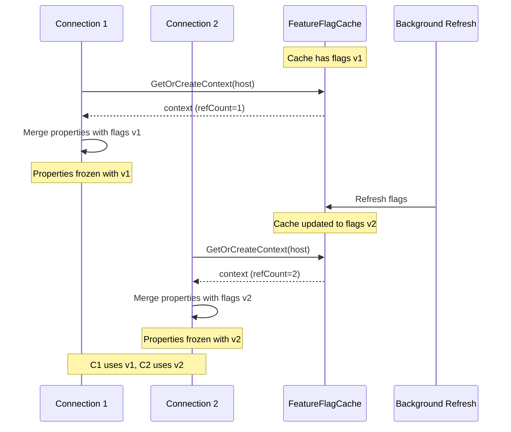

**Key Points**:
- **Shared cache, per-connection merge**: The `FeatureFlagCache` is shared (per-host), but property merging happens at each connection initialization
- **Latest values for new connections**: When a new connection is created, it reads the current cached values (which may have been updated by background refresh)
- **Stable within connection**: Once merged, a connection's `Properties` are stable for its lifetime (no mid-connection changes)
- **Background refresh benefits new connections**: The scheduled refresh ensures new connections get up-to-date flag values without waiting for a fetch

#### Feature Flag API

**Endpoint**: `GET /api/2.0/connector-service/feature-flags/OSS_JDBC/{driver_version}`

> **Note**: Currently using the JDBC endpoint (`OSS_JDBC`) until the ADBC endpoint (`OSS_ADBC`) is configured server-side. The feature flag name will still use `enableTelemetryForAdbc` to distinguish ADBC telemetry from JDBC telemetry.

Where `{driver_version}` is the driver version (e.g., `1.0.0`).

**Request Headers**:
- `Authorization`: Bearer token (same as connection auth)
- `User-Agent`: Custom user agent for connector service

**Response Format** (JSON):
```json
{
  "flags": [
    {
      "name": "databricks.partnerplatform.clientConfigsFeatureFlags.enableTelemetryForAdbc",
      "value": "true"
    },
    {
      "name": "databricks.partnerplatform.clientConfigsFeatureFlags.enableCloudFetch",
      "value": "true"
    },
    {
      "name": "databricks.partnerplatform.clientConfigsFeatureFlags.maxDownloadThreads",
      "value": "10"
    }
  ],
  "ttl_seconds": 900
}
```

**Response Fields**:
- `flags`: Array of feature flag entries with `name` and `value` (string). Names can be mapped to driver property names.
- `ttl_seconds`: Server-controlled refresh interval in seconds (default: 900 = 15 minutes)

**JDBC Reference**: See `DatabricksDriverFeatureFlagsContext.java:30-33` for endpoint format.

#### Refresh Strategy

The feature flag cache follows the JDBC driver pattern:

1. **Initial Blocking Fetch**: On connection open, make a blocking HTTP call to fetch all feature flags
2. **Cache All Flags**: Store all returned flags in a local cache (Guava Cache in JDBC, ConcurrentDictionary in C#)
3. **Scheduled Background Refresh**: Start a daemon thread that refreshes flags at intervals based on `ttl_seconds`
4. **Dynamic TTL**: If server returns a different `ttl_seconds`, reschedule the refresh interval

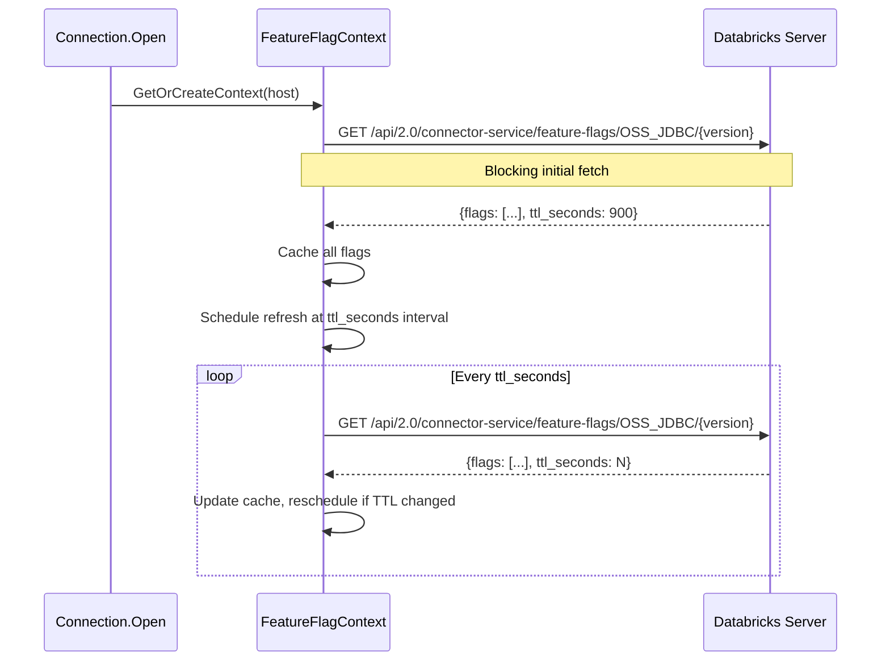

**JDBC Reference**: See `DatabricksDriverFeatureFlagsContext.java:48-58` for initial fetch and scheduling.

#### HTTP Client Pattern

The feature flag cache does **not** use a separate dedicated HTTP client. Instead, it reuses the connection's existing HTTP client infrastructure:

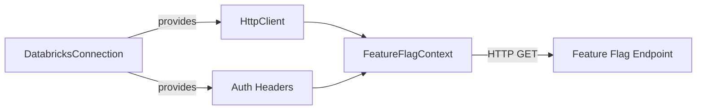

**Key Points**:
1. **Reuse connection's HttpClient**: The `FeatureFlagContext` receives the connection's `HttpClient` (already configured with base address, timeouts, etc.)
2. **Reuse connection's authentication**: Auth headers (Bearer token) come from the connection's authentication mechanism
3. **Custom User-Agent**: Set a connector-service-specific User-Agent header for the feature flag requests

**JDBC Implementation** (`DatabricksDriverFeatureFlagsContext.java:89-105`):
```java
// Get shared HTTP client from connection
IDatabricksHttpClient httpClient =
    DatabricksHttpClientFactory.getInstance().getClient(connectionContext);

// Create request
HttpGet request = new HttpGet(featureFlagEndpoint);

// Set custom User-Agent for connector service
request.setHeader("User-Agent",
    UserAgentManager.buildUserAgentForConnectorService(connectionContext));

// Add auth headers from connection's auth config
DatabricksClientConfiguratorManager.getInstance()
    .getConfigurator(connectionContext)
    .getDatabricksConfig()
    .authenticate()
    .forEach(request::addHeader);
```

**C# Equivalent Pattern**:
```csharp
// In DatabricksConnection - create HttpClient for feature flags
private HttpClient CreateFeatureFlagHttpClient()
{
    var handler = HiveServer2TlsImpl.NewHttpClientHandler(TlsOptions, _proxyConfigurator);
    var httpClient = new HttpClient(handler);

    // Set base address
    httpClient.BaseAddress = new Uri($"https://{_host}");

    // Set auth header (reuse connection's token)
    if (Properties.TryGetValue(SparkParameters.Token, out string? token))
    {
        httpClient.DefaultRequestHeaders.Authorization =
            new AuthenticationHeaderValue("Bearer", token);
    }

    // Set custom User-Agent for connector service
    httpClient.DefaultRequestHeaders.UserAgent.ParseAdd(
        BuildConnectorServiceUserAgent());

    return httpClient;
}

// Pass to FeatureFlagContext
var context = featureFlagCache.GetOrCreateContext(_host, CreateFeatureFlagHttpClient());
```

This approach:
- Avoids duplicating HTTP client configuration
- Ensures consistent authentication across all API calls
- Allows proper resource cleanup when connection closes

#### Interface

```csharp
namespace AdbcDrivers.Databricks
{
    /// <summary>
    /// Singleton that manages feature flag cache per host.
    /// Prevents rate limiting by caching feature flag responses.
    /// This is a generic cache for all feature flags, not just telemetry.
    /// </summary>
    internal sealed class FeatureFlagCache
    {
        private static readonly FeatureFlagCache s_instance = new FeatureFlagCache();
        public static FeatureFlagCache GetInstance() => s_instance;

        /// <summary>
        /// Gets or creates a feature flag context for the host.
        /// Increments reference count.
        /// Makes initial blocking fetch if context is new.
        /// </summary>
        public FeatureFlagContext GetOrCreateContext(string host, HttpClient httpClient, string driverVersion);

        /// <summary>
        /// Decrements reference count for the host.
        /// Removes context and stops refresh scheduler when ref count reaches zero.
        /// </summary>
        public void ReleaseContext(string host);
    }

    /// <summary>
    /// Holds feature flag state and reference count for a host.
    /// Manages background refresh scheduling.
    /// Uses the HttpClient provided by the connection for API calls.
    /// </summary>
    internal sealed class FeatureFlagContext : IDisposable
    {
        /// <summary>
        /// Creates a new context with the given HTTP client.
        /// Makes initial blocking fetch to populate cache.
        /// Starts background refresh scheduler.
        /// </summary>
        /// <param name="host">The Databricks host.</param>
        /// <param name="httpClient">
        /// HttpClient from the connection, pre-configured with:
        /// - Base address (https://{host})
        /// - Auth headers (Bearer token)
        /// - Custom User-Agent for connector service
        /// </param>
        public FeatureFlagContext(string host, HttpClient httpClient);

        public int RefCount { get; }
        public TimeSpan RefreshInterval { get; }  // From server ttl_seconds

        /// <summary>
        /// Gets a feature flag value by name.
        /// Returns null if the flag is not found.
        /// </summary>
        public string? GetFlagValue(string flagName);

        /// <summary>
        /// Checks if a feature flag is enabled (value is "true").
        /// Returns false if flag is not found or value is not "true".
        /// </summary>
        public bool IsFeatureEnabled(string flagName);

        /// <summary>
        /// Gets all cached feature flags as a dictionary.
        /// Can be used to merge with user properties.
        /// </summary>
        public IReadOnlyDictionary<string, string> GetAllFlags();

        /// <summary>
        /// Stops the background refresh scheduler.
        /// </summary>
        public void Shutdown();

        public void Dispose();
    }

    /// <summary>
    /// Response model for feature flags API.
    /// </summary>
    internal sealed class FeatureFlagsResponse
    {
        public List<FeatureFlagEntry>? Flags { get; set; }
        public int? TtlSeconds { get; set; }
    }

    internal sealed class FeatureFlagEntry
    {
        public string Name { get; set; } = string.Empty;
        public string Value { get; set; } = string.Empty;
    }
}
```

#### Usage Example

```csharp
// In DatabricksConnection constructor/initialization
// This runs for EACH new connection, using LATEST cached feature flags

// Step 1: Get or create feature flag context
// - If context exists: returns existing context with latest cached flags
// - If new: creates context, does initial blocking fetch, starts background refresh
var featureFlagCache = FeatureFlagCache.GetInstance();
var featureFlagContext = featureFlagCache.GetOrCreateContext(_host, CreateFeatureFlagHttpClient());

// Step 2: Merge feature flags into properties using LATEST cached values
// Each new connection gets a fresh merge with current flag values
Properties = MergePropertiesWithFeatureFlags(
    userProperties,
    featureFlagContext.GetAllFlags());  // Returns current cached flags

// Step 3: Existing property parsing works unchanged!
// Feature flags are now transparently available as properties
bool IsTelemetryEnabled()
{
    // This works whether the value came from:
    // - User property (highest priority)
    // - Feature flag (merged in)
    // - Or falls back to driver default
    if (Properties.TryGetValue("telemetry.enabled", out var value))
    {
        return bool.TryParse(value, out var result) && result;
    }
    return true; // Driver default
}

// Same pattern for all other properties - no changes needed!
if (Properties.TryGetValue(DatabricksParameters.CloudFetchEnabled, out var cfValue))
{
    // Value could be from user OR from feature flag - transparent!
}
```

**Key Benefits**:
- Existing code like `Properties.TryGetValue()` continues to work unchanged
- Each new connection uses the **latest** cached feature flag values
- Feature flag integration is a one-time merge at connection initialization
- Properties are stable for the lifetime of the connection (no mid-connection changes)

**JDBC Reference**: `DatabricksDriverFeatureFlagsContextFactory.java:27` maintains per-compute (host) feature flag contexts with reference counting. `DatabricksDriverFeatureFlagsContext.java` implements the caching, refresh scheduling, and API calls.

---

### 3.2 TelemetryClientManager and ITelemetryClient (Per-Host)

**Purpose**: Manage one telemetry client per host to prevent rate limiting from concurrent connections.

**Location**: `Apache.Arrow.Adbc.Drivers.Databricks.Telemetry.TelemetryClientManager`

#### Component Ownership Model

Understanding which components are per-connection vs per-host is critical:

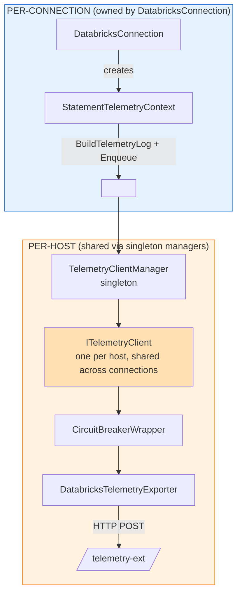

**ITelemetryClient responsibilities:**
- Receives events from multiple connections
- Batches events from all connections to same host
- Single flush timer per host

#### Why Two Levels of Batching?

| Component | Level | Batching Role |
|-----------|-------|---------------|
| **StatementTelemetryContext** | Per-statement | Holds telemetry data, populated inline by driver code |
| **ITelemetryClient** | Per-host | Batches proto messages from all connections before HTTP export |

**Example flow with 2 connections:**

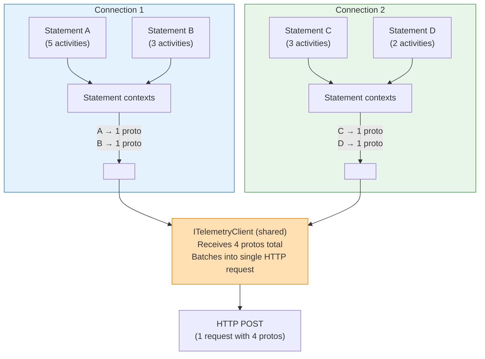

Without per-host sharing, each connection would make separate HTTP requests, potentially hitting rate limits.

#### Rationale
- **One client per host**: Large customers (e.g., Celonis) open many parallel connections to the same host
- **Prevents rate limiting**: Shared client batches events from all connections, avoiding multiple concurrent flushes
- **Reference counting**: Tracks active connections, only closes client when last connection closes
- **Thread-safe**: Safe for concurrent access from multiple connections
- **Single flush schedule**: One timer per host, not per connection

#### ITelemetryClient Interface

```csharp
namespace AdbcDrivers.Databricks.Telemetry
{
    /// <summary>
    /// Client that receives telemetry events from connections and exports them.
    /// One instance is shared per host via TelemetryClientManager.
    /// </summary>
    internal interface ITelemetryClient : IAsyncDisposable
    {
        /// <summary>
        /// Queue a telemetry log for export. Non-blocking, thread-safe.
        /// Events are batched and flushed periodically or when batch size is reached.
        /// Called by DatabricksStatement when a statement completes.
        /// </summary>
        void Enqueue(TelemetryFrontendLog log);

        /// <summary>
        /// Force flush all pending events immediately.
        /// Called when connection closes to ensure no events are lost.
        /// </summary>
        Task FlushAsync(CancellationToken ct = default);

        /// <summary>
        /// Gracefully close the client. Flushes pending events first.
        /// Called by TelemetryClientManager when reference count reaches zero.
        /// </summary>
        Task CloseAsync();
    }
}
```

#### TelemetryClient Implementation

```csharp
namespace AdbcDrivers.Databricks.Telemetry
{
    /// <summary>
    /// Default implementation that batches events from multiple connections
    /// and exports via HTTP on a timer or when batch size is reached.
    /// </summary>
    internal sealed class TelemetryClient : ITelemetryClient
    {
        private readonly ConcurrentQueue<TelemetryFrontendLog> _queue = new();
        private readonly ITelemetryExporter _exporter;
        private readonly TelemetryConfiguration _config;
        private readonly Timer _flushTimer;
        private readonly SemaphoreSlim _flushLock = new(1, 1);
        private readonly CancellationTokenSource _cts = new();
        private volatile bool _disposed;

        public TelemetryClient(
            ITelemetryExporter exporter,
            TelemetryConfiguration config)
        {
            _exporter = exporter;
            _config = config;

            // Start periodic flush timer (default: every 5 seconds)
            _flushTimer = new Timer(
                OnFlushTimer,
                null,
                _config.FlushIntervalMs,
                _config.FlushIntervalMs);
        }

        /// <summary>
        /// Queue event for batched export. Thread-safe, non-blocking.
        /// </summary>
        public void Enqueue(TelemetryFrontendLog log)
        {
            if (_disposed) return;

            _queue.Enqueue(log);

            // Trigger flush if batch size reached
            if (_queue.Count >= _config.BatchSize)
            {
                _ = FlushAsync(); // Fire-and-forget, errors swallowed
            }
        }

        /// <summary>
        /// Flush all pending events to the exporter.
        /// </summary>
        public async Task FlushAsync(CancellationToken ct = default)
        {
            if (_disposed) return;

            // Prevent concurrent flushes
            if (!await _flushLock.WaitAsync(0, ct))
                return;

            try
            {
                var batch = new List<TelemetryFrontendLog>();

                // Drain queue up to batch size
                while (batch.Count < _config.BatchSize && _queue.TryDequeue(out var log))
                {
                    batch.Add(log);
                }

                if (batch.Count > 0)
                {
                    // Export via circuit breaker → exporter → HTTP
                    await _exporter.ExportAsync(batch, ct);
                }
            }
            catch (Exception ex)
            {
                // Swallow all exceptions per telemetry requirement
                Debug.WriteLine($"[TRACE] TelemetryClient flush error: {ex.Message}");
            }
            finally
            {
                _flushLock.Release();
            }
        }

        /// <summary>
        /// Gracefully close: stop timer, flush remaining events.
        /// </summary>
        public async Task CloseAsync()
        {
            if (_disposed) return;
            _disposed = true;

            try
            {
                // Stop timer
                await _flushTimer.DisposeAsync();

                // Cancel any pending operations
                _cts.Cancel();

                // Final flush of remaining events
                await FlushAsync();
            }
            catch (Exception ex)
            {
                Debug.WriteLine($"[TRACE] TelemetryClient close error: {ex.Message}");
            }
            finally
            {
                _cts.Dispose();
                _flushLock.Dispose();
            }
        }

        public async ValueTask DisposeAsync() => await CloseAsync();

        private void OnFlushTimer(object? state)
        {
            if (_disposed) return;
            _ = FlushAsync(_cts.Token);
        }
    }
}
```

#### TelemetryClientManager Interface

```csharp
namespace AdbcDrivers.Databricks.Telemetry
{
    /// <summary>
    /// Singleton factory that manages one telemetry client per host.
    /// Prevents rate limiting by sharing clients across connections.
    /// </summary>
    internal sealed class TelemetryClientManager
    {
        private static readonly TelemetryClientManager Instance = new();
        public static TelemetryClientManager GetInstance() => Instance;

        private readonly ConcurrentDictionary<string, TelemetryClientHolder> _clients = new();

        /// <summary>
        /// Gets or creates a telemetry client for the host.
        /// Increments reference count. Thread-safe.
        /// </summary>
        public ITelemetryClient GetOrCreateClient(
            string host,
            Func<ITelemetryExporter> exporterFactory,
            TelemetryConfiguration config)
        {
            var holder = _clients.AddOrUpdate(
                host,
                _ => new TelemetryClientHolder(
                    new TelemetryClient(exporterFactory(), config)),
                (_, existing) =>
                {
                    Interlocked.Increment(ref existing._refCount);
                    return existing;
                });

            return holder.Client;
        }

        /// <summary>
        /// Decrements reference count for the host.
        /// Closes and removes client when ref count reaches zero.
        /// </summary>
        public async Task ReleaseClientAsync(string host)
        {
            if (_clients.TryGetValue(host, out var holder))
            {
                var newCount = Interlocked.Decrement(ref holder._refCount);
                if (newCount == 0)
                {
                    if (_clients.TryRemove(host, out var removed))
                    {
                        await removed.Client.CloseAsync();
                    }
                }
            }
        }
    }

    /// <summary>
    /// Holds a telemetry client and its reference count.
    /// </summary>
    internal sealed class TelemetryClientHolder
    {
        internal int _refCount = 1;

        public ITelemetryClient Client { get; }

        public TelemetryClientHolder(ITelemetryClient client)
        {
            Client = client;
        }
    }
}
```

#### Usage in DatabricksConnection

```csharp
public sealed class DatabricksConnection : SparkHttpConnection
{
    private ITelemetryClient? _telemetryClient;
    private TelemetrySessionContext? _telemetrySessionContext;

    protected override async Task OpenAsyncCore(CancellationToken ct)
    {
        await base.OpenAsyncCore(ct);

        // Get shared telemetry client for this host
        if (_telemetryConfig.Enabled && IsTelemetryFeatureFlagEnabled())
        {
            _telemetryClient = TelemetryClientManager.GetInstance()
                .GetOrCreateClient(
                    _host,
                    () => CreateTelemetryExporter(),  // Factory for lazy creation
                    _telemetryConfig);

            // Create per-connection aggregator that sends to shared client
            // Build frozen session context (shared with all statements)
            _telemetrySessionContext = BuildTelemetrySessionContext();
        }
    }

    protected override async ValueTask DisposeAsyncCore()
    {
        // Stop listener first
        if (_activityListener != null)
        {
            await _activityListener.StopAsync();
            _activityListener.Dispose();
        }

        // Flush aggregator
        if (_metricsAggregator != null)
        {
            await _metricsAggregator.FlushAsync();
            _metricsAggregator.Dispose();
        }

        // Release shared client (decrements ref count)
        if (_telemetryClient != null)
        {
            await TelemetryClientManager.GetInstance().ReleaseClientAsync(_host);
        }

        await base.DisposeAsyncCore();
    }

    private ITelemetryExporter CreateTelemetryExporter()
    {
        var innerExporter = new DatabricksTelemetryExporter(_httpClient, _host, _telemetryConfig);
        return new CircuitBreakerTelemetryExporter(_host, innerExporter);
    }
}
```

#### Summary: Component Responsibilities

| Component | Level | Responsibility |
|-----------|-------|----------------|
| **StatementTelemetryContext** | Per-statement | Holds telemetry data, populated inline by driver code |
| **TelemetrySessionContext** | Per-connection | Frozen session-level data shared with all statements |
| **ITelemetryClient** | Per-host (shared) | Batches protos from all connections, manages flush timer |
| **CircuitBreakerWrapper** | Per-host (shared) | Protects against endpoint failures |
| **DatabricksTelemetryExporter** | Per-host (shared) | HTTP POST to `/telemetry-ext` |
| **TelemetryClientManager** | Global singleton | Manages per-host clients with reference counting |

**JDBC Reference**: `TelemetryClientFactory.java:27` maintains `ConcurrentHashMap<String, TelemetryClientHolder>` with per-host clients and reference counting. `TelemetryClient.java` implements the batching queue and flush timer.

#### Test Injection Pattern

For integration and E2E tests, we need to inject a custom telemetry exporter to capture telemetry logs without making real HTTP calls. The design supports this through two mechanisms:

**1. Connection-Level Exporter Factory Override**

```csharp
public sealed class DatabricksConnection : SparkHttpConnection
{
    /// <summary>
    /// For testing only: allows injecting a custom exporter factory.
    /// When set, this factory is used instead of the default DatabricksTelemetryExporter.
    /// </summary>
    internal Func<ITelemetryExporter>? TestExporterFactory { get; set; }

    private ITelemetryExporter CreateTelemetryExporter()
    {
        // Use test factory if provided
        if (TestExporterFactory != null)
        {
            return TestExporterFactory();
        }

        // Default: create real exporter with circuit breaker
        var innerExporter = new DatabricksTelemetryExporter(_httpClient, _host, _telemetryConfig);
        return new CircuitBreakerTelemetryExporter(_host, innerExporter);
    }
}
```

**2. TelemetryClientManager Test Instance Replacement**

For tests that need to verify multiple connections share the same client:

```csharp
internal sealed class TelemetryClientManager
{
    private static TelemetryClientManager _instance = new();
    public static TelemetryClientManager Instance => _instance;

    /// <summary>
    /// For testing only: temporarily replaces the singleton instance.
    /// Returns IDisposable that restores the original on dispose.
    /// </summary>
    internal static IDisposable UseTestInstance(TelemetryClientManager testInstance)
    {
        var original = _instance;
        _instance = testInstance;
        return new TestInstanceScope(original);
    }

    private sealed class TestInstanceScope : IDisposable
    {
        private readonly TelemetryClientManager _original;
        public TestInstanceScope(TelemetryClientManager original) => _original = original;
        public void Dispose() => _instance = _original;
    }

    /// <summary>
    /// For testing only: resets all state (clears all clients).
    /// </summary>
    internal void Reset()
    {
        foreach (var host in _clients.Keys.ToList())
        {
            if (_clients.TryRemove(host, out var holder))
            {
                holder.Client.CloseAsync().GetAwaiter().GetResult();
            }
        }
    }
}
```

**3. CreateConnectionWithTelemetry Test Helper**

```csharp
/// <summary>
/// Test helper that creates a connection with injected telemetry exporter.
/// </summary>
internal static class TelemetryTestHelpers
{
    public static async Task<DatabricksConnection> CreateConnectionWithTelemetry(
        ITelemetryExporter mockExporter,
        IReadOnlyDictionary<string, string>? additionalProperties = null)
    {
        // Build connection properties from environment
        var properties = new Dictionary<string, string>
        {
            [DatabricksParameters.HOST] = Environment.GetEnvironmentVariable("DATABRICKS_HOST") ?? "",
            [DatabricksParameters.AUTH_TOKEN] = Environment.GetEnvironmentVariable("DATABRICKS_TOKEN") ?? "",
            [DatabricksParameters.HTTP_PATH] = Environment.GetEnvironmentVariable("DATABRICKS_HTTP_PATH") ?? "",
            [DatabricksParameters.TELEMETRY_ENABLED] = "true"
        };

        // Merge additional properties
        if (additionalProperties != null)
        {
            foreach (var kvp in additionalProperties)
            {
                properties[kvp.Key] = kvp.Value;
            }
        }

        var connection = new DatabricksConnection(properties);

        // Inject the mock exporter factory
        connection.TestExporterFactory = () => mockExporter;

        await connection.OpenAsync();
        return connection;
    }

    /// <summary>
    /// Creates a connection with a capturing exporter for testing.
    /// </summary>
    public static async Task<(DatabricksConnection Connection, List<TelemetryFrontendLog> CapturedLogs)>
        CreateConnectionWithCapturingTelemetry(
            IReadOnlyDictionary<string, string>? additionalProperties = null)
    {
        var capturedLogs = new List<TelemetryFrontendLog>();
        var mockExporter = new CapturingTelemetryExporter(capturedLogs);
        var connection = await CreateConnectionWithTelemetry(mockExporter, additionalProperties);
        return (connection, capturedLogs);
    }
}
```

**Test Flow Diagram:**

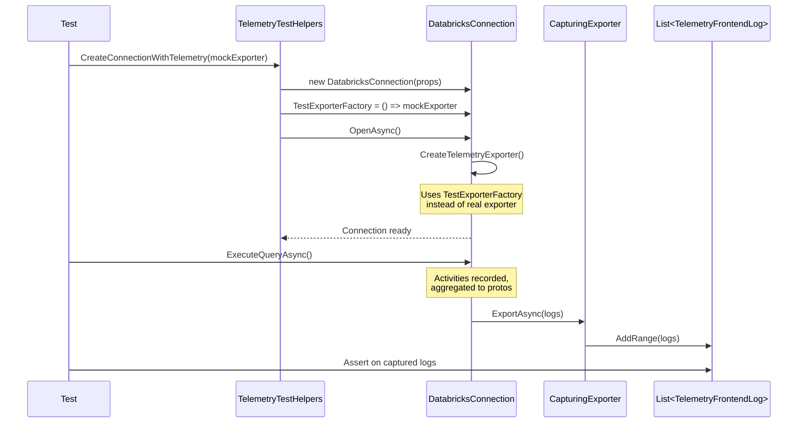

---

### 3.3 Circuit Breaker

**Purpose**: Implement circuit breaker pattern to protect against failing telemetry endpoint.

**Location**: `Apache.Arrow.Adbc.Drivers.Databricks.Telemetry.CircuitBreaker`

#### Rationale
- **Endpoint protection**: The telemetry endpoint itself may fail or become unavailable
- **Not just rate limiting**: Protects against 5xx errors, timeouts, network failures
- **Resource efficiency**: Prevents wasting resources on a failing endpoint
- **Auto-recovery**: Automatically detects when endpoint becomes healthy again

#### States
1. **Closed**: Normal operation, requests pass through
2. **Open**: After threshold failures, all requests rejected immediately (drop events)
3. **Half-Open**: After timeout, allows test requests to check if endpoint recovered

#### Interface

```csharp
namespace AdbcDrivers.Databricks.Telemetry
{
    /// <summary>
    /// Wraps telemetry exporter with circuit breaker pattern.
    /// </summary>
    internal sealed class CircuitBreakerTelemetryExporter : ITelemetryExporter
    {
        public CircuitBreakerTelemetryExporter(string host, ITelemetryExporter innerExporter);

        public Task ExportAsync(
            IReadOnlyList<TelemetryMetric> metrics,
            CancellationToken ct = default);
    }

    /// <summary>
    /// Singleton that manages circuit breakers per host.
    /// </summary>
    internal sealed class CircuitBreakerManager
    {
        private static readonly CircuitBreakerManager Instance = new();
        public static CircuitBreakerManager GetInstance() => Instance;

        public CircuitBreaker GetCircuitBreaker(string host);
    }

    internal sealed class CircuitBreaker
    {
        public CircuitBreakerConfig Config { get; }
        public Task ExecuteAsync(Func<Task> action);
    }

    internal class CircuitBreakerConfig
    {
        public int FailureThreshold { get; set; } = 5; // Open after 5 failures
        public TimeSpan Timeout { get; set; } = TimeSpan.FromMinutes(1); // Try again after 1 min
        public int SuccessThreshold { get; set; } = 2; // Close after 2 successes
    }
}
```

**JDBC Reference**: `CircuitBreakerTelemetryPushClient.java:15` and `CircuitBreakerManager.java:25`

---

### 3.4 StatementTelemetryContext Lifecycle

**Purpose**: Hold all telemetry data for a single statement execution. Populated directly by driver code — no Activity tags, no listeners, no aggregators.

**Location**: `AdbcDrivers.Databricks.Telemetry.StatementTelemetryContext`

#### Lifecycle

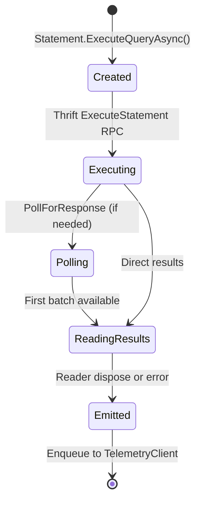

The context lives for the full duration of a statement execution — from `ExecuteQueryAsync()` to reader disposal. This naturally captures the complete lifecycle without timing or ordering issues.

#### Interface

```csharp
internal sealed class StatementTelemetryContext
{
    // ── Populated at construction (from connection session context) ──
    public string? SessionId { get; }
    public string? AuthType { get; }
    public DriverSystemConfiguration? SystemConfiguration { get; }
    public DriverConnectionParameters? DriverConnectionParams { get; }

    // ── Populated by Statement during execution ──
    public string? StatementId { get; set; }
    public StatementType StatementType { get; set; }
    public OperationType OperationType { get; set; }
    public ExecutionResultFormat ResultFormat { get; set; }
    public bool IsCompressed { get; set; }

    // ── Timing ──
    public Stopwatch ExecuteStopwatch { get; }      // Started at construction
    public long? PollCount { get; set; }
    public long? PollLatencyMs { get; set; }
    public long? FirstBatchReadyMs { get; set; }    // Elapsed ms from start
    public long? ResultsConsumedMs { get; set; }    // Elapsed ms from start

    // ── CloudFetch chunk details ──
    public int? TotalChunksPresent { get; set; }
    public int? TotalChunksIterated { get; set; }
    public long? InitialChunkLatencyMs { get; set; }
    public long? SlowestChunkLatencyMs { get; set; }
    public long? SumChunksDownloadTimeMs { get; set; }

    // ── Error info ──
    public bool HasError { get; set; }
    public string? ErrorName { get; set; }
    public string? ErrorMessage { get; set; }

    // ── Build final proto ──
    public OssSqlDriverTelemetryLog BuildTelemetryLog();
}
```

**Contract:**
- Construction: receives immutable session-level context from connection
- Mutation: only the owning statement thread writes (no concurrent access needed)
- `BuildTelemetryLog()`: constructs the proto once at emit time
- All timing derives from a single `Stopwatch` started at construction

#### Session Context (from Connection)

`DatabricksConnection` prepares a frozen session context during `InitializeTelemetry()`:

```csharp
internal sealed class TelemetrySessionContext
{
    public string? SessionId { get; init; }
    public string? AuthType { get; init; }
    public long WorkspaceId { get; init; }
    public DriverSystemConfiguration? SystemConfiguration { get; init; }
    public DriverConnectionParameters? DriverConnectionParams { get; init; }
    public ExecutionResultFormat DefaultResultFormat { get; init; }
    public bool DefaultCompressionEnabled { get; init; }
    public ITelemetryClient? TelemetryClient { get; init; }
}
```

Created once at connection open. Shared (read-only) with all statements on that connection. The `DriverConnectionParams.Mode` field captures the protocol: `DRIVER_MODE_THRIFT` or `DRIVER_MODE_SEA`.

#### Emit Timing

| Scenario | Emit Trigger | Data Completeness |
|----------|-------------|-------------------|
| Normal query | Reader dispose → Statement finalization | Complete |
| Error during execute | Catch block in ExecuteQueryAsync | Partial (no result latency) |
| Connection close | Flush any pending context | Partial |

**Guarantee**: Exactly one emission per statement — either on success (reader dispose) or on error (catch block).

#### Shared Telemetry Base (`DatabricksStatement`)

The telemetry lifecycle is identical for both protocols. `DatabricksStatement` serves as the shared base that owns the context and provides helper methods. Protocol-specific subclasses (`ThriftStatement`, `SeaStatement`) call these helpers — they never interact with `TelemetryClient` or `TelemetryFrontendLog` directly.

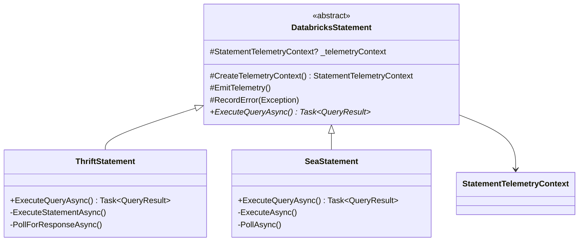

**Shared base provides:**

```csharp
internal abstract class DatabricksStatement
{
    protected StatementTelemetryContext? _telemetryContext;

    /// Creates context from connection's session context. Called at start of ExecuteQueryAsync.
    protected StatementTelemetryContext CreateTelemetryContext()
    {
        return new StatementTelemetryContext(_connection.TelemetrySessionContext);
    }

    /// Builds proto, wraps in FrontendLog, enqueues to TelemetryClient. Called once on completion.
    protected void EmitTelemetry()
    {
        try
        {
            if (_telemetryContext == null) return;
            var proto = _telemetryContext.BuildTelemetryLog();
            var frontendLog = WrapInFrontendLog(proto);
            _connection.TelemetrySessionContext?.TelemetryClient?.Enqueue(frontendLog);
        }
        catch { /* swallow */ }
    }

    /// Records error info on the context. Called in catch blocks.
    protected void RecordError(Exception ex)
    {
        if (_telemetryContext == null) return;
        _telemetryContext.HasError = true;
        _telemetryContext.ErrorName = ex.GetType().Name;
        _telemetryContext.ErrorMessage = ex.Message;
    }
}
```

**Protocol subclasses just call the helpers:**

```csharp
// ThriftStatement
public override async Task<QueryResult> ExecuteQueryAsync()
{
    _telemetryContext = CreateTelemetryContext();
    try
    {
        _telemetryContext.StatementType = StatementType.StatementQuery;
        _telemetryContext.OperationType = OperationType.OperationExecuteStatement;
        // ... thrift-specific execute, poll, create reader ...
        return result;
    }
    catch (Exception ex)
    {
        RecordError(ex);
        EmitTelemetry();
        throw;
    }
}

// SeaStatement — same pattern
public override async Task<QueryResult> ExecuteQueryAsync()
{
    _telemetryContext = CreateTelemetryContext();
    try
    {
        _telemetryContext.StatementType = StatementType.StatementQuery;
        _telemetryContext.OperationType = OperationType.OperationExecuteStatement;
        // ... SEA-specific execute, poll, create reader ...
        return result;
    }
    catch (Exception ex)
    {
        RecordError(ex);
        EmitTelemetry();
        throw;
    }
}
```

**What this eliminates:**
- No telemetry code duplicated between Thrift and SEA
- Protocol subclasses only set protocol-specific fields (e.g., `StatementId` from their respective responses)
- `CreateTelemetryContext()`, `EmitTelemetry()`, `RecordError()` are written once in the base
- Readers also receive the same `_telemetryContext` and call `RecordFirstBatchReady()` / `RecordResultsConsumed()` regardless of protocol

---

### 3.5 Instrumentation Points

**Purpose**: Document exactly where telemetry data is populated in the driver code.

Each driver operation populates the `StatementTelemetryContext` directly. The shared base handles context creation and emission; protocol subclasses only set protocol-specific fields:

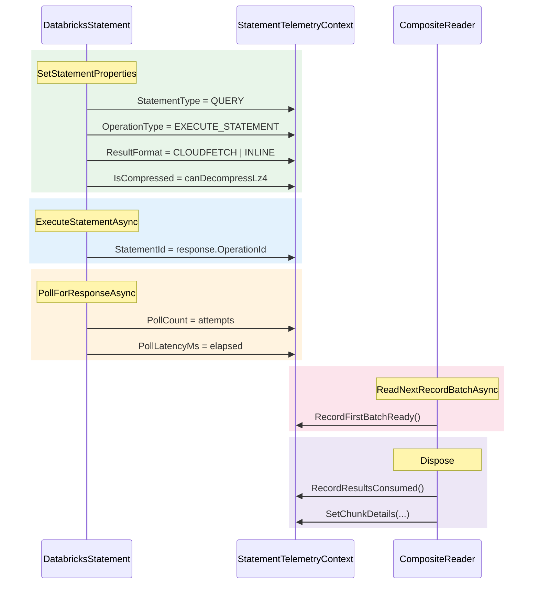

#### Summary Table

The `StatementTelemetryContext` is protocol-agnostic. Both Thrift and SEA backends populate the same fields at equivalent lifecycle points:

**Thrift (HiveServer2) Protocol:**

| Location | What Gets Set | When |
|----------|--------------|------|
| `DatabricksStatement.SetStatementProperties()` | `StatementType`, `ResultFormat`, `IsCompressed`, `OperationType` | Before Thrift RPC |
| `HiveServer2Statement.ExecuteStatementAsync()` | `StatementId` (from server response) | After Thrift response |
| `HiveServer2Connection.PollForResponseAsync()` | `PollCount`, `PollLatencyMs` | After polling completes |
| `DatabricksCompositeReader` constructor | `FirstBatchReadyMs` (if direct results) | At reader creation |
| `DatabricksCompositeReader.ReadNextRecordBatchAsync()` | `FirstBatchReadyMs` (if not already set) | On first non-null batch |
| `DatabricksCompositeReader.Dispose()` | `ResultsConsumedMs`, chunk details | At reader disposal |
| `DatabricksStatement` (on error) | `HasError`, `ErrorName`, `ErrorMessage` | In catch block |
| `DatabricksStatement` (on complete) | `BuildTelemetryLog()` + `Enqueue()` | After reader dispose or error |

**SEA (Statement Execution API) Protocol:**

| Location | What Gets Set | When |
|----------|--------------|------|
| `SeaStatement.ExecuteAsync()` | `StatementType`, `ResultFormat`, `OperationType` | Before REST API call |
| `SeaStatement.ExecuteAsync()` | `StatementId` (from REST response) | After REST response |
| `SeaStatement.PollAsync()` | `PollCount`, `PollLatencyMs` | After polling completes |
| `SeaReader` constructor | `FirstBatchReadyMs` (if inline results) | At reader creation |
| `SeaReader.ReadNextRecordBatchAsync()` | `FirstBatchReadyMs` (if not already set) | On first non-null batch |
| `SeaReader.Dispose()` | `ResultsConsumedMs`, chunk details | At reader disposal |
| `SeaStatement` (on error) | `HasError`, `ErrorName`, `ErrorMessage` | In catch block |
| `SeaStatement` (on complete) | `BuildTelemetryLog()` + `Enqueue()` | After reader dispose or error |

#### Protocol-Agnostic Design

The `StatementTelemetryContext` does not know or care which protocol is used. Both backends populate the same fields:

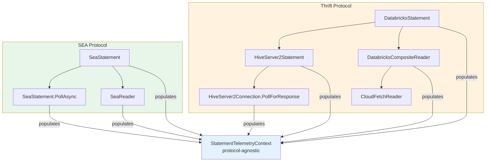

#### Passing Context Through the Stack

The `StatementTelemetryContext` is held on the statement and passed to protocol-specific code via method parameters:

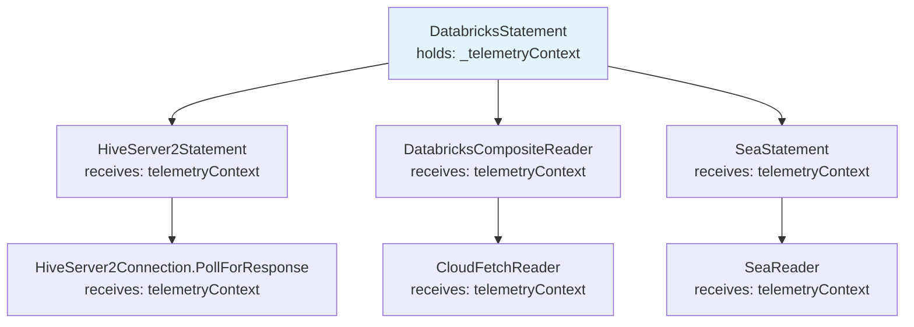

**Key principle**: The context is a regular object passed through method parameters — no global state, no tag propagation, no listener routing. The same context works regardless of whether the statement uses Thrift or SEA protocol.

#### Connection Usage (Revised)

```csharp
public sealed class DatabricksConnection : SparkHttpConnection
{
    private ITelemetryClient? _telemetryClient;
    private TelemetrySessionContext? _telemetrySessionContext;

    protected override async Task OpenAsyncCore(CancellationToken ct)
    {
        await base.OpenAsyncCore(ct);

        if (_telemetryConfig.Enabled && IsTelemetryFeatureFlagEnabled())
        {
            // Get shared telemetry client for this host
            _telemetryClient = TelemetryClientManager.GetInstance()
                .GetOrCreateClient(_host, () => CreateTelemetryExporter(), _telemetryConfig);

            // Build frozen session context (shared with all statements)
            _telemetrySessionContext = BuildTelemetrySessionContext();
        }
    }

    protected override async ValueTask DisposeAsyncCore()
    {
        // Flush and release shared client (decrements ref count)
        if (_telemetryClient != null)
        {
            await TelemetryClientManager.GetInstance().ReleaseClientAsync(_host);
        }
        await base.DisposeAsyncCore();
    }
}
```

---

### 3.6 DatabricksTelemetryExporter

**Purpose**: Export aggregated metrics to Databricks telemetry service.

**Location**: `AdbcDrivers.Databricks.Telemetry.DatabricksTelemetryExporter`

**Status**: Implemented (WI-3.4)

#### Interface

```csharp
namespace AdbcDrivers.Databricks.Telemetry
{
    public interface ITelemetryExporter
    {
        /// <summary>
        /// Export telemetry frontend logs to the backend service.
        /// Never throws exceptions (all swallowed and logged at TRACE level).
        /// </summary>
        Task ExportAsync(
            IReadOnlyList<TelemetryFrontendLog> logs,
            CancellationToken ct = default);
    }

    internal sealed class DatabricksTelemetryExporter : ITelemetryExporter
    {
        // Authenticated telemetry endpoint
        internal const string AuthenticatedEndpoint = "/telemetry-ext";

        // Unauthenticated telemetry endpoint
        internal const string UnauthenticatedEndpoint = "/telemetry-unauth";

        public DatabricksTelemetryExporter(
            HttpClient httpClient,
            string host,
            bool isAuthenticated,
            TelemetryConfiguration config);

        public Task ExportAsync(
            IReadOnlyList<TelemetryFrontendLog> logs,
            CancellationToken ct = default);

        // Creates TelemetryRequest wrapper with uploadTime and protoLogs
        internal TelemetryRequest CreateTelemetryRequest(IReadOnlyList<TelemetryFrontendLog> logs);
    }
}
```

**Implementation Details**:
- Creates `TelemetryRequest` with `uploadTime` (Unix ms) and `protoLogs` (JSON-serialized `TelemetryFrontendLog` array)
- Uses `/telemetry-ext` for authenticated requests
- Uses `/telemetry-unauth` for unauthenticated requests
- Implements retry logic for transient failures (configurable via `MaxRetries` and `RetryDelayMs`)
- Uses `ExceptionClassifier` to identify terminal vs retryable errors
- Never throws exceptions (all caught and logged at TRACE level)
- Cancellation is propagated (not swallowed)

---

## 4. Data Collection

> **V3 change**: The V2 tag definition system (`TelemetryTag` attribute, `TagExportScope`, `TelemetryTagRegistry`, tag filtering in `MetricsAggregator`) is removed. Telemetry data is populated directly on `StatementTelemetryContext` — see Section 3.5.

### 4.1 Tag Definition Constants (Simplified)

The `TagDefinitions/` files (`ConnectionOpenEvent.cs`, `StatementExecutionEvent.cs`, etc.) are **simplified to plain string constants** used for OpenTelemetry Activity tags. The `[TelemetryTag]` attributes, `TagExportScope` enum, and `TelemetryTagRegistry` are removed — they were only needed for Activity-based telemetry extraction.

**Keep** (string constants for Activity tracing):
```csharp
internal static class StatementExecutionEvent
{
    public const string SessionId = "session.id";
    public const string StatementId = "statement.id";
    public const string ResultFormat = "result.format";
    // ... etc
}
```

**Remove**:
- `TelemetryTag.cs` — attribute and `TagExportScope` enum
- `TelemetryTagRegistry.cs` — tag filtering registry
- `[TelemetryTag(...)]` attributes on all constants
- `GetDatabricksExportTags()` methods

These Activity tag constants continue to serve OpenTelemetry distributed tracing (APM tools, Jaeger, etc.) but are **not used for telemetry data collection** in V3.

---

## 5. Export Mechanism

### 5.1 Export Flow

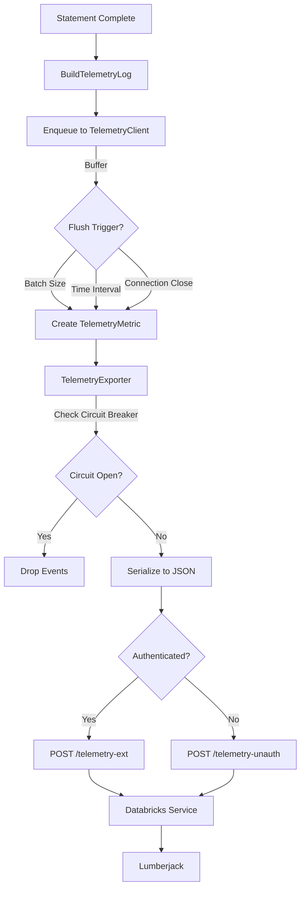

### 5.2 Data Model

**TelemetryMetric** (aggregated from multiple activities):

```csharp
public sealed class TelemetryMetric
{
    // Common fields
    public string MetricType { get; set; }  // "connection", "statement", "error"
    public DateTimeOffset Timestamp { get; set; }
    public long WorkspaceId { get; set; }

    // Correlation IDs (both included in every event)
    public string SessionId { get; set; }      // Connection-level ID (all statements in connection share this)
    public string StatementId { get; set; }    // Statement-level ID (unique per statement)

    // Statement metrics (aggregated from activities with same statement_id)
    public long ExecutionLatencyMs { get; set; }
    public string ResultFormat { get; set; }
    public int ChunkCount { get; set; }
    public long TotalBytesDownloaded { get; set; }
    public int PollCount { get; set; }

    // Driver config (from connection activity)
    public DriverConfiguration DriverConfig { get; set; }
}
```

**Derived from Activity**:
- `Timestamp`: `activity.StartTimeUtc`
- `ExecutionLatencyMs`: `activity.Duration.TotalMilliseconds`
- `SessionId`: `activity.GetTagItem("session.id")` - Shared across all statements in a connection
- `StatementId`: `activity.GetTagItem("statement.id")` - Unique per statement, used as aggregation key
- `ResultFormat`: `activity.GetTagItem("result.format")`

**Aggregation Pattern** (following JDBC):
- Multiple activities with the same `statement_id` are aggregated into a single `TelemetryMetric`
- The aggregated metric includes both `statement_id` (for statement tracking) and `session_id` (for connection correlation)
- This allows querying: "Show me all statements for session X" or "Show me details for statement Y"

### 5.3 Batching Strategy

Same as original design:
- **Batch size**: Default 100 metrics
- **Flush interval**: Default 5 seconds
- **Force flush**: On connection close

### 5.4 JSON Serialization: snake_case Field Names

**Requirement**: Proto fields must be serialized using **snake_case** names in JSON, matching the JDBC driver.

The JDBC driver uses Jackson with explicit `@JsonProperty("session_id")` annotations — all JSON field names match the proto field names exactly (snake_case):

```json
{
  "session_id": "abc123",
  "sql_statement_id": "def456",
  "system_configuration": { "driver_version": "1.0.0", "runtime_name": ".NET 8.0" },
  "driver_connection_params": { "http_path": "/sql/1.0/warehouses/xyz", "host_info": { "host_url": "https://..." } },
  "auth_type": "pat",
  "sql_operation": { "statement_type": "STATEMENT_QUERY", "execution_result": "EXECUTION_RESULT_EXTERNAL_LINKS" },
  "operation_latency_ms": 254
}
```

The C# driver must match this format. `Google.Protobuf.JsonFormatter.Default` produces **camelCase** (`sessionId`) by default, which is incorrect. Use `WithPreserveProtoFieldNames(true)` to produce snake_case:

```csharp
// Correct: snake_case matching JDBC
private static readonly JsonFormatter s_snakeCaseFormatter =
    new JsonFormatter(JsonFormatter.Settings.Default.WithPreserveProtoFieldNames(true));

var json = s_snakeCaseFormatter.Format(proto);
// Output: { "session_id": "...", "sql_statement_id": "...", ... }
```

> **Note**: The outer `TelemetryFrontendLog` wrapper (non-proto, serialized via `System.Text.Json`) uses camelCase (`workspaceId`, `frontendLogEventId`) which is correct — only the inner proto `OssSqlDriverTelemetryLog` must use snake_case to match the proto schema and JDBC.

---

## 6. Configuration

### 6.1 Configuration Model

```csharp
public sealed class TelemetryConfiguration
{
    // Enable/disable
    public bool Enabled { get; set; } = true;

    // Batching
    public int BatchSize { get; set; } = 100;
    public int FlushIntervalMs { get; set; } = 5000;

    // Export
    public int MaxRetries { get; set; } = 3;
    public int RetryDelayMs { get; set; } = 100;

    // Circuit breaker
    public bool CircuitBreakerEnabled { get; set; } = true;
    public int CircuitBreakerThreshold { get; set; } = 5;
    public TimeSpan CircuitBreakerTimeout { get; set; } = TimeSpan.FromMinutes(1);

    // Feature flag name to check in the cached flags
    public const string FeatureFlagName =
        "databricks.partnerplatform.clientConfigsFeatureFlags.enableTelemetryForAdbc";

    // Feature flag endpoint (relative to host)
    // {0} = driver version without OSS suffix
    // NOTE: Using OSS_JDBC endpoint until OSS_ADBC is configured server-side
    public const string FeatureFlagEndpointFormat =
        "/api/2.0/connector-service/feature-flags/OSS_JDBC/{0}";
}
```

### 6.2 Initialization

```csharp
// In DatabricksConnection.OpenAsync()
if (_telemetryConfig.Enabled && serverFeatureFlag.Enabled)
{
    _telemetryClient = TelemetryClientManager.GetInstance()
        .GetOrCreateClient(_host, () => CreateTelemetryExporter(), _telemetryConfig);
    _telemetrySessionContext = BuildTelemetrySessionContext();
}
```

### 6.3 Feature Flag Integration

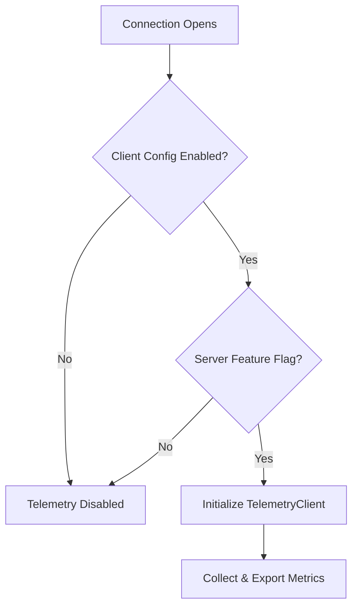

**Priority Order**:
1. Server feature flag (highest)
2. Client connection string
3. Environment variable
4. Default value

---

## 7. Privacy & Compliance

### 7.1 Data Privacy

**Never Collected from Activities**:
- ❌ SQL query text (only statement ID)
- ❌ Query results or data values
- ❌ Table/column names from queries
- ❌ User identities (only workspace ID)

**Always Collected**:
- ✅ Operation latency (from `Activity.Duration`)
- ✅ Error codes (from `activity.GetTagItem("error.type")`)
- ✅ Feature flags (boolean settings)
- ✅ Statement IDs (UUIDs)

### 7.2 Compliance

Same as original design:
- **GDPR**: No personal data
- **CCPA**: No personal information
- **SOC 2**: Encrypted in transit
- **Data Residency**: Regional control plane

---

## 8. Error Handling

### 8.1 Exception Swallowing Strategy

**Core Principle**: Every telemetry exception must be swallowed with minimal logging to avoid customer anxiety.

**Rationale** (from JDBC experience):
- Customers become anxious when they see error logs, even if telemetry is non-blocking
- Telemetry failures should never impact the driver's core functionality
- **Critical**: Circuit breaker must catch errors **before** swallowing, otherwise it won't work

#### Logging Levels
- **TRACE**: Use for most telemetry errors (default)
- **DEBUG**: Use only for circuit breaker state changes
- **WARN/ERROR**: Never use for telemetry errors

#### Exception Handling Layers

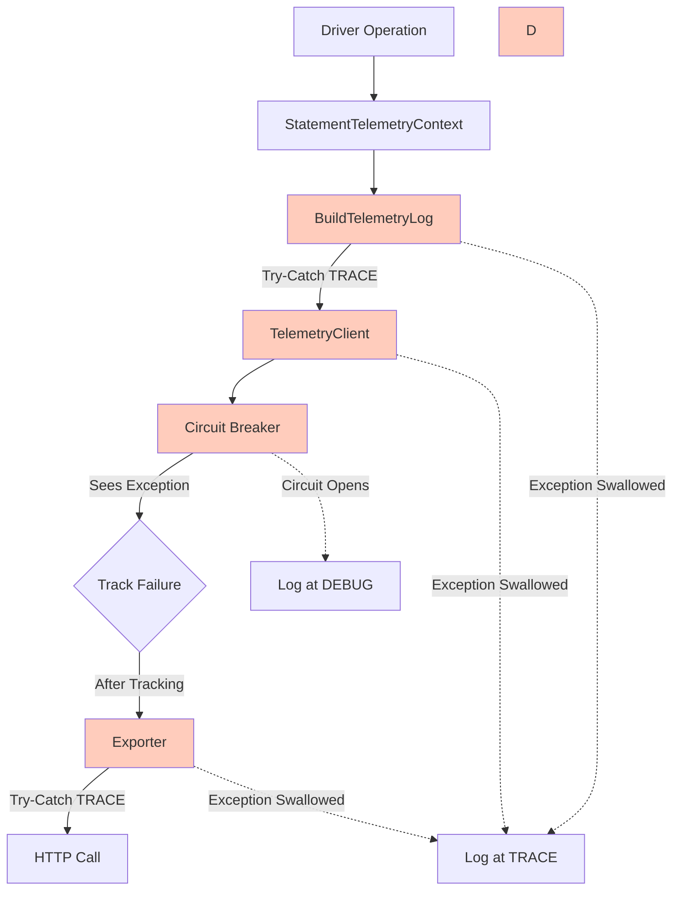

#### Statement Telemetry Error Handling

All telemetry operations are wrapped in try-catch at the statement level:

```csharp
// In DatabricksStatement base
protected void EmitTelemetry()
{
    try
    {
        if (_telemetryContext == null) return;
        var proto = _telemetryContext.BuildTelemetryLog();
        var frontendLog = WrapInFrontendLog(proto);
        _connection.TelemetrySessionContext?.TelemetryClient?.Enqueue(frontendLog);
    }
    catch (Exception ex)
    {
        // Swallow ALL exceptions — never impact driver operation
        Debug.WriteLine($"[TRACE] Telemetry emit error: {ex.Message}");
    }
}
```

#### Circuit Breaker Error Handling

**Important**: Circuit breaker MUST see exceptions before they are swallowed!

```csharp
public async Task ExportAsync(IReadOnlyList<TelemetryMetric> metrics)
{
    try
    {
        // Circuit breaker tracks failures BEFORE swallowing
        await _circuitBreaker.ExecuteAsync(async () =>
        {
            await _innerExporter.ExportAsync(metrics);
        });
    }
    catch (CircuitBreakerOpenException)
    {
        // Circuit is open, drop events silently
        Debug.WriteLine($"[DEBUG] Circuit breaker OPEN - dropping telemetry");
    }
    catch (Exception ex)
    {
        // All other exceptions swallowed AFTER circuit breaker saw them
        Debug.WriteLine($"[TRACE] Telemetry export error: {ex.Message}");
    }
}
```

**JDBC Reference**: `TelemetryPushClient.java:86-94` - Re-throws exception if circuit breaker enabled, allowing it to track failures before swallowing.

---

### 8.2 Terminal vs Retryable Exceptions

**Requirement**: Do not flush exceptions immediately when they occur. Flush immediately only for **terminal exceptions**.

#### Exception Classification

**Terminal Exceptions** (flush immediately):
- Authentication failures (401, 403)
- Invalid SQL syntax errors
- Permission denied errors
- Resource not found errors (404)
- Invalid request format errors (400)

**Retryable Exceptions** (buffer until statement completes):
- Network timeouts
- Connection errors
- Rate limiting (429)
- Service unavailable (503)
- Internal server errors (500, 502, 504)

#### Rationale
- Some exceptions are retryable and may succeed on retry
- If a retryable exception is thrown twice but succeeds the third time, we'd flush twice unnecessarily
- Only terminal (non-retryable) exceptions should trigger immediate flush
- Statement completion should trigger flush for accumulated exceptions

#### Exception Classifier

```csharp
internal static class ExceptionClassifier
{
    public static bool IsTerminalException(Exception ex)
    {
        return ex switch
        {
            HttpRequestException httpEx when IsTerminalHttpStatus(httpEx) => true,
            AuthenticationException => true,
            UnauthorizedAccessException => true,
            SqlException sqlEx when IsSyntaxError(sqlEx) => true,
            _ => false
        };
    }

    private static bool IsTerminalHttpStatus(HttpRequestException ex)
    {
        if (ex.StatusCode.HasValue)
        {
            var statusCode = (int)ex.StatusCode.Value;
            return statusCode is 400 or 401 or 403 or 404;
        }
        return false;
    }
}
```

#### Exception Buffering in Statement

```csharp
public void RecordException(string statementId, Exception ex)
{
    try
    {
        if (ExceptionClassifier.IsTerminalException(ex))
        {
            // Terminal exception: flush immediately
            var errorMetric = CreateErrorMetric(statementId, ex);
            _ = _telemetryClient.ExportAsync(new[] { errorMetric });
        }
        else
        {
            // Retryable exception: buffer until statement completes
            _statementContexts[statementId].Exceptions.Add(ex);
        }
    }
    catch (Exception aggregatorEx)
    {
        Debug.WriteLine($"[TRACE] Error recording exception: {aggregatorEx.Message}");
    }
}

public void CompleteStatement(string statementId, bool failed)
{
    try
    {
        if (_statementContexts.TryRemove(statementId, out var context))
        {
            // Only flush exceptions if statement ultimately failed
            if (failed && context.Exceptions.Any())
            {
                var errorMetrics = context.Exceptions
                    .Select(ex => CreateErrorMetric(statementId, ex))
                    .ToList();
                _ = _telemetryClient.ExportAsync(errorMetrics);
            }
        }
    }
    catch (Exception ex)
    {
        Debug.WriteLine($"[TRACE] Error completing statement: {ex.Message}");
    }
}
```

#### Usage Example

```csharp
string statementId = GetStatementId();

try
{
    var result = await ExecuteStatementAsync(statementId);
    EmitTelemetry();  // Emit on success
}
catch (Exception ex)
{
    RecordError(ex);
    EmitTelemetry();  // Emit on error
    throw; // Re-throw for application handling
}
```

---

### 8.3 Failure Modes

| Failure | Behavior |
|---------|----------|
| Listener throws | Caught, logged at TRACE, activity continues |
| Aggregator throws | Caught, logged at TRACE, skip this activity |
| Exporter fails | Circuit breaker tracks failure, then caught and logged at TRACE |
| Circuit breaker open | Drop metrics immediately, log at DEBUG |
| Out of memory | Disable listener, stop collecting |
| Terminal exception | Flush immediately, log at TRACE |
| Retryable exception | Buffer until statement completes |

---

## 9. Graceful Shutdown

**Requirement**: All pending telemetry logs must be sent to Databricks **before** the connection dispose completes. The user must be able to trust that after `connection.Dispose()` returns, all telemetry has been delivered (or at least attempted).

### 9.1 Flush-Before-Close Guarantee

The JDBC driver achieves this with a **synchronous blocking flush** on close:

```java
// JDBC TelemetryClient.close()
collector.exportAllPendingTelemetryDetails();  // Export any pending statement telemetry
flush(true).get();                             // Block until HTTP flush completes
```

The C# driver follows the same pattern. On connection dispose:

1. **Emit any pending statement telemetry** that hasn't been emitted yet
2. **Synchronously flush** the `TelemetryClient` queue — block until the HTTP POST completes (or fails/times out)
3. **Release** the shared client (decrement ref count)

This guarantees: after `connection.Dispose()` returns, all telemetry logs from that connection have been sent (or failed with timeout).

### 9.2 Shutdown Sequence

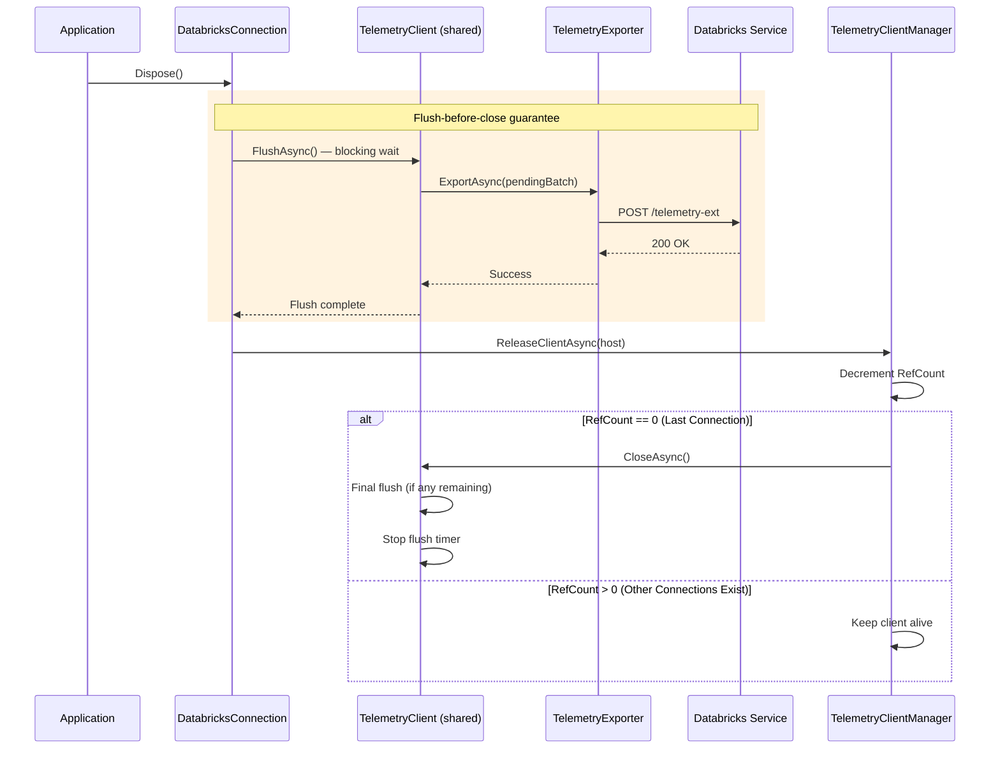

### 9.3 Connection Close Implementation

```csharp
// In DatabricksConnection.Dispose (pseudocode)
private void DisposeTelemetry()
{
    try
    {
        // Step 1: Synchronous flush — BLOCKS until HTTP completes or times out
        // This is the flush-before-close guarantee
        _telemetryClient?.FlushAsync()
            .ConfigureAwait(false).GetAwaiter().GetResult();

        // Step 2: Release shared client (decrements ref count, closes if last)
        TelemetryClientManager.GetInstance()
            .ReleaseClientAsync(_host)
            .ConfigureAwait(false).GetAwaiter().GetResult();
    }
    catch (Exception ex)
    {
        // Swallow all exceptions — never fail the connection close
        Debug.WriteLine($"[TRACE] Error during telemetry cleanup: {ex.Message}");
    }
}
```

**Why synchronous blocking?** The base class hierarchy uses `IDisposable` (not `IAsyncDisposable`), so `Dispose()` is synchronous. We use `.GetAwaiter().GetResult()` to block until the flush HTTP call completes. This matches JDBC's `flush(true).get()` pattern.

### 9.4 Timeout Protection

The flush must not block indefinitely. Add a timeout to prevent hanging on connection close:

```csharp
// Flush with timeout — don't block forever
var flushTask = _telemetryClient.FlushAsync();
if (!flushTask.Wait(TimeSpan.FromSeconds(5)))
{
    Debug.WriteLine("[TRACE] Telemetry flush timed out after 5s, proceeding with close");
}
```

| Scenario | Behavior |
|----------|----------|
| Flush succeeds quickly | Dispose returns after HTTP 200 |
| Flush takes > 5 seconds | Dispose returns after timeout, logs are best-effort |
| Network failure | CircuitBreaker handles it, flush returns with failure, Dispose continues |
| TelemetryClient already closed | No-op, Dispose continues |

### 9.5 TelemetryClient Close Implementation

```csharp
public sealed class TelemetryClient : ITelemetryClient
{
    private readonly ITelemetryExporter _exporter;
    private readonly CancellationTokenSource _cts = new();
    private readonly Task _backgroundFlushTask;

    public async Task CloseAsync()
    {
        try
        {
            // Step 1: Cancel background flush task
            _cts.Cancel();

            // Step 2: Flush all pending metrics synchronously
            await FlushAsync(force: true);

            // Step 3: Wait for background task to complete (with timeout)
            await _backgroundFlushTask.WaitAsync(TimeSpan.FromSeconds(5));
        }
        catch (Exception ex)
        {
            // Swallow per requirement
            Debug.WriteLine($"[TRACE] Error closing telemetry client: {ex.Message}");
        }
        finally
        {
            _cts.Dispose();
        }
    }
}
```

### 9.6 Reference Counting Example

**TelemetryClientHolder with Reference Counting**:

```csharp
// Connection 1 opens
var client1 = TelemetryClientManager.GetInstance()
    .GetOrCreateClient("host1", httpClient, config);
// RefCount for "host1" = 1

// Connection 2 opens (same host)
var client2 = TelemetryClientManager.GetInstance()
    .GetOrCreateClient("host1", httpClient, config);
// RefCount for "host1" = 2
// client1 == client2 (same instance)

// Connection 1 closes
await TelemetryClientManager.GetInstance().ReleaseClientAsync("host1");
// RefCount for "host1" = 1
// Client NOT closed (other connection still using it)

// Connection 2 closes
await TelemetryClientManager.GetInstance().ReleaseClientAsync("host1");
// RefCount for "host1" = 0
// Client IS closed and removed from cache
```

**Same logic applies to FeatureFlagCache**.

### 9.7 Shutdown Contracts

**TelemetryClientManager**:
- `GetOrCreateClient()`: Atomically increments ref count
- `ReleaseClientAsync()`: Atomically decrements ref count, closes client if zero
- Thread-safe for concurrent access

**FeatureFlagCache**:
- `GetOrCreateContext()`: Atomically increments ref count
- `ReleaseContext()`: Atomically decrements ref count, removes context if zero
- Thread-safe for concurrent access

**TelemetryClient.CloseAsync()**:
- Synchronously flushes all pending metrics (blocks until complete)
- Cancels background flush task
- Disposes resources (HTTP client, executors, etc.)
- Never throws exceptions

**JDBC Reference**: `TelemetryClient.java:105-139` - Synchronous close with flush and executor shutdown.

---

## 10. Testing Strategy

### 10.1 Proto Field Coverage Tests

Every field in the `OssSqlDriverTelemetryLog` proto must be populated and verified. The table below maps each proto field to the expected source and validation:

#### OssSqlDriverTelemetryLog (top-level)

| Proto Field | Type | Expected Source | Validation |
|-------------|------|----------------|------------|
| `session_id` | string | `SessionHandle.SessionId` (GUID hex) | Non-empty, 32-char hex |
| `sql_statement_id` | string | `OperationHandle.OperationId` (GUID hex) | Non-empty, 32-char hex |
| `system_configuration` | message | Connection properties + runtime info | All sub-fields populated (see below) |
| `driver_connection_params` | message | Connection properties | `http_path`, `host_info`, `mode` populated (see below) |
| `auth_type` | string | Inferred from token/OAuth config | One of: `"pat"`, `"oauth"`, `"basic"` — never `"unknown"` |
| `sql_operation` | message | Statement execution data | Present with `statement_type` + `execution_result` (see below) |
| `error_info` | message | Exception (if error occurred) | Present only on error, with `error_name` |
| `operation_latency_ms` | int64 | `ExecuteQueryAsyncInternal` duration | > 0 for any real query |

#### DriverSystemConfiguration

| Proto Field | Expected Value | Validation |
|-------------|---------------|------------|
| `driver_version` | Assembly `ProductVersion` | Non-empty, contains version number |
| `driver_name` | `"Apache Arrow ADBC Databricks Driver"` | Exact match |
| `runtime_name` | e.g. `".NET 8.0.23"` | Non-empty |
| `runtime_version` | e.g. `"8.0.23"` | Non-empty |
| `runtime_vendor` | `"Microsoft"` | Non-empty |
| `os_name` | e.g. `"Ubuntu 20.04.6 LTS"` | Non-empty |
| `os_version` | e.g. `"5.4.0.1154"` | Non-empty |
| `os_arch` | e.g. `"X64"` or `"Arm64"` | Non-empty |
| `client_app_name` | Entry assembly name or `"unknown"` | Non-empty |
| `locale_name` | e.g. `"en-US"` | Non-empty |
| `char_set_encoding` | `"utf-8"` | Exact match |
| `process_name` | e.g. `"dotnet"` | Non-empty |

#### DriverConnectionParameters

| Proto Field | Expected Value | Validation |
|-------------|---------------|------------|
| `http_path` | e.g. `"/sql/1.0/warehouses/abc123"` | Non-empty, starts with `/` |
| `mode` | `DRIVER_MODE_THRIFT` or `DRIVER_MODE_SEA` | Not `UNSPECIFIED` |
| `host_info.host_url` | e.g. `"https://host.cloud.databricks.com:443"` | Non-empty, starts with `https://` |
| `host_info.port` | Port number (may be 0 if embedded in URL) | — |
| `auth_mech` | e.g. `DRIVER_AUTH_MECH_PAT` | Not `UNSPECIFIED` |
| `auth_flow` | e.g. `DRIVER_AUTH_FLOW_TOKEN_PASSTHROUGH` | Not `UNSPECIFIED` |
| `enable_arrow` | `true` | Boolean |
| `enable_direct_results` | `true` (if enabled) | Boolean |
| `rows_fetched_per_block` | e.g. `"2000000"` | Non-empty |
| `socket_timeout` | e.g. `"900"` | Non-empty |
| `async_poll_interval_millis` | e.g. `"100"` | Non-empty |
| `check_certificate_revocation` | Boolean | — |
| `string_column_length` | e.g. `255` | > 0 |

#### SqlExecutionEvent

| Proto Field | Expected Value | Validation |
|-------------|---------------|------------|
| `statement_type` | `STATEMENT_QUERY`, `STATEMENT_UPDATE`, `STATEMENT_METADATA` | Not `UNSPECIFIED` |
| `is_compressed` | `true` if LZ4 enabled | Boolean |
| `execution_result` | `EXECUTION_RESULT_INLINE_ARROW` or `EXECUTION_RESULT_EXTERNAL_LINKS` | Not `UNSPECIFIED` |
| `retry_count` | Number of retries (0 if none) | >= 0 |
| `chunk_details` | Present for CloudFetch results | See below |
| `result_latency` | Present for completed queries | See below |
| `operation_detail` | Present when polling occurred | See below |

#### ChunkDetails (CloudFetch only)

| Proto Field | Validation |
|-------------|------------|
| `initial_chunk_latency_millis` | > 0 |
| `slowest_chunk_latency_millis` | >= `initial_chunk_latency_millis` |
| `total_chunks_present` | > 0 |
| `total_chunks_iterated` | > 0, <= `total_chunks_present` |
| `sum_chunks_download_time_millis` | > 0 |

#### ResultLatency

| Proto Field | Validation |
|-------------|------------|
| `result_set_ready_latency_millis` | > 0 (time from execute to first batch) |
| `result_set_consumption_latency_millis` | >= 0 (time from first batch to all consumed) |

#### OperationDetail

| Proto Field | Validation |
|-------------|------------|
| `n_operation_status_calls` | > 0 (if polling occurred) |
| `operation_status_latency_millis` | > 0 (if polling occurred) |
| `operation_type` | e.g. `OPERATION_EXECUTE_STATEMENT` — not `UNSPECIFIED` |

#### DriverErrorInfo (error path only)

| Proto Field | Validation |
|-------------|------------|
| `error_name` | Non-empty, contains exception type name |
| `stack_trace` | Non-empty, contains error message |

---

### 10.2 E2E Test Scenarios

Each test creates a real connection with a `CapturingTelemetryExporter`, executes a specific scenario, and validates the captured proto fields.

#### Scenario 1: Simple inline query (SELECT 1)

| Aspect | Details |
|--------|---------|
| **Setup** | Standard connection, telemetry enabled |
| **Action** | `SELECT 1 AS test_value` — small result, no CloudFetch |
| **Expected proto fields** | |
| `session_id` | Non-empty |
| `sql_statement_id` | Non-empty |
| `system_configuration` | All 12 fields populated |
| `driver_connection_params` | `http_path`, `host_info`, `mode=THRIFT`, `auth_mech`, `auth_flow` populated |
| `auth_type` | `"pat"` or `"oauth"` (not `"unknown"`) |
| `sql_operation.statement_type` | `STATEMENT_QUERY` |
| `sql_operation.execution_result` | `EXECUTION_RESULT_INLINE_ARROW` or `EXECUTION_RESULT_EXTERNAL_LINKS` |
| `sql_operation.result_latency` | `result_set_ready_latency_millis > 0` |
| `sql_operation.operation_detail.operation_type` | `OPERATION_EXECUTE_STATEMENT` |
| `operation_latency_ms` | > 0 |
| `error_info` | Not present |
| **Emission count** | Exactly 1 |

#### Scenario 2: CloudFetch query (large result set)

| Aspect | Details |
|--------|---------|
| **Setup** | Connection with CloudFetch enabled, query returns enough data for external links |
| **Action** | Query that produces multiple CloudFetch chunks (e.g., `SELECT * FROM large_table LIMIT 100000`) |
| **Expected proto fields** | |
| `sql_operation.execution_result` | `EXECUTION_RESULT_EXTERNAL_LINKS` |
| `sql_operation.is_compressed` | `true` (if LZ4 enabled) |
| `sql_operation.chunk_details.total_chunks_present` | > 0 |
| `sql_operation.chunk_details.total_chunks_iterated` | > 0 |
| `sql_operation.chunk_details.initial_chunk_latency_millis` | > 0 |
| `sql_operation.chunk_details.slowest_chunk_latency_millis` | > 0 |
| `sql_operation.chunk_details.sum_chunks_download_time_millis` | > 0 |
| `sql_operation.result_latency.result_set_ready_latency_millis` | > 0 |
| `sql_operation.result_latency.result_set_consumption_latency_millis` | > 0 |
| **Emission count** | Exactly 1 |

#### Scenario 3: Query with polling (async execution)

| Aspect | Details |
|--------|---------|
| **Setup** | Standard connection, query that requires server-side polling (not direct results) |
| **Action** | Query that takes long enough to require polling (or disable direct results) |
| **Expected proto fields** | |
| `sql_operation.operation_detail.n_operation_status_calls` | > 0 |
| `sql_operation.operation_detail.operation_status_latency_millis` | > 0 |
| `sql_operation.operation_detail.operation_type` | `OPERATION_EXECUTE_STATEMENT` |
| **Emission count** | Exactly 1 |

#### Scenario 4: SQL error (invalid query)

| Aspect | Details |
|--------|---------|
| **Setup** | Standard connection, telemetry enabled |
| **Action** | `SELECT FROM NONEXISTENT_TABLE_XYZ` — intentionally invalid SQL |
| **Expected proto fields** | |
| `session_id` | Non-empty (connection still valid) |
| `sql_statement_id` | May or may not be populated (depends on when error occurs) |
| `error_info.error_name` | Non-empty, contains exception type |
| `error_info.stack_trace` | Non-empty, contains error message |
| `operation_latency_ms` | > 0 (time spent before error) |
| `sql_operation` | May be partial or absent |
| **Emission count** | Exactly 1 |

#### Scenario 5: Metadata operation (GetCatalogs)

| Aspect | Details |
|--------|---------|
| **Setup** | Standard connection, telemetry enabled |
| **Action** | `connection.GetInfo()` or `connection.GetTableTypes()` |
| **Expected proto fields** | |
| `sql_operation.statement_type` | `STATEMENT_METADATA` |
| `sql_operation.operation_detail.operation_type` | `OPERATION_LIST_CATALOGS` (or similar) |
| `operation_latency_ms` | > 0 |
| **Emission count** | Exactly 1 |

#### Scenario 6: Multiple statements on same connection

| Aspect | Details |
|--------|---------|
| **Setup** | Single connection, telemetry enabled |
| **Action** | Execute 3 separate queries sequentially |
| **Expected proto fields** | |
| All 3 logs have same `session_id` | Connection-level correlation |
| All 3 logs have different `sql_statement_id` | Unique per statement |
| All 3 logs have `system_configuration` | Identical across all (from session context) |
| All 3 logs have `driver_connection_params` | Identical across all (from session context) |
| **Emission count** | Exactly 3 |

#### Scenario 7: Telemetry disabled via feature flag

| Aspect | Details |
|--------|---------|
| **Setup** | Connection with `telemetry.enabled=false` |
| **Action** | Execute any query |
| **Expected** | No telemetry logs captured |
| **Emission count** | 0 |

#### Scenario 8: ExecuteUpdate (INSERT/CREATE)

| Aspect | Details |
|--------|---------|
| **Setup** | Standard connection, telemetry enabled |
| **Action** | `CREATE TABLE temp_test (id INT)` or `INSERT INTO ...` |
| **Expected proto fields** | |
| `sql_operation.statement_type` | `STATEMENT_UPDATE` |
| `sql_operation.operation_detail.operation_type` | `OPERATION_EXECUTE_STATEMENT` |
| `operation_latency_ms` | > 0 |
| **Emission count** | Exactly 1 |

---

### 10.3 Unit Tests

**StatementTelemetryContext Tests**:
- `BuildTelemetryLog_AllFieldsPopulated_ProtoComplete` — set every field, verify proto output
- `BuildTelemetryLog_MinimalFields_NoNullRefs` — only session context, no crash
- `BuildTelemetryLog_ErrorPath_IncludesErrorInfo`
- `BuildTelemetryLog_CloudFetch_IncludesChunkDetails`
- `BuildTelemetryLog_WithPolling_IncludesOperationDetail`
- `BuildTelemetryLog_WithResultLatency_IncludesResultLatency`
- `Timing_StopwatchCalculatesLatency` — verify `FirstBatchReadyMs`, `ResultsConsumedMs`

**DatabricksStatement Telemetry Base Tests**:
- `CreateTelemetryContext_CopiesSessionContext`
- `EmitTelemetry_EnqueuesToClient`
- `EmitTelemetry_NullClient_NoOp`
- `RecordError_SetsErrorFields`
- `EmitTelemetry_CalledOnce_NoDuplicates`

**Export Pipeline Tests** (unchanged):
- `TelemetryClient_BatchesAndFlushes`
- `TelemetryClientManager_OneClientPerHost`
- `TelemetryClientManager_RefCountingWorks`
- `CircuitBreaker_OpensAfterFailures`
- `CircuitBreaker_ClosesAfterSuccesses`
- `ExceptionClassifier_IdentifiesTerminal`
- `FeatureFlagCache_CachesPerHost`

### 10.4 Test Coverage Goals

| Component | Unit Test Coverage | E2E Test Coverage |
|-----------|-------------------|-------------------|
| StatementTelemetryContext | > 90% | Covered by scenarios |
| DatabricksStatement (telemetry base) | > 90% | Covered by scenarios |
| Proto field population | **100%** (every field verified) | **100%** (every field in at least one scenario) |
| TelemetryClient / Manager | > 90% | > 80% |
| CircuitBreaker | > 90% | > 80% |
| ExceptionClassifier | 100% | N/A |

---

## 11. Alternatives Considered

### 11.1 Alternative 1: Separate Telemetry System

**Description**: Create a dedicated telemetry collection system parallel to Activity infrastructure, with explicit TelemetryCollector and TelemetryExporter classes.

**Approach**:
- Add `TelemetryCollector.RecordXXX()` calls at each driver operation
- Maintain separate `TelemetryEvent` data model
- Export via dedicated `TelemetryExporter`
- Manual correlation with distributed traces

**Pros**:
- Independent from Activity API
- Direct control over data collection
- Matches JDBC driver design pattern

**Cons**:
- Duplicate instrumentation at every operation point
- Two parallel data models (Activity + TelemetryEvent)
- Manual correlation between traces and metrics required
- Higher maintenance burden (two systems)
- Increased code complexity

**Why Not Chosen**: The driver already has comprehensive Activity instrumentation. Creating a parallel system would duplicate this effort and increase maintenance complexity without providing significant benefits.

---

### 11.2 Alternative 2: OpenTelemetry Metrics API Directly

**Description**: Use OpenTelemetry's Metrics API (`Meter` and `Counter`/`Histogram`) directly in driver code.

**Approach**:
- Create `Meter` instance for the driver
- Add `Counter.Add()` and `Histogram.Record()` calls at each operation
- Export via OpenTelemetry SDK to Databricks backend

**Pros**:
- Industry standard metrics API
- Built-in aggregation and export
- Native OTEL ecosystem support

**Cons**:
- Still requires separate instrumentation alongside Activity
- Introduces new dependency (OpenTelemetry.Api.Metrics)
- Metrics and traces remain separate systems
- Manual correlation still needed
- Databricks export requires custom OTLP exporter

**Why Not Chosen**: This still creates duplicate instrumentation points. The Activity-based approach allows us to derive metrics from existing Activity data, avoiding code duplication.

---

### 11.3 Alternative 3: Log-Based Metrics

**Description**: Write structured logs at key operations and extract metrics from logs.

**Approach**:
- Use `ILogger` to log structured events
- Include metric-relevant fields (latency, result format, etc.)
- Backend log processor extracts metrics from log entries

**Pros**:
- Simple implementation (just logging)
- No new infrastructure needed
- Flexible data collection

**Cons**:
- High log volume (every operation logged)
- Backend processing complexity
- Delayed metrics (log ingestion lag)
- No built-in aggregation
- Difficult to correlate with distributed traces
- Privacy concerns (logs may contain sensitive data)

**Why Not Chosen**: Log-based metrics are inefficient and lack the structure needed for real-time aggregation. They also complicate privacy compliance.

---

### 11.4 Why Activity-Based Approach Was Replaced (V2 → V3)

The V2 Activity-based design was initially chosen to avoid duplicate instrumentation, but implementation revealed fundamental complexity issues:

| Problem | Root Cause | Impact |
|---------|-----------|--------|
| **Activity ordering** | Child activities stop before parent; reader activities stop after Execute emits | Premature emission with incomplete data |
| **Tag propagation** | .NET Activity tags NOT inherited by children | Every activity needs manual `session.id` + `statement.id` propagation |
| **Operation name matching** | `MergeFrom` routes by string matching on operation names | Fragile — breaks when names change |
| **Multiple emissions** | Non-Execute root activities (ReadNextRecordBatch, Dispose) trigger duplicate emissions | Required `_emittedStatementIds` tracking hack |
| **Result latency gap** | Reader Dispose fires after Execute activity already emitted | Cannot capture `result_set_consumption_latency_ms` |
| **Global listener** | `ActivityListener` is global, receives ALL activities from ALL connections | Complex session-based routing needed |

### 11.5 Why Direct Object Approach Was Chosen (V3)

The V3 direct object design addresses all V2 issues:

| Aspect | V2: Activity-Based | V3: Direct Object |
|--------|-------------------|-------------------|
| **Data flow** | Activity → tags → Listener → Aggregator → Context → Proto | Statement → Context → Proto |
| **Routing** | Global listener routes by `session.id` tag | Direct object reference on statement |
| **Tag propagation** | Every child activity needs `session.id` + `statement.id` | Not needed |
| **Emit trigger** | Root activity completion (fragile ordering) | Reader dispose or error catch (deterministic) |
| **Result latency** | Cannot capture (reader disposes after emit) | Trivial (reader holds context reference) |
| **Duplicate handling** | `_emittedStatementIds` tracking needed | Impossible by design (one emit point) |
| **Thread safety** | ConcurrentDictionary, locks in aggregator | Single-threaded per statement |
| **Testability** | Need mock ActivitySource, listener wiring | Create context → set fields → assert |
| **Lines of code** | ~800 (Listener + Aggregator + tag propagation) | ~200 (context creation + inline sets) |

**Trade-offs Accepted**:
- Activity infrastructure remains for OpenTelemetry distributed tracing (unchanged)
- Telemetry collection is separate from tracing (but this is actually simpler)
- Slight code duplication at instrumentation points (but explicit and easy to understand)

---

## 12. Implementation Checklist

### Phase 1: Infrastructure — already implemented
- [x] `FeatureFlagCache` — per-host caching with background refresh
- [x] `FeatureFlagContext` — reference counting, initial blocking fetch, TTL-based refresh
- [x] `CircuitBreaker` — state machine (Closed → Open → Half-Open)
- [x] `DatabricksTelemetryExporter` — HTTP POST to `/telemetry-ext` and `/telemetry-unauth`
- [x] `ITelemetryExporter` — exporter interface
- [x] `ExceptionClassifier` — terminal vs retryable classification
- [x] `TelemetryConfiguration` — config model with feature flag support
- [x] `ProtoJsonConverter` — proto ↔ JSON serialization
- [x] Proto file (`sql_driver_telemetry.proto`) and generated C# types
- [x] Models (`TelemetryFrontendLog`, `FrontendLogEntry`, `FrontendLogContext`, `TelemetryClientContext`, `TelemetryRequest`)
- [x] `TagDefinitions/` — tag name constants (to be simplified in Phase 6)

### Phase 2: Export pipeline — not yet implemented
- [ ] `ITelemetryClient` — interface: `Enqueue(log)`, `FlushAsync()`, `CloseAsync()`
- [ ] `TelemetryClient` — batching queue with periodic flush timer
- [ ] `TelemetryClientManager` — singleton, per-host client with reference counting
- [ ] `TelemetryClientHolder` — holds client + ref count
- [ ] `CircuitBreakerManager` — singleton, per-host circuit breakers
- [ ] `CircuitBreakerTelemetryExporter` — wraps `ITelemetryExporter` with circuit breaker
- [ ] Fix JSON serialization — use `WithPreserveProtoFieldNames(true)` for snake_case (Section 5.4)

### Phase 3: Direct collection (V3) — not yet implemented
- [ ] `TelemetrySessionContext` — frozen session-level data built at connection open
- [ ] `StatementTelemetryContext` — per-statement data container with `Stopwatch` and `BuildTelemetryLog()`
- [ ] Shared `DatabricksStatement` telemetry base:
  - [ ] `CreateTelemetryContext()` — creates context from session context
  - [ ] `EmitTelemetry()` — builds proto, wraps in FrontendLog, enqueues to client
  - [ ] `RecordError(Exception)` — records error info on context
- [ ] `DatabricksConnection.InitializeTelemetry()` — build `TelemetrySessionContext`, get shared `ITelemetryClient`
- [ ] `DatabricksConnection.Dispose()` — flush-before-close with timeout (Section 9.4)

### Phase 4: Thrift protocol instrumentation
- [ ] `DatabricksStatement.SetStatementProperties()` — set `StatementType`, `ResultFormat`, `IsCompressed`, `OperationType`
- [ ] `HiveServer2Statement.ExecuteStatementAsync()` — set `StatementId` from server response
- [ ] `HiveServer2Connection.PollForResponseAsync()` — set `PollCount`, `PollLatencyMs`
- [ ] `DatabricksCompositeReader` — record `FirstBatchReadyMs`, `ResultsConsumedMs`, chunk details
- [ ] Emit on reader dispose (success) or catch block (error)

### Phase 5: SEA protocol instrumentation
- [ ] `SeaStatement.ExecuteAsync()` — set `StatementType`, `ResultFormat`, `OperationType`, `StatementId`
- [ ] `SeaStatement.PollAsync()` — set `PollCount`, `PollLatencyMs`
- [ ] `SeaReader` — record `FirstBatchReadyMs`, `ResultsConsumedMs`, chunk details
- [ ] Emit on reader dispose (success) or catch block (error)
- [ ] Set `DriverConnectionParams.Mode = DRIVER_MODE_SEA`

### Phase 6: Cleanup
- [ ] Simplify `TagDefinitions/` — remove `TelemetryTag` attribute, `TagExportScope`, `TelemetryTagRegistry`, `TelemetryEventType`; keep plain `const string` values
- [ ] Remove any V2 Activity tag propagation code if present

### Phase 7: Testing
- [ ] Unit tests: `StatementTelemetryContext.BuildTelemetryLog()` — every proto field verified (Section 10.1)
- [ ] Unit tests: `DatabricksStatement` base — `CreateTelemetryContext`, `EmitTelemetry`, `RecordError`
- [ ] Unit tests: `TelemetryClient` — batching, flush, close
- [ ] Unit tests: `TelemetryClientManager` — per-host sharing, reference counting
- [ ] Unit tests: `CircuitBreakerTelemetryExporter` — open/close/half-open
- [ ] E2E Scenario 1: Simple inline query — all top-level fields populated (Section 10.2)
- [ ] E2E Scenario 2: CloudFetch query — `chunk_details` fully populated
- [ ] E2E Scenario 3: Query with polling — `operation_detail` populated
- [ ] E2E Scenario 4: SQL error — `error_info` populated
- [ ] E2E Scenario 5: Metadata operation — `statement_type = METADATA`
- [ ] E2E Scenario 6: Multiple statements — same `session_id`, different `sql_statement_id`
- [ ] E2E Scenario 7: Telemetry disabled — 0 emissions
- [ ] E2E Scenario 8: ExecuteUpdate — `statement_type = UPDATE`
- [ ] Verify snake_case JSON field names match JDBC output
- [ ] Verify flush-before-close guarantee (logs sent before dispose returns)

**Code Guidelines**:
- Avoid `#if` preprocessor directives — write code compatible with all target .NET versions (netstandard2.0, net472, net8.0)
- Use polyfills or runtime checks instead of compile-time conditionals where needed
- All telemetry code wrapped in try-catch — never impact driver operations

---

## 13. Open Questions

### 13.1 Feature Flag Endpoint Migration

**Question**: When should we migrate from `OSS_JDBC` to `OSS_ADBC` endpoint?

**Current State**: The ADBC driver currently uses the JDBC feature flag endpoint (`/api/2.0/connector-service/feature-flags/OSS_JDBC/{version}`) because the ADBC endpoint is not yet configured on the server side.

**Migration Plan**:
1. Server team configures the `OSS_ADBC` endpoint with appropriate feature flags
2. Update `TelemetryConfiguration.FeatureFlagEndpointFormat` to use `OSS_ADBC`
3. Coordinate with server team on feature flag name (`enableTelemetryForAdbc`)

### 13.2 Context Passing in HiveServer2 Base Class

**Question**: `PollForResponseAsync` lives in `HiveServer2Connection` (base class). How should `StatementTelemetryContext` be passed to it?

**Options**:
1. Add optional `StatementTelemetryContext?` parameter to `PollForResponseAsync` (clean but changes base class signature)
2. Store context on a thread-local or `AsyncLocal<T>` (avoids signature change but implicit)
3. Pass via the statement object which already has a reference to the connection

**Recommendation**: Option 1 — explicit parameter is simplest and most testable.

---

## 14. References

### 14.1 Related Documentation

- [.NET Activity API](https://learn.microsoft.com/en-us/dotnet/core/diagnostics/distributed-tracing)
- [OpenTelemetry .NET](https://opentelemetry.io/docs/languages/net/)
- [ActivityListener Documentation](https://learn.microsoft.com/en-us/dotnet/api/system.diagnostics.activitylistener)

### 14.2 Existing Code References

**ADBC Driver**:
- `ActivityTrace.cs`: Existing Activity helper
- `DatabricksAdbcActivitySource`: Existing ActivitySource
- Connection/Statement activities: Already instrumented

**JDBC Driver** (reference implementation):
- `TelemetryClient.java:15`: Main telemetry client with batching and flush
- `TelemetryClientFactory.java:27`: Per-host client management with reference counting
- `TelemetryClientHolder.java:5`: Reference counting holder
- `CircuitBreakerTelemetryPushClient.java:15`: Circuit breaker wrapper
- `CircuitBreakerManager.java:25`: Per-host circuit breaker management
- `TelemetryPushClient.java:86-94`: Exception re-throwing for circuit breaker
- `TelemetryHelper.java:45-46,77`: Feature flag name and checking
- `DatabricksDriverFeatureFlagsContextFactory.java`: Per-host feature flag cache with reference counting
- `DatabricksDriverFeatureFlagsContext.java:30-33`: Feature flag API endpoint format
- `DatabricksDriverFeatureFlagsContext.java:48-58`: Initial fetch and background refresh scheduling
- `DatabricksDriverFeatureFlagsContext.java:89-140`: HTTP call and response parsing
- `FeatureFlagsResponse.java`: Response model with `flags` array and `ttl_seconds`

---

## Summary

This **direct object telemetry design (V3)** provides a simple approach to collecting driver metrics by:

1. **Direct population**: `StatementTelemetryContext` is populated inline — no Activity tags, no listeners, no aggregators
2. **Protocol-agnostic**: Same telemetry context works for both Thrift and SEA backends
3. **Shared base**: `DatabricksStatement` provides `CreateTelemetryContext`, `EmitTelemetry`, `RecordError` — protocol subclasses just call them
4. **Deterministic emission**: Exactly one telemetry event per statement — on reader dispose (success) or catch block (error)
5. **Flush-before-close**: Connection dispose blocks until all pending telemetry is sent to Databricks
6. **JDBC-compatible**: snake_case JSON field names, same proto schema, same export endpoint
