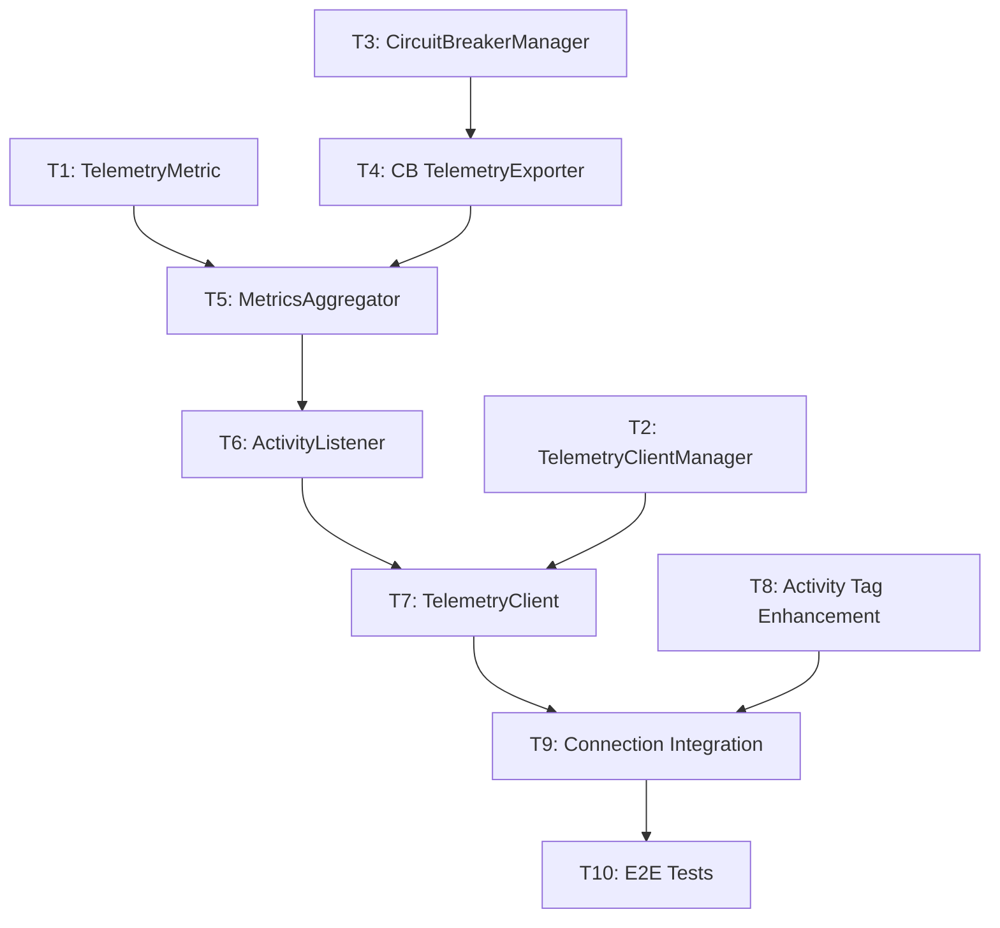

<!--
Copyright (c) 2025 ADBC Drivers Contributors

Licensed under the Apache License, Version 2.0 (the "License");
you may not use this file except in compliance with the License.
You may obtain a copy of the License at

        http://www.apache.org/licenses/LICENSE-2.0

Unless required by applicable law or agreed to in writing, software
distributed under the License is distributed on an "AS IS" BASIS,
WITHOUT WARRANTIES OR CONDITIONS OF ANY KIND, either express or implied.
See the License for the specific language governing permissions and
limitations under the License.
-->

# Telemetry Sprint Plan — 2026-03-05 to 2026-03-19

## Sprint Goal

Complete the telemetry pipeline end-to-end: implement the remaining orchestration components (TelemetryClientManager, CircuitBreakerManager, MetricsAggregator, ActivityListener, TelemetryClient), integrate telemetry into DatabricksConnection lifecycle, enhance Activity tags, and validate with E2E tests.

## Current State (~48% complete)

### Completed Work Items

| Work Item | Description | Location |
|-----------|-------------|----------|
| WI-1.1 | TelemetryConfiguration | `csharp/src/Telemetry/TelemetryConfiguration.cs` |
| WI-1.2 | Tag Definition System | `csharp/src/Telemetry/TagDefinitions/` |
| WI-1.3 | Telemetry Data Models | `csharp/src/Telemetry/Models/` |
| WI-2.1 | FeatureFlagCache | `csharp/src/FeatureFlagCache.cs`, `FeatureFlagContext.cs` |
| WI-3.1 | CircuitBreaker | `csharp/src/Telemetry/CircuitBreaker.cs` |
| WI-4.1 | ExceptionClassifier | `csharp/src/Telemetry/ExceptionClassifier.cs` |
| WI-5.1 | TelemetryMetric Data Model | `csharp/src/Telemetry/TelemetryMetric.cs` |
| WI-5.2 | DatabricksTelemetryExporter | `csharp/src/Telemetry/DatabricksTelemetryExporter.cs` |

### Remaining Work Items (this sprint)

| Work Item | Description | Dependencies |
|-----------|-------------|--------------|
| WI-2.2 | TelemetryClientManager | WI-1.1 |
| WI-3.2 | CircuitBreakerManager | WI-3.1 |
| WI-3.3 | CircuitBreakerTelemetryExporter | WI-3.2, WI-5.2 |
| WI-5.3 | MetricsAggregator | WI-1.2, WI-1.3, WI-4.1, WI-5.1 |
| WI-5.4 | DatabricksActivityListener | WI-5.3 |
| WI-5.5 | TelemetryClient | WI-5.4 |
| WI-6.1 | DatabricksConnection Integration | WI-2.1, WI-2.2, WI-5.5 |
| WI-6.2 | Activity Tag Enhancement | WI-1.2 |
| WI-7.1 | E2E Telemetry Tests | WI-6.1, WI-6.2 |

---

## Task Details

### T1: TelemetryMetric Data Model (WI-5.1)

**Estimate**: 1 day
**Dependencies**: None
**Location**: `csharp/src/Telemetry/TelemetryMetric.cs`

**Description**: Data model for aggregated telemetry metrics passed between the MetricsAggregator and the exporter pipeline.

**Fields**:
- MetricType (enum: Connection, Statement, Error)
- Timestamp
- WorkspaceId
- SessionId, StatementId
- ExecutionLatencyMs
- ResultFormat, ChunkCount, TotalBytesDownloaded
- PollCount, PollLatencyMs
- DriverConfiguration (snapshot)

**Unit Tests** (`csharp/test/Unit/Telemetry/TelemetryMetricTests.cs`):

| Test Name | Input | Expected Output |
|-----------|-------|-----------------|
| `TelemetryMetric_Serialization_ProducesValidJson` | Populated metric | Valid JSON matching Databricks schema |
| `TelemetryMetric_Serialization_OmitsNullFields` | Metric with null optional fields | JSON without null fields |

**Acceptance Criteria**:
- [x] All fields defined per design doc
- [x] JSON serialization uses snake_case property names
- [x] Null fields omitted from serialization
- [x] Unit tests pass

**Status**: ✅ COMPLETED (2026-03-05)

**Implementation Notes**:
- Created `TelemetryMetric.cs` with all required fields
- Implemented `DriverConfiguration` nested class with comprehensive configuration snapshot fields
- Added JSON serialization attributes with snake_case naming using `JsonPropertyName`
- Configured null field omission using `JsonIgnore(Condition = JsonIgnoreCondition.WhenWritingNull)`
- Created comprehensive test suite with 11 unit tests covering:
  - Full serialization with all fields populated
  - Null field omission
  - Property naming (snake_case verification)
  - Deserialization
  - Partial data scenarios
  - MetricType enum serialization
  - DriverConfiguration serialization
- All 477 unit tests pass (including 11 new TelemetryMetric tests)

---

### T2: TelemetryClientManager (WI-2.2)

**Estimate**: 1.5 days
**Dependencies**: WI-1.1 (TelemetryConfiguration) — completed
**Location**: `csharp/src/Telemetry/TelemetryClientManager.cs`, `TelemetryClientHolder.cs`

**Description**: Singleton that manages one telemetry client per host with reference counting. Prevents rate limiting by sharing clients across concurrent connections to the same host.

**Key Behaviors**:
- Thread-safe `GetOrCreateClient(host, httpClient, config)` — creates new client or increments ref count
- `ReleaseClientAsync(host)` — decrements ref count; closes and removes client when ref count reaches zero
- Uses `ConcurrentDictionary<string, TelemetryClientHolder>` for thread safety
- Client flushed before removal on last reference release

**Unit Tests** (`csharp/test/Unit/Telemetry/TelemetryClientManagerTests.cs`):

| Test Name | Input | Expected Output |
|-----------|-------|-----------------|
| `GetOrCreateClient_NewHost_CreatesClient` | "host1.databricks.com" | New client with RefCount=1 |
| `GetOrCreateClient_ExistingHost_ReturnsSameClient` | Same host twice | Same client instance, RefCount=2 |
| `ReleaseClientAsync_LastReference_ClosesClient` | Single reference, then release | Client.CloseAsync() called, removed from cache |
| `ReleaseClientAsync_MultipleReferences_KeepsClient` | Two references, release one | RefCount=1, client still active |
| `GetOrCreateClient_ThreadSafe_NoDuplicates` | Concurrent calls from 10 threads | Single client instance created |

**Acceptance Criteria**:
- [ ] Singleton pattern with `GetInstance()`
- [ ] Thread-safe reference counting
- [ ] Client flushed on last reference release
- [ ] Unit tests pass including thread safety test

---

### T3: CircuitBreakerManager (WI-3.2)

**Estimate**: 0.5 days
**Dependencies**: WI-3.1 (CircuitBreaker) — completed
**Location**: `csharp/src/Telemetry/CircuitBreakerManager.cs`

**Description**: Singleton that manages circuit breakers per host. Simple wrapper over `ConcurrentDictionary` to ensure one circuit breaker instance per host.

**Key Behaviors**:
- `GetCircuitBreaker(host)` — returns existing or creates new CircuitBreaker for host
- Uses `ConcurrentDictionary<string, CircuitBreaker>`
- Default config from `CircuitBreakerConfig` (5 failures, 1 min timeout, 2 successes to close)

**Unit Tests** (`csharp/test/Unit/Telemetry/CircuitBreakerManagerTests.cs`):

| Test Name | Input | Expected Output |
|-----------|-------|-----------------|
| `GetCircuitBreaker_NewHost_CreatesBreaker` | "host1.databricks.com" | New CircuitBreaker instance |
| `GetCircuitBreaker_SameHost_ReturnsSameBreaker` | Same host twice | Same CircuitBreaker instance |
| `GetCircuitBreaker_DifferentHosts_CreatesSeparateBreakers` | "host1", "host2" | Different CircuitBreaker instances |

**Acceptance Criteria**:
- [ ] Singleton pattern
- [ ] One circuit breaker per host
- [ ] Unit tests pass

---

### T4: CircuitBreakerTelemetryExporter (WI-3.3)

**Estimate**: 1 day
**Dependencies**: T3 (CircuitBreakerManager)
**Location**: `csharp/src/Telemetry/CircuitBreakerTelemetryExporter.cs`

**Description**: Wrapper that protects the inner `ITelemetryExporter` with a circuit breaker. When the circuit is open, events are silently dropped (logged at DEBUG level). When closed, events pass through to the inner exporter.

**Key Behaviors**:
- Implements `ITelemetryExporter`
- Delegates to `CircuitBreakerManager.GetCircuitBreaker(host)` for per-host isolation
- Catches `CircuitBreakerOpenException` and drops events silently
- Inner exporter failures tracked by circuit breaker

**Unit Tests** (`csharp/test/Unit/Telemetry/CircuitBreakerTelemetryExporterTests.cs`):

| Test Name | Input | Expected Output |
|-----------|-------|-----------------|
| `CircuitClosed_ExportsMetrics` | Metrics list, circuit closed | Inner exporter called |
| `CircuitOpen_DropsMetrics` | Metrics list, circuit open | No export, no exception |
| `InnerExporterFails_CircuitBreakerTracksFailure` | Inner exporter throws | Circuit breaker failure count incremented |

**Acceptance Criteria**:
- [ ] Implements `ITelemetryExporter`
- [ ] Per-host circuit breaker isolation
- [ ] Silent drop when circuit open
- [ ] Unit tests pass

---

### T5: MetricsAggregator (WI-5.3)

**Estimate**: 2.5 days
**Dependencies**: T1, T4, WI-1.2, WI-1.3, WI-4.1 (all completed or earlier in sprint)
**Location**: `csharp/src/Telemetry/MetricsAggregator.cs`

**Description**: Aggregates Activity data by `statement_id` and coordinates export. This is the core orchestration component of the telemetry pipeline.

**Key Behaviors**:
- `ProcessActivity(Activity)` — extracts metrics from Activity tags and events
- Connection events: emitted immediately (no aggregation)
- Statement events: aggregated by `statement_id` in `ConcurrentDictionary<string, StatementTelemetryDetails>`
- Error events: terminal errors flush immediately; retryable errors buffer until statement complete
- `CompleteStatement(statementId)` — emits aggregated metric for the statement
- `FlushAsync()` — flushes batch when threshold or time interval reached
- Uses `TelemetryTagRegistry` to filter tags (only export safe tags to Databricks)
- All exceptions swallowed (logged at TRACE level)

**Unit Tests** (`csharp/test/Unit/Telemetry/MetricsAggregatorTests.cs`):

| Test Name | Input | Expected Output |
|-----------|-------|-----------------|
| `ProcessActivity_ConnectionOpen_EmitsImmediately` | Connection.Open activity | Metric queued for export |
| `ProcessActivity_Statement_AggregatesByStatementId` | Multiple activities with same statement_id | Single aggregated metric |
| `CompleteStatement_EmitsAggregatedMetric` | Call CompleteStatement() | Queues aggregated metric |
| `FlushAsync_BatchSizeReached_ExportsMetrics` | 100 metrics (batch size) | Calls exporter |
| `FlushAsync_TimeInterval_ExportsMetrics` | Wait 5 seconds | Calls exporter |
| `RecordException_Terminal_FlushesImmediately` | Terminal exception | Immediately exports error metric |
| `RecordException_Retryable_BuffersUntilComplete` | Retryable exception | Buffers, exports on CompleteStatement |
| `ProcessActivity_ExceptionSwallowed_NoThrow` | Activity processing throws | No exception propagated |
| `ProcessActivity_FiltersTags_UsingRegistry` | Activity with sensitive tags | Only safe tags in metric |

**Acceptance Criteria**:
- [ ] Per-statement aggregation with ConcurrentDictionary
- [ ] Immediate emit for connection and terminal error events
- [ ] Batch flush on threshold and time interval
- [ ] Tag filtering via TelemetryTagRegistry
- [ ] All exceptions swallowed
- [ ] Unit tests pass

---

### T6: DatabricksActivityListener (WI-5.4)

**Estimate**: 1.5 days
**Dependencies**: T5 (MetricsAggregator)
**Location**: `csharp/src/Telemetry/DatabricksActivityListener.cs`

**Description**: Listens to `System.Diagnostics.Activity` events from the `"Databricks.Adbc.Driver"` ActivitySource and delegates to MetricsAggregator.

**Key Behaviors**:
- Creates `ActivityListener` filtered to `"Databricks.Adbc.Driver"` source
- `Sample` callback respects feature flag (returns `AllDataAndRecorded` or `None`)
- `ActivityStopped` callback delegates to `MetricsAggregator.ProcessActivity()`
- All callbacks wrapped in try-catch — never throws to Activity infrastructure
- `StopAsync()` flushes pending metrics and disposes listener
- Implements `IDisposable`

**Unit Tests** (`csharp/test/Unit/Telemetry/DatabricksActivityListenerTests.cs`):

| Test Name | Input | Expected Output |
|-----------|-------|-----------------|
| `Start_ListensToDatabricksActivitySource` | N/A | ShouldListenTo returns true for "Databricks.Adbc.Driver" |
| `ActivityStopped_ProcessesActivity` | Activity stops | MetricsAggregator.ProcessActivity called |
| `ActivityStopped_ExceptionSwallowed` | Aggregator throws | No exception propagated |
| `Sample_FeatureFlagDisabled_ReturnsNone` | Config.Enabled=false | ActivitySamplingResult.None |
| `Sample_FeatureFlagEnabled_ReturnsAllData` | Config.Enabled=true | ActivitySamplingResult.AllDataAndRecorded |
| `StopAsync_FlushesAndDisposes` | N/A | Aggregator.FlushAsync called, resources disposed |

**Acceptance Criteria**:
- [ ] Listens only to Databricks ActivitySource
- [ ] Respects feature flag via Sample
- [ ] All exceptions swallowed
- [ ] Clean shutdown with flush
- [ ] Unit tests pass

---

### T7: TelemetryClient (WI-5.5)

**Estimate**: 1 day
**Dependencies**: T6, T2
**Location**: `csharp/src/Telemetry/TelemetryClient.cs`, `ITelemetryClient.cs`

**Description**: Main telemetry client that coordinates the listener, aggregator, and exporter into a cohesive lifecycle. This is the public-facing API that `DatabricksConnection` interacts with.

**Key Behaviors**:
- Constructor initializes: DatabricksTelemetryExporter -> CircuitBreakerTelemetryExporter -> MetricsAggregator -> DatabricksActivityListener
- `ExportAsync()` delegates to exporter
- `CloseAsync()` flushes pending metrics, cancels background tasks, disposes resources
- All exceptions swallowed in `CloseAsync()`

**Unit Tests** (`csharp/test/Unit/Telemetry/TelemetryClientTests.cs`):

| Test Name | Input | Expected Output |
|-----------|-------|-----------------|
| `Constructor_InitializesComponents` | Valid config | Listener, aggregator, exporter created |
| `ExportAsync_DelegatesToExporter` | Metrics list | CircuitBreakerTelemetryExporter.ExportAsync called |
| `CloseAsync_FlushesAndCancels` | N/A | Pending metrics flushed, background task cancelled |
| `CloseAsync_ExceptionSwallowed` | Flush throws | No exception propagated |

**Acceptance Criteria**:
- [ ] Coordinates full pipeline lifecycle
- [ ] Clean shutdown with flush
- [ ] All exceptions swallowed
- [ ] Unit tests pass

---

### T8: Activity Tag Enhancement (WI-6.2)

**Estimate**: 1.5 days
**Dependencies**: WI-1.2 (Tag Definitions) — completed
**Location**: Modifications to existing files in `csharp/src/`

**Description**: Add telemetry-specific tags to existing driver Activities so the MetricsAggregator can extract meaningful metrics.

**Changes**:

| File | Tags Added |
|------|-----------|
| `DatabricksStatement.cs` | `result.format`, `result.chunk_count`, `result.bytes_downloaded`, `statement.type` |
| `DatabricksOperationStatusPoller` (or equivalent) | `poll.count`, `poll.latency_ms`, `time_to_first_byte_ms` |
| `DatabricksConnection.cs` | `driver.version`, `driver.os`, `driver.runtime`, `feature.cloudfetch`, `feature.lz4` |
| CloudFetch reader classes | `compression.enabled`, `row_count` |

**Unit Tests** (additions to existing test files):

| Test Name | Input | Expected Output |
|-----------|-------|-----------------|
| `StatementActivity_HasResultFormatTag` | Execute query with CloudFetch | Activity has "result.format"="cloudfetch" tag |
| `StatementActivity_HasChunkCountTag` | Execute query with 5 chunks | Activity has "result.chunk_count"=5 tag |
| `ConnectionActivity_HasDriverVersionTag` | Open connection | Activity has "driver.version" tag |
| `ConnectionActivity_HasFeatureFlagsTag` | Open connection with CloudFetch | Activity has "feature.cloudfetch"=true tag |

**Acceptance Criteria**:
- [ ] All specified tags added to correct Activities
- [ ] Tags use names from TagDefinitions registry
- [ ] No sensitive data in tags (verified against TelemetryTagRegistry)
- [ ] Unit tests pass

---

### T9: DatabricksConnection Integration (WI-6.1)

**Estimate**: 2 days
**Dependencies**: T7, T8
**Location**: Modify `csharp/src/DatabricksConnection.cs`

**Description**: Wire telemetry components into the connection lifecycle. This is the integration point that connects all telemetry components to the driver.

**Changes**:
1. **In `OpenAsync()`** (after session creation):
   - Check feature flag via `FeatureFlagCache`
   - If enabled: `TelemetryClientManager.GetOrCreateClient(host, httpClient, config)`
   - Start activity listener
2. **In `Dispose()`**:
   - Flush pending metrics
   - `TelemetryClientManager.ReleaseClientAsync(host)`
   - `FeatureFlagCache.ReleaseContext(host)`
3. **Property merge**:
   - Merge feature flags into Properties dictionary at initialization
   - Priority: User properties > Feature flags > Defaults

**Integration Tests** (`csharp/test/E2E/TelemetryTests.cs`):

| Test Name | Input | Expected Output |
|-----------|-------|-----------------|
| `OpenAsync_InitializesTelemetry` | Connection with telemetry enabled | TelemetryClientManager.GetOrCreateClient called |
| `OpenAsync_FeatureFlagDisabled_NoTelemetry` | Feature flag returns false | No telemetry client created |
| `Dispose_ReleasesTelemetryClient` | Connection dispose | TelemetryClientManager.ReleaseClientAsync called |
| `Dispose_FlushesMetricsBeforeRelease` | Connection with pending metrics | Metrics flushed before client release |

**Acceptance Criteria**:
- [ ] Telemetry initialized after successful session creation
- [ ] Feature flag check gates telemetry initialization
- [ ] Clean shutdown: flush -> release client -> release feature flags
- [ ] No impact on connection behavior when telemetry fails
- [ ] Integration tests pass

---

### T10: E2E Telemetry Tests (WI-7.1)

**Estimate**: 2 days
**Dependencies**: T9
**Location**: `csharp/test/E2E/TelemetryTests.cs`, `csharp/test/E2E/Telemetry/ClientTelemetryE2ETests.cs`

**Description**: Comprehensive end-to-end tests validating the full telemetry flow against a live Databricks environment.

**E2E Tests**:

| Test Name | Description | Validation |
|-----------|-------------|------------|
| `Telemetry_Connection_ExportsConnectionEvent` | Open connection to Databricks | Connection event exported with driver config |
| `Telemetry_Statement_ExportsStatementEvent` | Execute `SELECT 1` | Statement event with execution latency |
| `Telemetry_CloudFetch_ExportsChunkMetrics` | Execute large query | chunk_count, bytes_downloaded populated |
| `Telemetry_Error_ExportsErrorEvent` | Execute invalid SQL | Error event with error.type |
| `Telemetry_FeatureFlagDisabled_NoExport` | Server feature flag off | No telemetry events exported |
| `Telemetry_MultipleConnections_SameHost_SharesClient` | Open 3 connections to same host | Single telemetry client used |
| `Telemetry_CircuitBreaker_StopsExportingOnFailure` | Telemetry endpoint unavailable | After threshold failures, events dropped |
| `Telemetry_GracefulShutdown_FlushesBeforeClose` | Close connection with pending events | All events flushed before close |

**Acceptance Criteria**:
- [ ] All E2E tests pass against live Databricks environment
- [ ] Tests are skippable (using `SkippableFact`) when no credentials configured
- [ ] Performance overhead < 1% verified
- [ ] Zero exceptions propagated to driver operations
- [ ] Circuit breaker correctly isolates failing endpoints

---

## Execution Schedule

### Week 1 (March 5–11)

| Day | Tasks | Notes |
|-----|-------|-------|
| Thu Mar 5 | T1 (TelemetryMetric), T3 (CircuitBreakerManager) | Independent, can parallelize |
| Fri Mar 6 | T2 (TelemetryClientManager) | Start in parallel with T4 |
| Mon Mar 9 | T4 (CircuitBreakerTelemetryExporter) | Depends on T3 |
| Tue–Wed Mar 10–11 | T5 (MetricsAggregator) | Largest task, depends on T1, T4 |

### Week 2 (March 12–18)

| Day | Tasks | Notes |
|-----|-------|-------|
| Thu Mar 12 | T6 (ActivityListener) | Depends on T5 |
| Fri Mar 13 | T7 (TelemetryClient), T8 (Activity Tags) | Independent, can parallelize |
| Mon–Tue Mar 16–17 | T9 (Connection Integration) | Depends on T7, T8 |
| Wed–Thu Mar 18–19 | T10 (E2E Tests) | Final validation |

```
Week 1:  [T1, T3] ──> [T2, T4] ──> [T5 ·········]
Week 2:  [T6 ····] ──> [T7, T8] ──> [T9 ········] ──> [T10 ·······]
```

---

## Dependency Graph



---

## Success Criteria

1. All unit tests pass with > 90% code coverage on new components
2. All E2E tests pass against live Databricks environment
3. Performance overhead < 1% on query execution
4. Zero exceptions propagated to driver operations
5. Telemetry events successfully exported to Databricks service
6. Circuit breaker correctly isolates failing endpoints
7. Graceful shutdown flushes all pending metrics
8. Multiple connections to same host share single telemetry client

---

## Risk Mitigation

| Risk | Impact | Mitigation |
|------|--------|------------|
| Feature flag endpoint unavailable | No telemetry | Default to disabled; log at TRACE only |
| Telemetry endpoint rate limiting | Events dropped | Circuit breaker with per-host isolation |
| Memory pressure from buffered metrics | OOM | Bounded buffer, aggressive flush on close |
| Thread safety issues | Race conditions | ConcurrentDictionary, atomic ref counting, thread safety tests |
| Activity tag overhead | Performance regression | Lazy tag evaluation, benchmark tests |

---

## References

- [telemetry-design.md](./telemetry-design.md) — Detailed design document
- [telemetry-sprint-plan.md](./telemetry-sprint-plan.md) — Original sprint plan with completed items
- [JDBC TelemetryClient.java](https://github.com/databricks/databricks-jdbc) — Reference implementation
- [.NET Activity API](https://learn.microsoft.com/en-us/dotnet/core/diagnostics/distributed-tracing)
