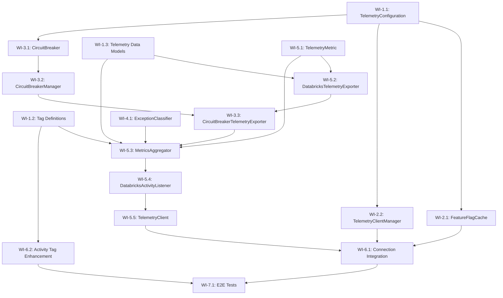

<!--
Copyright (c) 2025 ADBC Drivers Contributors

Licensed under the Apache License, Version 2.0 (the "License");
you may not use this file except in compliance with the License.
You may obtain a copy of the License at

        http://www.apache.org/licenses/LICENSE-2.0

Unless required by applicable law or agreed to in writing, software
distributed under the License is distributed on an "AS IS" BASIS,
WITHOUT WARRANTIES OR CONDITIONS OF ANY KIND, either express or implied.
See the License for the specific language governing permissions and
limitations under the License.
-->

# C# ADBC Driver: Telemetry Implementation Sprint Plan

## Overview

This document outlines the sprint plan for implementing Activity-based telemetry in the C# Databricks ADBC driver, as designed in `telemetry-design.md`. The implementation leverages the existing `TracingConnection` and `IActivityTracer` infrastructure.

## Current State Analysis

### Existing Infrastructure
- **TracingConnection base class**: Already provides `IActivityTracer` interface and `TraceActivity()` method
- **TracingDelegatingHandler**: W3C trace context propagation for HTTP requests
- **StatementExecutionConnection**: Uses `System.Diagnostics.Activity` and `ActivityEvent` for session lifecycle tracing
- **TelemetryTests.cs**: Basic test class exists, inherits from common test infrastructure

### What Needs to Be Built
All telemetry components from the design document need to be implemented from scratch:
- Feature flag cache and per-host management
- Telemetry client with circuit breaker
- Activity listener for metrics collection
- Metrics aggregator with statement-level aggregation
- Telemetry exporter for Databricks service

---

## Sprint Goal

Implement the core telemetry infrastructure including feature flag management, per-host client management, circuit breaker, and basic metrics collection/export for connection and statement events.

---

## Work Items

### Phase 1: Foundation - Configuration and Tag Definitions

#### WI-1.1: TelemetryConfiguration Class
**Description**: Create configuration model for telemetry settings.

**Status**: ✅ **COMPLETED**

**Location**: `csharp/src/Telemetry/TelemetryConfiguration.cs`

**Input**:
- Connection properties dictionary
- Environment variables

**Output**:
- Configuration object with all telemetry settings (enabled, batch size, flush interval, circuit breaker settings, etc.)

**Test Expectations**:

| Test Type | Test Name | Input | Expected Output |
|-----------|-----------|-------|-----------------|
| Unit | `TelemetryConfiguration_DefaultValues_AreCorrect` | No properties | Enabled=true, BatchSize=100, FlushIntervalMs=5000 |
| Unit | `TelemetryConfiguration_FromProperties_ParsesCorrectly` | `{"telemetry.enabled": "false", "telemetry.batch_size": "50"}` | Enabled=false, BatchSize=50 |
| Unit | `TelemetryConfiguration_InvalidProperty_UsesDefault` | `{"telemetry.batch_size": "invalid"}` | BatchSize=100 (default) |

**Implementation Notes**:
- Implemented with graceful degradation for invalid values (uses defaults instead of throwing exceptions)
- Supports priority order: Connection Properties > Environment Variables > Defaults
- All integer properties validated for positive/non-negative values
- Comprehensive test coverage with 24 unit tests covering:
  - Default values validation
  - Property parsing (boolean, int, TimeSpan)
  - Environment variable fallback and priority
  - Invalid value handling (graceful degradation)
  - Edge cases (zero, negative, large values)
- Test file location: `csharp/test/Unit/Telemetry/TelemetryConfigurationTests.cs`

**Key Design Decisions**:
1. **Graceful degradation**: Invalid property values use defaults rather than throwing exceptions to ensure telemetry failures don't impact driver operations
2. **Property naming**: Used `telemetry.*` prefix for connection properties and `DATABRICKS_TELEMETRY_*` for environment variables
3. **Non-negative vs Positive**: MaxRetries and RetryDelayMs allow zero (for disabling), while BatchSize, FlushIntervalMs, and CircuitBreakerThreshold require positive values

---

#### WI-1.2: Tag Definition System
**Description**: Create centralized tag definitions with export scope annotations.

**Status**: ✅ **COMPLETED**

**Location**: `csharp/src/Telemetry/TagDefinitions/`

**Files**:
- `TelemetryTag.cs` - Attribute and enums for export scope
- `TelemetryTagRegistry.cs` - Central registry
- `TelemetryEventType.cs` - Event type enum
- `ConnectionOpenEvent.cs` - Connection event tags
- `StatementExecutionEvent.cs` - Statement execution tags
- `ErrorEvent.cs` - Error event tags

**Input**:
- Tag name string
- Event type enum

**Output**:
- Boolean indicating if tag should be exported to Databricks
- Set of allowed tags for an event type

**Test Expectations**:

| Test Type | Test Name | Input | Expected Output |
|-----------|-----------|-------|-----------------|
| Unit | `TelemetryTagRegistry_GetDatabricksExportTags_ConnectionOpen_ReturnsCorrectTags` | EventType.ConnectionOpen | Set containing "workspace.id", "session.id", "driver.version", etc. |
| Unit | `TelemetryTagRegistry_ShouldExportToDatabricks_SensitiveTag_ReturnsFalse` | EventType.StatementExecution, "db.statement" | false |
| Unit | `TelemetryTagRegistry_ShouldExportToDatabricks_SafeTag_ReturnsTrue` | EventType.StatementExecution, "statement.id" | true |
| Unit | `ConnectionOpenEvent_GetDatabricksExportTags_ExcludesServerAddress` | N/A | Set does NOT contain "server.address" |

**Implementation Notes**:
- Used `HashSet<string>` instead of `IReadOnlySet<string>` for netstandard2.0 compatibility
- All tag definitions use the `[TelemetryTag]` attribute for metadata
- Sensitive tags (server.address, db.statement, error.stack_trace) are marked with `ExportScope = TagExportScope.ExportLocal`
- Comprehensive test coverage with 31 unit tests in `TelemetryTagRegistryTests.cs`
- Test file location: `csharp/test/Unit/Telemetry/TagDefinitions/TelemetryTagRegistryTests.cs`

**Key Design Decisions**:
1. **Flag-based enum**: `TagExportScope` uses `[Flags]` attribute to support combinations (ExportAll = ExportLocal | ExportDatabricks)
2. **Privacy by design**: Sensitive tags are explicitly marked as local-only and excluded from `GetDatabricksExportTags()`
3. **Static helper methods**: Each event class has `GetDatabricksExportTags()` to return the set of exportable tags
4. **Registry pattern**: `TelemetryTagRegistry.ShouldExportToDatabricks()` provides centralized filtering logic
5. **Unknown tags dropped**: Tags not in the registry are silently dropped for Databricks export (returns false)

---

#### WI-1.3: Telemetry Data Models
**Description**: Data model classes following JDBC driver format for compatibility with Databricks telemetry backend. Implements TelemetryRequest wrapper, TelemetryFrontendLog, TelemetryEvent, and all supporting types.

**Status**: ✅ **COMPLETED**

**Location**: `csharp/src/Telemetry/Models/`

**Files**:
- `TelemetryRequest.cs` - Top-level wrapper with uploadTime and protoLogs array
- `TelemetryFrontendLog.cs` - Frontend log event with workspace_id, frontend_log_event_id, context, entry
- `TelemetryEvent.cs` - SQL driver telemetry event with session_id, sql_statement_id, system_configuration, operation_latency_ms
- `FrontendLogContext.cs` - Context with client_context and timestamp_millis
- `FrontendLogEntry.cs` - Entry containing sql_driver_log
- `TelemetryClientContext.cs` - Client context with user_agent
- `DriverSystemConfiguration.cs` - System config (driver_name, driver_version, os_name, os_version, os_arch, runtime_name, runtime_version, locale, timezone)
- `DriverConnectionParameters.cs` - Connection params (cloud_fetch_enabled, lz4_compression_enabled, direct_results_enabled, max_download_threads, auth_type, transport_mode)
- `SqlExecutionEvent.cs` - Execution details (result_format, chunk_count, bytes_downloaded, compression_enabled, row_count, poll_count, poll_latency_ms, time_to_first_byte_ms, execution_status, statement_type, retry_performed, retry_count)
- `DriverErrorInfo.cs` - Error details (error_type, error_message, error_code, sql_state, http_status_code, is_terminal, retry_attempted)

**Input**:
- Telemetry data from driver operations

**Output**:
- JSON-serializable objects compatible with Databricks telemetry backend

**Test Expectations**:

| Test Type | Test Name | Input | Expected Output |
|-----------|-----------|-------|-----------------|
| Unit | `TelemetryRequest_Serialization_ProducesValidJson` | TelemetryRequest with uploadTime and protoLogs | Valid JSON with correct property names |
| Unit | `TelemetryRequest_ProtoLogs_ContainsSerializedStrings` | TelemetryRequest with serialized frontendLogs | protoLogs array contains JSON strings |
| Unit | `TelemetryFrontendLog_Serialization_MatchesJdbcFormat` | TelemetryFrontendLog with all fields | JSON with snake_case property names |
| Unit | `TelemetryEvent_Serialization_OmitsNullFields` | TelemetryEvent with some null fields | JSON without null properties |
| Unit | `TelemetryEvent_Contains_RequiredFields` | TelemetryEvent with required fields | JSON with session_id, sql_statement_id, system_configuration, operation_latency_ms |

**Implementation Notes**:
- Uses `System.Text.Json` with `[JsonPropertyName]` attributes for snake_case serialization
- Null fields are omitted using `[JsonIgnore(Condition = JsonIgnoreCondition.WhenWritingNull)]`
- Default values (e.g., 0 for OperationLatencyMs) are omitted using `[JsonIgnore(Condition = JsonIgnoreCondition.WhenWritingDefault)]`
- Comprehensive test coverage with 32 unit tests in `TelemetryRequestTests.cs`, `TelemetryFrontendLogTests.cs`, and `TelemetryEventTests.cs`
- Test file location: `csharp/test/Unit/Telemetry/Models/`

**Key Design Decisions**:
1. **JDBC Format Compatibility**: All JSON property names use snake_case to match the JDBC driver format
2. **Nested Structure**: TelemetryRequest → protoLogs (JSON strings) → TelemetryFrontendLog → entry → sql_driver_log → TelemetryEvent
3. **Null Omission**: Null fields are automatically omitted from serialization to reduce payload size
4. **Separation of Concerns**: Each model class has a single responsibility and clear documentation

---

### Phase 2: Per-Host Management

#### WI-2.1: FeatureFlagCache
**Description**: Singleton that caches feature flags per host with reference counting.

**Location**: `csharp/src/Telemetry/FeatureFlagCache.cs`

**Input**:
- Host string
- HttpClient for API calls

**Output**:
- Boolean indicating if telemetry is enabled for the host
- Reference counting for cleanup

**Test Expectations**:

| Test Type | Test Name | Input | Expected Output |
|-----------|-----------|-------|-----------------|
| Unit | `FeatureFlagCache_GetOrCreateContext_NewHost_CreatesContext` | "host1.databricks.com" | New context with RefCount=1 |
| Unit | `FeatureFlagCache_GetOrCreateContext_ExistingHost_IncrementsRefCount` | Same host twice | RefCount=2 for single context |
| Unit | `FeatureFlagCache_ReleaseContext_LastReference_RemovesContext` | Single reference, then release | Context removed from cache |
| Unit | `FeatureFlagCache_ReleaseContext_MultipleReferences_DecrementsOnly` | Two references, release one | RefCount=1, context still exists |
| Unit | `FeatureFlagCache_IsTelemetryEnabledAsync_CachedValue_DoesNotFetch` | Pre-cached enabled=true | Returns true without HTTP call |
| Unit | `FeatureFlagCache_IsTelemetryEnabledAsync_ExpiredCache_RefetchesValue` | Cached value older than 15 minutes | Makes HTTP call to refresh |
| Integration | `FeatureFlagCache_IsTelemetryEnabledAsync_FetchesFromServer` | Live Databricks host | Returns boolean from feature flag endpoint |

---

#### WI-2.2: TelemetryClientManager
**Description**: Singleton that manages one telemetry client per host with reference counting.

**Location**: `csharp/src/Telemetry/TelemetryClientManager.cs`

**Input**:
- Host string
- HttpClient
- TelemetryConfiguration

**Output**:
- Shared ITelemetryClient instance per host
- Reference counting for cleanup

**Test Expectations**:

| Test Type | Test Name | Input | Expected Output |
|-----------|-----------|-------|-----------------|
| Unit | `TelemetryClientManager_GetOrCreateClient_NewHost_CreatesClient` | "host1.databricks.com" | New client with RefCount=1 |
| Unit | `TelemetryClientManager_GetOrCreateClient_ExistingHost_ReturnsSameClient` | Same host twice | Same client instance, RefCount=2 |
| Unit | `TelemetryClientManager_ReleaseClientAsync_LastReference_ClosesClient` | Single reference, then release | Client.CloseAsync() called, removed from cache |
| Unit | `TelemetryClientManager_ReleaseClientAsync_MultipleReferences_KeepsClient` | Two references, release one | RefCount=1, client still active |
| Unit | `TelemetryClientManager_GetOrCreateClient_ThreadSafe_NoDuplicates` | Concurrent calls from 10 threads | Single client instance created |

---

### Phase 3: Circuit Breaker

#### WI-3.1: CircuitBreaker
**Description**: Implements circuit breaker pattern with three states (Closed, Open, Half-Open).

**Status**: ✅ **COMPLETED**

**Location**: `csharp/src/Telemetry/CircuitBreaker.cs`

**Input**:
- Async action to execute
- Circuit breaker configuration (failure threshold, timeout, success threshold)

**Output**:
- Execution result or CircuitBreakerOpenException
- State transitions logged at DEBUG level

**Test Expectations**:

| Test Type | Test Name | Input | Expected Output |
|-----------|-----------|-------|-----------------|
| Unit | `CircuitBreaker_Closed_SuccessfulExecution_StaysClosed` | Successful action | Executes action, state=Closed |
| Unit | `CircuitBreaker_Closed_FailuresBelowThreshold_StaysClosed` | 4 failures (threshold=5) | Executes actions, state=Closed |
| Unit | `CircuitBreaker_Closed_FailuresAtThreshold_TransitionsToOpen` | 5 failures (threshold=5) | state=Open |
| Unit | `CircuitBreaker_Open_RejectsRequests_ThrowsException` | Action when Open | CircuitBreakerOpenException |
| Unit | `CircuitBreaker_Open_AfterTimeout_TransitionsToHalfOpen` | Wait for timeout period | state=HalfOpen |
| Unit | `CircuitBreaker_HalfOpen_Success_TransitionsToClosed` | Successful action in HalfOpen | state=Closed |
| Unit | `CircuitBreaker_HalfOpen_Failure_TransitionsToOpen` | Failed action in HalfOpen | state=Open |

**Implementation Notes**:
- Created three files: `CircuitBreaker.cs`, `CircuitBreakerConfig.cs`, `CircuitBreakerOpenException.cs`
- Thread-safe state management using `Interlocked` operations and `Volatile` reads
- State stored as `int` for atomic compare-exchange operations
- Tracks consecutive failures in Closed state and consecutive successes in HalfOpen state
- Timeout-based transition from Open to HalfOpen checked on each execution attempt
- Default configuration: 5 failure threshold, 1 minute timeout, 2 success threshold
- `CircuitBreakerConfig.FromTelemetryConfiguration()` for integration with TelemetryConfiguration
- Comprehensive test coverage with 29 unit tests including thread safety tests
- Test file location: `csharp/test/Unit/Telemetry/CircuitBreakerTests.cs`

**Key Design Decisions**:
1. **State as int**: Used `int` type for state to enable atomic `Interlocked.CompareExchange` operations
2. **Opened timestamp**: Stores `DateTime.UtcNow.Ticks` as `long` for atomic operations
3. **HalfOpen re-entry**: Multiple concurrent requests can enter HalfOpen after timeout, allowing parallel recovery testing
4. **Exception propagation**: Exceptions from user actions are re-thrown after state tracking
5. **Reset method**: Internal method for testing to reset circuit breaker state

---

#### WI-3.2: CircuitBreakerManager
**Description**: Singleton that manages circuit breakers per host.

**Status**: ✅ **COMPLETED**

**Location**: `csharp/src/Telemetry/CircuitBreakerManager.cs`

**Input**:
- Host string

**Output**:
- CircuitBreaker instance for the host

**Test Expectations**:

| Test Type | Test Name | Input | Expected Output |
|-----------|-----------|-------|-----------------|
| Unit | `CircuitBreakerManager_GetCircuitBreaker_NewHost_CreatesBreaker` | "host1.databricks.com" | New CircuitBreaker instance |
| Unit | `CircuitBreakerManager_GetCircuitBreaker_SameHost_ReturnsSameBreaker` | Same host twice | Same CircuitBreaker instance |
| Unit | `CircuitBreakerManager_GetCircuitBreaker_DifferentHosts_CreatesSeparateBreakers` | "host1", "host2" | Different CircuitBreaker instances |

**Implementation Notes**:
- Singleton pattern using `private static readonly` instance with `GetInstance()` method
- Uses `ConcurrentDictionary<string, CircuitBreaker>` with `StringComparer.OrdinalIgnoreCase` for case-insensitive host matching
- `GetOrAdd` ensures thread-safe atomic creation of circuit breakers
- Two overloads for `GetCircuitBreaker`: default config and custom config (failureThreshold + timeout)
- `RemoveCircuitBreaker(host)` for cleanup when last connection to a host is closed
- `Reset()` internal method for test isolation
- Input validation: throws `ArgumentNullException` for null, `ArgumentException` for empty/whitespace hosts
- Comprehensive test coverage with 23 unit tests including:
  - Singleton verification
  - Same host returns same instance (including case-insensitive)
  - Different hosts get separate instances with independent state
  - Thread safety with 10 concurrent threads for same host
  - Thread safety with 20 concurrent threads for different hosts
  - Mixed concurrent access (50 threads, 5 hosts, 10 threads per host)
  - Input validation, remove, and reset operations
- Test file location: `csharp/test/Unit/Telemetry/CircuitBreakerManagerTests.cs`

**Key Design Decisions**:
1. **Case-insensitive host matching**: Uses `StringComparer.OrdinalIgnoreCase` since DNS hostnames are case-insensitive
2. **Lazy creation**: Circuit breakers are created on first access via `GetOrAdd`, not pre-allocated
3. **Config-ignored on existing**: When a breaker already exists for a host, the config overload returns the existing instance (config parameters are ignored)
4. **Polly-backed**: Each circuit breaker uses the existing Polly-based `CircuitBreaker` class
5. **No reference counting**: Unlike `TelemetryClientManager`, the circuit breaker manager uses simple add/remove since circuit breakers are lightweight stateless-ish objects

---

#### WI-3.3: CircuitBreakerTelemetryExporter
**Description**: Wrapper that protects telemetry exporter with circuit breaker.

**Location**: `csharp/src/Telemetry/CircuitBreakerTelemetryExporter.cs`

**Input**:
- Host string
- Inner ITelemetryExporter

**Output**:
- Exports metrics when circuit is closed
- Drops metrics when circuit is open (logged at DEBUG)

**Test Expectations**:

| Test Type | Test Name | Input | Expected Output |
|-----------|-----------|-------|-----------------|
| Unit | `CircuitBreakerTelemetryExporter_CircuitClosed_ExportsMetrics` | Metrics list, circuit closed | Inner exporter called |
| Unit | `CircuitBreakerTelemetryExporter_CircuitOpen_DropsMetrics` | Metrics list, circuit open | No export, no exception |
| Unit | `CircuitBreakerTelemetryExporter_InnerExporterFails_CircuitBreakerTracksFailure` | Inner exporter throws | Circuit breaker failure count incremented |

---

### Phase 4: Exception Handling

#### WI-4.1: ExceptionClassifier
**Description**: Classifies exceptions as terminal or retryable.

**Status**: ✅ **COMPLETED**

**Location**: `csharp/src/Telemetry/ExceptionClassifier.cs`

**Input**:
- Exception instance

**Output**:
- Boolean indicating if exception is terminal (should flush immediately)

**Test Expectations**:

| Test Type | Test Name | Input | Expected Output |
|-----------|-----------|-------|-----------------|
| Unit | `ExceptionClassifier_IsTerminalException_401_ReturnsTrue` | HttpRequestException with 401 | true |
| Unit | `ExceptionClassifier_IsTerminalException_403_ReturnsTrue` | HttpRequestException with 403 | true |
| Unit | `ExceptionClassifier_IsTerminalException_400_ReturnsTrue` | HttpRequestException with 400 | true |
| Unit | `ExceptionClassifier_IsTerminalException_404_ReturnsTrue` | HttpRequestException with 404 | true |
| Unit | `ExceptionClassifier_IsTerminalException_AuthException_ReturnsTrue` | AuthenticationException | true |
| Unit | `ExceptionClassifier_IsTerminalException_429_ReturnsFalse` | HttpRequestException with 429 | false |
| Unit | `ExceptionClassifier_IsTerminalException_503_ReturnsFalse` | HttpRequestException with 503 | false |
| Unit | `ExceptionClassifier_IsTerminalException_500_ReturnsFalse` | HttpRequestException with 500 | false |
| Unit | `ExceptionClassifier_IsTerminalException_Timeout_ReturnsFalse` | TaskCanceledException (timeout) | false |
| Unit | `ExceptionClassifier_IsTerminalException_NetworkError_ReturnsFalse` | SocketException | false |

**Implementation Notes**:
- Static class with single `IsTerminalException(Exception?)` method
- Terminal exceptions: HTTP 400, 401, 403, 404, `AuthenticationException`, `UnauthorizedAccessException`
- Retryable exceptions: HTTP 429, 500, 502, 503, 504, `TimeoutException`, network errors
- Safe default: Returns `false` for null or unknown exceptions
- Handles wrapped `HttpRequestException` in `InnerException` by recursively checking inner exceptions
- Supports both .NET 5+ (using `HttpRequestException.StatusCode`) and older frameworks (parsing status code from message)
- Comprehensive test coverage with 28 unit tests in `ExceptionClassifierTests.cs`
- Test file location: `csharp/test/Unit/Telemetry/ExceptionClassifierTests.cs`

**Key Design Decisions**:
1. **Safe default**: Returns `false` (retryable) for unknown exceptions to avoid flushing unnecessarily
2. **Recursive inner exception check**: Handles wrapped exceptions by checking `InnerException`
3. **Cross-framework compatibility**: Uses conditional compilation (`#if NET5_0_OR_GREATER`) for status code extraction
4. **Message-based fallback**: For older .NET frameworks, parses status code from exception message

---

### Phase 5: Core Telemetry Components

#### WI-5.1: TelemetryMetric Data Model
**Description**: Data model for aggregated telemetry metrics.

**Location**: `csharp/src/Telemetry/TelemetryMetric.cs`

**Fields**:
- MetricType (connection, statement, error)
- Timestamp, WorkspaceId
- SessionId, StatementId
- ExecutionLatencyMs, ResultFormat, ChunkCount, TotalBytesDownloaded, PollCount
- DriverConfiguration

**Test Expectations**:

| Test Type | Test Name | Input | Expected Output |
|-----------|-----------|-------|-----------------|
| Unit | `TelemetryMetric_Serialization_ProducesValidJson` | Populated metric | Valid JSON matching Databricks schema |
| Unit | `TelemetryMetric_Serialization_OmitsNullFields` | Metric with null optional fields | JSON without null fields |

---

#### WI-5.2: DatabricksTelemetryExporter
**Description**: Exports metrics to Databricks telemetry service via HTTP POST.

**Location**: `csharp/src/Telemetry/DatabricksTelemetryExporter.cs`

**Input**:
- List of TelemetryMetric
- HttpClient
- TelemetryConfiguration

**Output**:
- HTTP POST to `/telemetry-ext` (authenticated) or `/telemetry-unauth` (unauthenticated)
- Retry logic for transient failures

**Test Expectations**:

| Test Type | Test Name | Input | Expected Output |
|-----------|-----------|-------|-----------------|
| Unit | `DatabricksTelemetryExporter_ExportAsync_Authenticated_UsesCorrectEndpoint` | Metrics, authenticated client | POST to /telemetry-ext |
| Unit | `DatabricksTelemetryExporter_ExportAsync_Unauthenticated_UsesCorrectEndpoint` | Metrics, unauthenticated client | POST to /telemetry-unauth |
| Unit | `DatabricksTelemetryExporter_ExportAsync_Success_ReturnsWithoutError` | Valid metrics, 200 response | Completes without exception |
| Unit | `DatabricksTelemetryExporter_ExportAsync_TransientFailure_Retries` | 503 then 200 | Retries and succeeds |
| Unit | `DatabricksTelemetryExporter_ExportAsync_MaxRetries_DoesNotThrow` | Continuous 503 | Completes without exception (swallowed) |
| Integration | `DatabricksTelemetryExporter_ExportAsync_RealEndpoint_Succeeds` | Live Databricks endpoint | Successfully exports |

---

#### WI-5.3: MetricsAggregator
**Description**: Aggregates Activity data by statement_id, handles exception buffering.

**Location**: `csharp/src/Telemetry/MetricsAggregator.cs`

**Input**:
- Activity instances from ActivityListener
- ITelemetryExporter for flushing

**Output**:
- Aggregated TelemetryMetric per statement
- Batched flush on threshold or interval

**Test Expectations**:

| Test Type | Test Name | Input | Expected Output |
|-----------|-----------|-------|-----------------|
| Unit | `MetricsAggregator_ProcessActivity_ConnectionOpen_EmitsImmediately` | Connection.Open activity | Metric queued for export |
| Unit | `MetricsAggregator_ProcessActivity_Statement_AggregatesByStatementId` | Multiple activities with same statement_id | Single aggregated metric |
| Unit | `MetricsAggregator_CompleteStatement_EmitsAggregatedMetric` | Call CompleteStatement() | Queues aggregated metric |
| Unit | `MetricsAggregator_FlushAsync_BatchSizeReached_ExportsMetrics` | 100 metrics (batch size) | Calls exporter |
| Unit | `MetricsAggregator_FlushAsync_TimeInterval_ExportsMetrics` | Wait 5 seconds | Calls exporter |
| Unit | `MetricsAggregator_RecordException_Terminal_FlushesImmediately` | Terminal exception | Immediately exports error metric |
| Unit | `MetricsAggregator_RecordException_Retryable_BuffersUntilComplete` | Retryable exception | Buffers, exports on CompleteStatement |
| Unit | `MetricsAggregator_ProcessActivity_ExceptionSwallowed_NoThrow` | Activity processing throws | No exception propagated |
| Unit | `MetricsAggregator_ProcessActivity_FiltersTags_UsingRegistry` | Activity with sensitive tags | Only safe tags in metric |

---

#### WI-5.4: DatabricksActivityListener
**Description**: Listens to Activity events and delegates to MetricsAggregator.

**Location**: `csharp/src/Telemetry/DatabricksActivityListener.cs`

**Input**:
- Host string
- ITelemetryClient
- TelemetryConfiguration

**Output**:
- Metrics collected from driver activities
- All exceptions swallowed

**Test Expectations**:

| Test Type | Test Name | Input | Expected Output |
|-----------|-----------|-------|-----------------|
| Unit | `DatabricksActivityListener_Start_ListensToDatabricksActivitySource` | N/A | ShouldListenTo returns true for "Databricks.Adbc.Driver" |
| Unit | `DatabricksActivityListener_ActivityStopped_ProcessesActivity` | Activity stops | MetricsAggregator.ProcessActivity called |
| Unit | `DatabricksActivityListener_ActivityStopped_ExceptionSwallowed` | Aggregator throws | No exception propagated |
| Unit | `DatabricksActivityListener_Sample_FeatureFlagDisabled_ReturnsNone` | Config.Enabled=false | ActivitySamplingResult.None |
| Unit | `DatabricksActivityListener_Sample_FeatureFlagEnabled_ReturnsAllData` | Config.Enabled=true | ActivitySamplingResult.AllDataAndRecorded |
| Unit | `DatabricksActivityListener_StopAsync_FlushesAndDisposes` | N/A | Aggregator.FlushAsync called, resources disposed |

---

#### WI-5.5: TelemetryClient
**Description**: Main telemetry client that coordinates listener, aggregator, and exporter.

**Location**: `csharp/src/Telemetry/TelemetryClient.cs`

**Input**:
- Host string
- HttpClient
- TelemetryConfiguration

**Output**:
- Coordinated telemetry lifecycle (start, export, close)

**Test Expectations**:

| Test Type | Test Name | Input | Expected Output |
|-----------|-----------|-------|-----------------|
| Unit | `TelemetryClient_Constructor_InitializesComponents` | Valid config | Listener, aggregator, exporter created |
| Unit | `TelemetryClient_ExportAsync_DelegatesToExporter` | Metrics list | CircuitBreakerTelemetryExporter.ExportAsync called |
| Unit | `TelemetryClient_CloseAsync_FlushesAndCancels` | N/A | Pending metrics flushed, background task cancelled |
| Unit | `TelemetryClient_CloseAsync_ExceptionSwallowed` | Flush throws | No exception propagated |

---

### Phase 6: Integration

#### WI-6.1: DatabricksConnection Telemetry Integration
**Description**: Integrate telemetry components into connection lifecycle.

**Location**: Modify `csharp/src/DatabricksConnection.cs`

**Changes**:
- Initialize telemetry in `OpenAsync()` after feature flag check
- Release telemetry resources in `Dispose()`
- Add telemetry tags to existing activities

**Test Expectations**:

| Test Type | Test Name | Input | Expected Output |
|-----------|-----------|-------|-----------------|
| Integration | `DatabricksConnection_OpenAsync_InitializesTelemetry` | Connection with telemetry enabled | TelemetryClientManager.GetOrCreateClient called |
| Integration | `DatabricksConnection_OpenAsync_FeatureFlagDisabled_NoTelemetry` | Feature flag returns false | No telemetry client created |
| Integration | `DatabricksConnection_Dispose_ReleasesTelemetryClient` | Connection dispose | TelemetryClientManager.ReleaseClientAsync called |
| Integration | `DatabricksConnection_Dispose_FlushesMetricsBeforeRelease` | Connection with pending metrics | Metrics flushed before client release |

---

#### WI-6.2: Activity Tag Enhancement
**Description**: Add telemetry-specific tags to existing driver activities.

**Location**: Modify various files in `csharp/src/`

**Changes**:
- Add `result.format`, `result.chunk_count`, `result.bytes_downloaded` to statement activities
- Add `poll.count`, `poll.latency_ms` to statement activities
- Add `driver.version`, `driver.os`, `driver.runtime` to connection activities
- Add `feature.cloudfetch`, `feature.lz4` to connection activities

**Test Expectations**:

| Test Type | Test Name | Input | Expected Output |
|-----------|-----------|-------|-----------------|
| Unit | `StatementActivity_HasResultFormatTag` | Execute query with CloudFetch | Activity has "result.format"="cloudfetch" tag |
| Unit | `StatementActivity_HasChunkCountTag` | Execute query with 5 chunks | Activity has "result.chunk_count"=5 tag |
| Unit | `ConnectionActivity_HasDriverVersionTag` | Open connection | Activity has "driver.version" tag |
| Unit | `ConnectionActivity_HasFeatureFlagsTag` | Open connection with CloudFetch | Activity has "feature.cloudfetch"=true tag |

---

### Phase 7: End-to-End Testing

#### WI-7.1: E2E Telemetry Tests
**Description**: Comprehensive end-to-end tests for telemetry flow.

**Location**: `csharp/test/E2E/TelemetryTests.cs`

**Test Expectations**:

| Test Type | Test Name | Input | Expected Output |
|-----------|-----------|-------|-----------------|
| E2E | `Telemetry_Connection_ExportsConnectionEvent` | Open connection to Databricks | Connection event exported to telemetry service |
| E2E | `Telemetry_Statement_ExportsStatementEvent` | Execute SELECT 1 | Statement event exported with execution latency |
| E2E | `Telemetry_CloudFetch_ExportsChunkMetrics` | Execute large query | Statement event includes chunk_count, bytes_downloaded |
| E2E | `Telemetry_Error_ExportsErrorEvent` | Execute invalid SQL | Error event exported with error.type |
| E2E | `Telemetry_FeatureFlagDisabled_NoExport` | Server feature flag off | No telemetry events exported |
| E2E | `Telemetry_MultipleConnections_SameHost_SharesClient` | Open 3 connections to same host | Single telemetry client used |
| E2E | `Telemetry_CircuitBreaker_StopsExportingOnFailure` | Telemetry endpoint unavailable | After threshold failures, events dropped |
| E2E | `Telemetry_GracefulShutdown_FlushesBeforeClose` | Close connection with pending events | All events flushed before connection closes |

---

## Implementation Dependencies



## File Structure

```
csharp/src/
├── Telemetry/
│   ├── TelemetryConfiguration.cs
│   ├── TelemetryClient.cs
│   ├── TelemetryMetric.cs
│   ├── ITelemetryClient.cs
│   ├── ITelemetryExporter.cs
│   │
│   ├── TagDefinitions/
│   │   ├── TelemetryTag.cs
│   │   ├── TelemetryTagRegistry.cs
│   │   ├── TelemetryEventType.cs
│   │   ├── ConnectionOpenEvent.cs
│   │   ├── StatementExecutionEvent.cs
│   │   └── ErrorEvent.cs
│   │
│   ├── Models/
│   │   ├── TelemetryRequest.cs
│   │   ├── TelemetryFrontendLog.cs
│   │   ├── TelemetryEvent.cs
│   │   ├── FrontendLogContext.cs
│   │   ├── FrontendLogEntry.cs
│   │   ├── TelemetryClientContext.cs
│   │   ├── DriverSystemConfiguration.cs
│   │   ├── DriverConnectionParameters.cs
│   │   ├── SqlExecutionEvent.cs
│   │   └── DriverErrorInfo.cs
│   │
│   ├── FeatureFlagCache.cs
│   ├── FeatureFlagContext.cs
│   │
│   ├── TelemetryClientManager.cs
│   ├── TelemetryClientHolder.cs
│   │
│   ├── CircuitBreaker.cs
│   ├── CircuitBreakerConfig.cs
│   ├── CircuitBreakerManager.cs
│   ├── CircuitBreakerTelemetryExporter.cs
│   │
│   ├── ExceptionClassifier.cs
│   │
│   ├── DatabricksActivityListener.cs
│   ├── MetricsAggregator.cs
│   └── DatabricksTelemetryExporter.cs

csharp/test/
├── Telemetry/
│   ├── TelemetryConfigurationTests.cs
│   ├── TagDefinitions/
│   │   └── TelemetryTagRegistryTests.cs
│   ├── Models/
│   │   ├── TelemetryRequestTests.cs
│   │   ├── TelemetryFrontendLogTests.cs
│   │   └── TelemetryEventTests.cs
│   ├── FeatureFlagCacheTests.cs
│   ├── TelemetryClientManagerTests.cs
│   ├── CircuitBreakerTests.cs
│   ├── CircuitBreakerManagerTests.cs
│   ├── ExceptionClassifierTests.cs
│   ├── TelemetryMetricTests.cs
│   ├── DatabricksTelemetryExporterTests.cs
│   ├── MetricsAggregatorTests.cs
│   └── DatabricksActivityListenerTests.cs
└── E2E/
    └── TelemetryTests.cs (enhanced)
```

## Test Coverage Goals

| Component | Unit Test Coverage Target | Integration/E2E Coverage Target |
|-----------|---------------------------|--------------------------------|
| TelemetryConfiguration | > 90% | N/A |
| Tag Definitions | 100% | N/A |
| Telemetry Data Models | > 90% | N/A |
| FeatureFlagCache | > 90% | > 80% |
| TelemetryClientManager | > 90% | > 80% |
| CircuitBreaker | > 90% | > 80% |
| ExceptionClassifier | 100% | N/A |
| MetricsAggregator | > 90% | > 80% |
| DatabricksActivityListener | > 90% | > 80% |
| DatabricksTelemetryExporter | > 90% | > 80% |
| Connection Integration | N/A | > 80% |

## Risk Mitigation

### Risk 1: Feature Flag Endpoint Not Available
**Mitigation**: Default to telemetry disabled if feature flag check fails. Log at TRACE level only.

### Risk 2: Telemetry Endpoint Rate Limiting
**Mitigation**: Circuit breaker with per-host isolation prevents cascading failures. Dropped events logged at DEBUG level.

### Risk 3: Memory Pressure from Buffered Metrics
**Mitigation**: Bounded buffer size, aggressive flushing on connection close, configurable batch size.

### Risk 4: Thread Safety Issues
**Mitigation**: Use ConcurrentDictionary for all shared state, atomic reference counting operations, comprehensive thread safety unit tests.

## Success Criteria

1. All unit tests pass with > 90% code coverage
2. All integration tests pass against live Databricks environment
3. Performance overhead < 1% on query execution
4. Zero exceptions propagated to driver operations
5. Telemetry events successfully exported to Databricks service
6. Circuit breaker correctly isolates failing endpoints
7. Graceful shutdown flushes all pending metrics

---

## References

- [telemetry-design.md](./telemetry-design.md) - Detailed design document
- [JDBC TelemetryClient.java](https://github.com/databricks/databricks-jdbc) - Reference implementation
- [.NET Activity API](https://learn.microsoft.com/en-us/dotnet/core/diagnostics/distributed-tracing)
