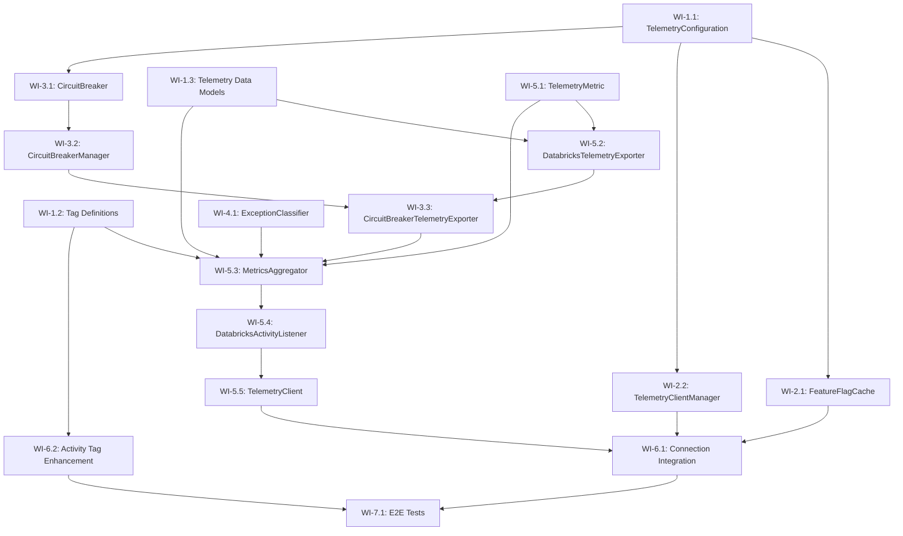

<!--
Copyright (c) 2025 ADBC Drivers Contributors

Licensed under the Apache License, Version 2.0 (the "License");
you may not use this file except in compliance with the License.
You may obtain a copy of the License at

        http://www.apache.org/licenses/LICENSE-2.0

Unless required by applicable law or agreed to in writing, software
distributed under the License is distributed on an "AS IS" BASIS,
WITHOUT WARRANTIES OR CONDITIONS OF ANY KIND, either express or implied.
See the License for the specific language governing permissions and
limitations under the License.
-->

# C# ADBC Driver: Telemetry Implementation Sprint Plan

## Overview

This document outlines the sprint plan for implementing Activity-based telemetry in the C# Databricks ADBC driver, as designed in `telemetry-design.md`. The implementation leverages the existing `TracingConnection` and `IActivityTracer` infrastructure.

## Current State Analysis

### Existing Infrastructure
- **TracingConnection base class**: Already provides `IActivityTracer` interface and `TraceActivity()` method
- **TracingDelegatingHandler**: W3C trace context propagation for HTTP requests
- **StatementExecutionConnection**: Uses `System.Diagnostics.Activity` and `ActivityEvent` for session lifecycle tracing
- **TelemetryTests.cs**: Basic test class exists, inherits from common test infrastructure

### What Needs to Be Built
All telemetry components from the design document need to be implemented from scratch:
- Feature flag cache and per-host management
- Telemetry client with circuit breaker
- Activity listener for metrics collection
- Metrics aggregator with statement-level aggregation
- Telemetry exporter for Databricks service

---

## Sprint Goal

Implement the core telemetry infrastructure including feature flag management, per-host client management, circuit breaker, and basic metrics collection/export for connection and statement events.

---

## Work Items

### Phase 1: Foundation - Configuration and Tag Definitions

#### WI-1.1: TelemetryConfiguration Class
**Description**: Create configuration model for telemetry settings.

**Status**: ✅ **COMPLETED**

**Location**: `csharp/src/Telemetry/TelemetryConfiguration.cs`

**Input**:
- Connection properties dictionary
- Environment variables

**Output**:
- Configuration object with all telemetry settings (enabled, batch size, flush interval, circuit breaker settings, etc.)

**Test Expectations**:

| Test Type | Test Name | Input | Expected Output |
|-----------|-----------|-------|-----------------|
| Unit | `TelemetryConfiguration_DefaultValues_AreCorrect` | No properties | Enabled=true, BatchSize=100, FlushIntervalMs=5000 |
| Unit | `TelemetryConfiguration_FromProperties_ParsesCorrectly` | `{"telemetry.enabled": "false", "telemetry.batch_size": "50"}` | Enabled=false, BatchSize=50 |
| Unit | `TelemetryConfiguration_InvalidProperty_UsesDefault` | `{"telemetry.batch_size": "invalid"}` | BatchSize=100 (default) |

**Implementation Notes**:
- Implemented with graceful degradation for invalid values (uses defaults instead of throwing exceptions)
- Supports priority order: Connection Properties > Environment Variables > Defaults
- All integer properties validated for positive/non-negative values
- Comprehensive test coverage with 24 unit tests covering:
  - Default values validation
  - Property parsing (boolean, int, TimeSpan)
  - Environment variable fallback and priority
  - Invalid value handling (graceful degradation)
  - Edge cases (zero, negative, large values)
- Test file location: `csharp/test/Unit/Telemetry/TelemetryConfigurationTests.cs`

**Key Design Decisions**:
1. **Graceful degradation**: Invalid property values use defaults rather than throwing exceptions to ensure telemetry failures don't impact driver operations
2. **Property naming**: Used `telemetry.*` prefix for connection properties and `DATABRICKS_TELEMETRY_*` for environment variables
3. **Non-negative vs Positive**: MaxRetries and RetryDelayMs allow zero (for disabling), while BatchSize, FlushIntervalMs, and CircuitBreakerThreshold require positive values

---

#### WI-1.2: Tag Definition System
**Description**: Create centralized tag definitions with export scope annotations.

**Status**: ✅ **COMPLETED**

**Location**: `csharp/src/Telemetry/TagDefinitions/`

**Files**:
- `TelemetryTag.cs` - Attribute and enums for export scope
- `TelemetryTagRegistry.cs` - Central registry
- `TelemetryEventType.cs` - Event type enum
- `ConnectionOpenEvent.cs` - Connection event tags
- `StatementExecutionEvent.cs` - Statement execution tags
- `ErrorEvent.cs` - Error event tags

**Input**:
- Tag name string
- Event type enum

**Output**:
- Boolean indicating if tag should be exported to Databricks
- Set of allowed tags for an event type

**Test Expectations**:

| Test Type | Test Name | Input | Expected Output |
|-----------|-----------|-------|-----------------|
| Unit | `TelemetryTagRegistry_GetDatabricksExportTags_ConnectionOpen_ReturnsCorrectTags` | EventType.ConnectionOpen | Set containing "workspace.id", "session.id", "driver.version", etc. |
| Unit | `TelemetryTagRegistry_ShouldExportToDatabricks_SensitiveTag_ReturnsFalse` | EventType.StatementExecution, "db.statement" | false |
| Unit | `TelemetryTagRegistry_ShouldExportToDatabricks_SafeTag_ReturnsTrue` | EventType.StatementExecution, "statement.id" | true |
| Unit | `ConnectionOpenEvent_GetDatabricksExportTags_ExcludesServerAddress` | N/A | Set does NOT contain "server.address" |

**Implementation Notes**:
- Used `HashSet<string>` instead of `IReadOnlySet<string>` for netstandard2.0 compatibility
- All tag definitions use the `[TelemetryTag]` attribute for metadata
- Sensitive tags (server.address, db.statement, error.stack_trace) are marked with `ExportScope = TagExportScope.ExportLocal`
- Comprehensive test coverage with 31 unit tests in `TelemetryTagRegistryTests.cs`
- Test file location: `csharp/test/Unit/Telemetry/TagDefinitions/TelemetryTagRegistryTests.cs`

**Key Design Decisions**:
1. **Flag-based enum**: `TagExportScope` uses `[Flags]` attribute to support combinations (ExportAll = ExportLocal | ExportDatabricks)
2. **Privacy by design**: Sensitive tags are explicitly marked as local-only and excluded from `GetDatabricksExportTags()`
3. **Static helper methods**: Each event class has `GetDatabricksExportTags()` to return the set of exportable tags
4. **Registry pattern**: `TelemetryTagRegistry.ShouldExportToDatabricks()` provides centralized filtering logic
5. **Unknown tags dropped**: Tags not in the registry are silently dropped for Databricks export (returns false)

---

#### WI-1.3: Telemetry Data Models
**Description**: Data model classes following JDBC driver format for compatibility with Databricks telemetry backend. Implements TelemetryRequest wrapper, TelemetryFrontendLog, TelemetryEvent, and all supporting types.

**Status**: ✅ **COMPLETED**

**Location**: `csharp/src/Telemetry/Models/`

**Files**:
- `TelemetryRequest.cs` - Top-level wrapper with uploadTime and protoLogs array
- `TelemetryFrontendLog.cs` - Frontend log event with workspace_id, frontend_log_event_id, context, entry
- `TelemetryEvent.cs` - SQL driver telemetry event with session_id, sql_statement_id, system_configuration, operation_latency_ms
- `FrontendLogContext.cs` - Context with client_context and timestamp_millis
- `FrontendLogEntry.cs` - Entry containing sql_driver_log
- `TelemetryClientContext.cs` - Client context with user_agent
- `DriverSystemConfiguration.cs` - System config (driver_name, driver_version, os_name, os_version, os_arch, runtime_name, runtime_version, locale, timezone)
- `DriverConnectionParameters.cs` - Connection params (cloud_fetch_enabled, lz4_compression_enabled, direct_results_enabled, max_download_threads, auth_type, transport_mode)
- `SqlExecutionEvent.cs` - Execution details (result_format, chunk_count, bytes_downloaded, compression_enabled, row_count, poll_count, poll_latency_ms, time_to_first_byte_ms, execution_status, statement_type, retry_performed, retry_count)
- `DriverErrorInfo.cs` - Error details (error_type, error_message, error_code, sql_state, http_status_code, is_terminal, retry_attempted)

**Input**:
- Telemetry data from driver operations

**Output**:
- JSON-serializable objects compatible with Databricks telemetry backend

**Test Expectations**:

| Test Type | Test Name | Input | Expected Output |
|-----------|-----------|-------|-----------------|
| Unit | `TelemetryRequest_Serialization_ProducesValidJson` | TelemetryRequest with uploadTime and protoLogs | Valid JSON with correct property names |
| Unit | `TelemetryRequest_ProtoLogs_ContainsSerializedStrings` | TelemetryRequest with serialized frontendLogs | protoLogs array contains JSON strings |
| Unit | `TelemetryFrontendLog_Serialization_MatchesJdbcFormat` | TelemetryFrontendLog with all fields | JSON with snake_case property names |
| Unit | `TelemetryEvent_Serialization_OmitsNullFields` | TelemetryEvent with some null fields | JSON without null properties |
| Unit | `TelemetryEvent_Contains_RequiredFields` | TelemetryEvent with required fields | JSON with session_id, sql_statement_id, system_configuration, operation_latency_ms |

**Implementation Notes**:
- Uses `System.Text.Json` with `[JsonPropertyName]` attributes for snake_case serialization
- Null fields are omitted using `[JsonIgnore(Condition = JsonIgnoreCondition.WhenWritingNull)]`
- Default values (e.g., 0 for OperationLatencyMs) are omitted using `[JsonIgnore(Condition = JsonIgnoreCondition.WhenWritingDefault)]`
- Comprehensive test coverage with 32 unit tests in `TelemetryRequestTests.cs`, `TelemetryFrontendLogTests.cs`, and `TelemetryEventTests.cs`
- Test file location: `csharp/test/Unit/Telemetry/Models/`

**Key Design Decisions**:
1. **JDBC Format Compatibility**: All JSON property names use snake_case to match the JDBC driver format
2. **Nested Structure**: TelemetryRequest → protoLogs (JSON strings) → TelemetryFrontendLog → entry → sql_driver_log → TelemetryEvent
3. **Null Omission**: Null fields are automatically omitted from serialization to reduce payload size
4. **Separation of Concerns**: Each model class has a single responsibility and clear documentation

---

### Phase 2: Per-Host Management

#### WI-2.1: FeatureFlagCache
**Description**: Singleton that caches feature flags per host with reference counting.

**Location**: `csharp/src/Telemetry/FeatureFlagCache.cs`

**Input**:
- Host string
- HttpClient for API calls

**Output**:
- Boolean indicating if telemetry is enabled for the host
- Reference counting for cleanup

**Test Expectations**:

| Test Type | Test Name | Input | Expected Output |
|-----------|-----------|-------|-----------------|
| Unit | `FeatureFlagCache_GetOrCreateContext_NewHost_CreatesContext` | "host1.databricks.com" | New context with RefCount=1 |
| Unit | `FeatureFlagCache_GetOrCreateContext_ExistingHost_IncrementsRefCount` | Same host twice | RefCount=2 for single context |
| Unit | `FeatureFlagCache_ReleaseContext_LastReference_RemovesContext` | Single reference, then release | Context removed from cache |
| Unit | `FeatureFlagCache_ReleaseContext_MultipleReferences_DecrementsOnly` | Two references, release one | RefCount=1, context still exists |
| Unit | `FeatureFlagCache_IsTelemetryEnabledAsync_CachedValue_DoesNotFetch` | Pre-cached enabled=true | Returns true without HTTP call |
| Unit | `FeatureFlagCache_IsTelemetryEnabledAsync_ExpiredCache_RefetchesValue` | Cached value older than 15 minutes | Makes HTTP call to refresh |
| Integration | `FeatureFlagCache_IsTelemetryEnabledAsync_FetchesFromServer` | Live Databricks host | Returns boolean from feature flag endpoint |

---

#### WI-2.2: TelemetryClientManager ✅ COMPLETED
**Description**: Singleton that manages one telemetry client per host with reference counting.

**Location**: `csharp/src/Telemetry/TelemetryClientManager.cs`, `csharp/src/Telemetry/TelemetryClientHolder.cs`

**Input**:
- Host string
- `Func<ITelemetryExporter>` exporter factory (changed from HttpClient to align with TelemetryClient constructor)
- TelemetryConfiguration

**Output**:
- Shared ITelemetryClient instance per host
- Reference counting for cleanup

**Implementation Notes**:
- Signature changed from `GetOrCreateClient(host, HttpClient, config)` to `GetOrCreateClient(host, Func<ITelemetryExporter> exporterFactory, config)` since `TelemetryClient` takes `ITelemetryExporter`, not `HttpClient`. The factory pattern defers exporter creation to first-access.
- Uses `ConcurrentDictionary.AddOrUpdate` with `Interlocked.Increment` for thread-safe ref counting.
- `UseTestInstance()` returns `IDisposable` that restores original singleton on dispose. `CreateForTesting()` creates isolated instances.
- Case-insensitive host matching via `StringComparer.OrdinalIgnoreCase` (consistent with `CircuitBreakerManager`).
- `Reset()` calls `CloseAsync()` on all clients during cleanup.

**Test Expectations**:

| Test Type | Test Name | Input | Expected Output |
|-----------|-----------|-------|-----------------|
| Unit | `GetOrCreateClient_NewHost_CreatesClient` | "host1.databricks.com" | New client with RefCount=1 |
| Unit | `GetOrCreateClient_ExistingHost_ReturnsSameClient` | Same host twice | Same client instance, RefCount=2 |
| Unit | `ReleaseClientAsync_LastReference_ClosesClient` | Single reference, then release | Client.CloseAsync() called, removed from cache |
| Unit | `ReleaseClientAsync_MultipleReferences_KeepsClient` | Two references, release one | RefCount=1, client still active |
| Unit | `GetOrCreateClient_ThreadSafe_NoDuplicates` | Concurrent calls from 10 threads | Single client instance created |
| Unit | `ReleaseClientAsync_UnknownHost_NoError` | Unknown host | No exception |
| Unit | `GetInstance_ReturnsSingleton` | Multiple calls | Same instance |
| Unit | `Reset_ClearsAllClients` | Add clients then reset | All removed and closed |
| Unit | Additional: 18 more tests | Input validation, case-insensitive, concurrent get/release, test support | All pass (26 total) |

---

### Phase 3: Circuit Breaker

#### WI-3.1: CircuitBreaker
**Description**: Implements circuit breaker pattern with three states (Closed, Open, Half-Open).

**Status**: ✅ **COMPLETED**

**Location**: `csharp/src/Telemetry/CircuitBreaker.cs`

**Input**:
- Async action to execute
- Circuit breaker configuration (failure threshold, timeout, success threshold)

**Output**:
- Execution result or CircuitBreakerOpenException
- State transitions logged at DEBUG level

**Test Expectations**:

| Test Type | Test Name | Input | Expected Output |
|-----------|-----------|-------|-----------------|
| Unit | `CircuitBreaker_Closed_SuccessfulExecution_StaysClosed` | Successful action | Executes action, state=Closed |
| Unit | `CircuitBreaker_Closed_FailuresBelowThreshold_StaysClosed` | 4 failures (threshold=5) | Executes actions, state=Closed |
| Unit | `CircuitBreaker_Closed_FailuresAtThreshold_TransitionsToOpen` | 5 failures (threshold=5) | state=Open |
| Unit | `CircuitBreaker_Open_RejectsRequests_ThrowsException` | Action when Open | CircuitBreakerOpenException |
| Unit | `CircuitBreaker_Open_AfterTimeout_TransitionsToHalfOpen` | Wait for timeout period | state=HalfOpen |
| Unit | `CircuitBreaker_HalfOpen_Success_TransitionsToClosed` | Successful action in HalfOpen | state=Closed |
| Unit | `CircuitBreaker_HalfOpen_Failure_TransitionsToOpen` | Failed action in HalfOpen | state=Open |

**Implementation Notes**:
- Created three files: `CircuitBreaker.cs`, `CircuitBreakerConfig.cs`, `CircuitBreakerOpenException.cs`
- Thread-safe state management using `Interlocked` operations and `Volatile` reads
- State stored as `int` for atomic compare-exchange operations
- Tracks consecutive failures in Closed state and consecutive successes in HalfOpen state
- Timeout-based transition from Open to HalfOpen checked on each execution attempt
- Default configuration: 5 failure threshold, 1 minute timeout, 2 success threshold
- `CircuitBreakerConfig.FromTelemetryConfiguration()` for integration with TelemetryConfiguration
- Comprehensive test coverage with 29 unit tests including thread safety tests
- Test file location: `csharp/test/Unit/Telemetry/CircuitBreakerTests.cs`

**Key Design Decisions**:
1. **State as int**: Used `int` type for state to enable atomic `Interlocked.CompareExchange` operations
2. **Opened timestamp**: Stores `DateTime.UtcNow.Ticks` as `long` for atomic operations
3. **HalfOpen re-entry**: Multiple concurrent requests can enter HalfOpen after timeout, allowing parallel recovery testing
4. **Exception propagation**: Exceptions from user actions are re-thrown after state tracking
5. **Reset method**: Internal method for testing to reset circuit breaker state

---

#### WI-3.2: CircuitBreakerManager
**Description**: Singleton that manages circuit breakers per host.

**Status**: ✅ **COMPLETED**

**Location**: `csharp/src/Telemetry/CircuitBreakerManager.cs`

**Input**:
- Host string

**Output**:
- CircuitBreaker instance for the host

**Test Expectations**:

| Test Type | Test Name | Input | Expected Output |
|-----------|-----------|-------|-----------------|
| Unit | `CircuitBreakerManager_GetCircuitBreaker_NewHost_CreatesBreaker` | "host1.databricks.com" | New CircuitBreaker instance |
| Unit | `CircuitBreakerManager_GetCircuitBreaker_SameHost_ReturnsSameBreaker` | Same host twice | Same CircuitBreaker instance |
| Unit | `CircuitBreakerManager_GetCircuitBreaker_DifferentHosts_CreatesSeparateBreakers` | "host1", "host2" | Different CircuitBreaker instances |

**Implementation Notes**:
- Singleton pattern using `private static readonly` instance with `GetInstance()` method
- Uses `ConcurrentDictionary<string, CircuitBreaker>` with `StringComparer.OrdinalIgnoreCase` for case-insensitive host matching
- `GetOrAdd` ensures thread-safe atomic creation of circuit breakers
- Two overloads for `GetCircuitBreaker`: default config and custom config (failureThreshold + timeout)
- `RemoveCircuitBreaker(host)` for cleanup when last connection to a host is closed
- `Reset()` internal method for test isolation
- Input validation: throws `ArgumentNullException` for null, `ArgumentException` for empty/whitespace hosts
- Comprehensive test coverage with 23 unit tests including:
  - Singleton verification
  - Same host returns same instance (including case-insensitive)
  - Different hosts get separate instances with independent state
  - Thread safety with 10 concurrent threads for same host
  - Thread safety with 20 concurrent threads for different hosts
  - Mixed concurrent access (50 threads, 5 hosts, 10 threads per host)
  - Input validation, remove, and reset operations
- Test file location: `csharp/test/Unit/Telemetry/CircuitBreakerManagerTests.cs`

**Key Design Decisions**:
1. **Case-insensitive host matching**: Uses `StringComparer.OrdinalIgnoreCase` since DNS hostnames are case-insensitive
2. **Lazy creation**: Circuit breakers are created on first access via `GetOrAdd`, not pre-allocated
3. **Config-ignored on existing**: When a breaker already exists for a host, the config overload returns the existing instance (config parameters are ignored)
4. **Polly-backed**: Each circuit breaker uses the existing Polly-based `CircuitBreaker` class
5. **No reference counting**: Unlike `TelemetryClientManager`, the circuit breaker manager uses simple add/remove since circuit breakers are lightweight stateless-ish objects

---

#### WI-3.3: CircuitBreakerTelemetryExporter
**Description**: Wrapper that protects telemetry exporter with circuit breaker.

**Status**: ✅ **COMPLETED**

**Location**: `csharp/src/Telemetry/CircuitBreakerTelemetryExporter.cs`

**Input**:
- Host string
- Inner ITelemetryExporter

**Output**:
- Exports metrics when circuit is closed
- Drops metrics when circuit is open (logged at DEBUG)

**Test Expectations**:

| Test Type | Test Name | Input | Expected Output |
|-----------|-----------|-------|-----------------|
| Unit | `CircuitBreakerTelemetryExporter_CircuitClosed_ExportsMetrics` | Metrics list, circuit closed | Inner exporter called |
| Unit | `CircuitBreakerTelemetryExporter_CircuitOpen_DropsMetrics` | Metrics list, circuit open | No export, no exception |
| Unit | `CircuitBreakerTelemetryExporter_InnerExporterFails_CircuitBreakerTracksFailure` | Inner exporter throws | Circuit breaker failure count incremented |

**Implementation Notes**:
- Implements `ITelemetryExporter` interface with `ExportAsync` method
- Constructor takes `(string host, ITelemetryExporter innerExporter)` with input validation
- Gets `CircuitBreaker` from `CircuitBreakerManager.GetInstance().GetCircuitBreaker(host)` for per-host isolation
- Uses `CircuitBreaker.ExecuteAsync<bool>` to wrap inner exporter calls so failures are tracked
- When inner exporter returns `false` (swallowed failure), throws internal `TelemetryExportFailedException` so the circuit breaker can track it as a failure
- Catches `BrokenCircuitException` when circuit is open and returns `false` gracefully with DEBUG-level logging
- Catches `OperationCanceledException` and re-throws (cancellation is not swallowed)
- All other exceptions are swallowed after the circuit breaker has tracked them, logged at TRACE level
- Null/empty logs bypass the circuit breaker and delegate directly to the inner exporter
- Comprehensive test coverage with 22 unit tests including constructor validation, circuit closed/open behavior, failure tracking, cancellation propagation, per-host isolation, and recovery
- Test file location: `csharp/test/Unit/Telemetry/CircuitBreakerTelemetryExporterTests.cs`

**Key Design Decisions**:
1. **False-return tracking**: When the inner exporter returns `false` (indicating a swallowed failure), the wrapper throws a `TelemetryExportFailedException` inside `ExecuteAsync` so the circuit breaker can track the failure. This satisfies the requirement that "circuit breaker MUST see exceptions before they are swallowed."
2. **Null/empty bypass**: Null or empty logs bypass the circuit breaker entirely and delegate to the inner exporter. This avoids unnecessary circuit breaker overhead for no-op calls.
3. **Cancellation propagation**: `OperationCanceledException` is the only exception that propagates to the caller, matching the existing `DatabricksTelemetryExporter` behavior.
4. **Per-host isolation**: Uses `CircuitBreakerManager` singleton to get per-host circuit breakers, ensuring failures on one host don't affect other hosts.

---

### Phase 4: Exception Handling

#### WI-4.1: ExceptionClassifier
**Description**: Classifies exceptions as terminal or retryable.

**Status**: ✅ **COMPLETED**

**Location**: `csharp/src/Telemetry/ExceptionClassifier.cs`

**Input**:
- Exception instance

**Output**:
- Boolean indicating if exception is terminal (should flush immediately)

**Test Expectations**:

| Test Type | Test Name | Input | Expected Output |
|-----------|-----------|-------|-----------------|
| Unit | `ExceptionClassifier_IsTerminalException_401_ReturnsTrue` | HttpRequestException with 401 | true |
| Unit | `ExceptionClassifier_IsTerminalException_403_ReturnsTrue` | HttpRequestException with 403 | true |
| Unit | `ExceptionClassifier_IsTerminalException_400_ReturnsTrue` | HttpRequestException with 400 | true |
| Unit | `ExceptionClassifier_IsTerminalException_404_ReturnsTrue` | HttpRequestException with 404 | true |
| Unit | `ExceptionClassifier_IsTerminalException_AuthException_ReturnsTrue` | AuthenticationException | true |
| Unit | `ExceptionClassifier_IsTerminalException_429_ReturnsFalse` | HttpRequestException with 429 | false |
| Unit | `ExceptionClassifier_IsTerminalException_503_ReturnsFalse` | HttpRequestException with 503 | false |
| Unit | `ExceptionClassifier_IsTerminalException_500_ReturnsFalse` | HttpRequestException with 500 | false |
| Unit | `ExceptionClassifier_IsTerminalException_Timeout_ReturnsFalse` | TaskCanceledException (timeout) | false |
| Unit | `ExceptionClassifier_IsTerminalException_NetworkError_ReturnsFalse` | SocketException | false |

**Implementation Notes**:
- Static class with single `IsTerminalException(Exception?)` method
- Terminal exceptions: HTTP 400, 401, 403, 404, `AuthenticationException`, `UnauthorizedAccessException`
- Retryable exceptions: HTTP 429, 500, 502, 503, 504, `TimeoutException`, network errors
- Safe default: Returns `false` for null or unknown exceptions
- Handles wrapped `HttpRequestException` in `InnerException` by recursively checking inner exceptions
- Supports both .NET 5+ (using `HttpRequestException.StatusCode`) and older frameworks (parsing status code from message)
- Comprehensive test coverage with 28 unit tests in `ExceptionClassifierTests.cs`
- Test file location: `csharp/test/Unit/Telemetry/ExceptionClassifierTests.cs`

**Key Design Decisions**:
1. **Safe default**: Returns `false` (retryable) for unknown exceptions to avoid flushing unnecessarily
2. **Recursive inner exception check**: Handles wrapped exceptions by checking `InnerException`
3. **Cross-framework compatibility**: Uses conditional compilation (`#if NET5_0_OR_GREATER`) for status code extraction
4. **Message-based fallback**: For older .NET frameworks, parses status code from exception message

---

### Phase 5: Core Telemetry Components

#### WI-5.0: StatementTelemetryContext
**Description**: Core data model that holds all aggregated telemetry data for a single statement execution. Merges data from MULTIPLE activities (root + children) into a single complete proto message (OssSqlDriverTelemetryLog).

**Status**: ✅ **COMPLETED**

**Location**: `csharp/src/Telemetry/StatementTelemetryContext.cs`

**Input**:
- Activity instances from different stages of statement execution (ExecuteQuery, DownloadFiles, PollOperationStatus)

**Output**:
- Aggregated `OssSqlDriverTelemetryLog` proto message via `BuildTelemetryLog()`

**Test Expectations**:

| Test Type | Test Name | Input | Expected Output |
|-----------|-----------|-------|-----------------|
| Unit | `MergeFrom_ExecuteQuery_CapturesLatencyAndStatementType` | Root activity with Duration | TotalLatencyMs set from Duration |
| Unit | `MergeFrom_ExecuteQuery_CapturesSessionAndStatementId` | Activity with session.id, statement.id | Both captured |
| Unit | `MergeFrom_DownloadFiles_CapturesChunkDetailsFromTags` | Activity with cloudfetch.total_chunks tag | TotalChunksPresent set |
| Unit | `MergeFrom_DownloadFiles_CapturesChunkDetailsFromEvents` | Activity with cloudfetch.download_summary event | Chunk metrics extracted |
| Unit | `MergeFrom_PollOperationStatus_CapturesPollMetrics` | Activity with poll.count and poll.latency_ms | PollCount and PollLatencyMs set |
| Unit | `MergeFrom_ErrorActivity_CapturesErrorInfo` | Activity with Error status | HasError=true, ErrorName/ErrorMessage set |
| Unit | `MergeFrom_MultipleActivities_AggregatesCorrectly` | Root + child activities | All fields populated |
| Unit | `BuildTelemetryLog_CreatesCompleteProto` | Fully populated context | OssSqlDriverTelemetryLog with all fields |
| Unit | `BuildTelemetryLog_WithError_IncludesDriverErrorInfo` | Error context | Proto has error_info |
| Unit | `BuildTelemetryLog_WithChunkDetails_IncludesCloudFetchMetrics` | Chunk details | Proto has chunk_details in sql_operation |
| Unit | `ParseExecutionResult_MapsCorrectly` | 'cloudfetch'→ExternalLinks, 'inline_arrow'→InlineArrow | Correct enum values |
| Unit | `TruncateMessage_LongMessage_Truncated` | 300 char message | 200 chars |

**Implementation Notes**:
- `internal sealed class` with nullable fields for all telemetry dimensions
- `MergeFrom(Activity)` routes by `activity.OperationName` using `Contains()` checks for ExecuteQuery, ExecuteUpdate, DownloadFiles, CloudFetch, PollOperationStatus, GetOperationStatus
- Always captures SessionId and StatementId from any activity via `CaptureIdentifiers()`
- Handles `cloudfetch.download_summary` ActivityEvent for chunk details (matching existing `CloudFetchDownloader` event format)
- Tags from activity take precedence over event data (event only fills null values)
- Error info extracted from `ActivityStatusCode.Error` with fallback to `StatusDescription`
- `BuildTelemetryLog()` creates complete proto with conditional sub-message creation (only creates ChunkDetails, ResultLatency, OperationDetail when data present)
- Static parser methods for all proto enums: ParseExecutionResult, ParseDriverMode, ParseAuthMech, ParseAuthFlow, ParseStatementType, ParseOperationType
- `TruncateMessage()` utility with 200 char max for error messages
- All tag values support both native types (int, long, bool) and string parsing
- Comprehensive test coverage with 86 tests including Theory-based enum parsing tests
- Test file location: `csharp/test/Unit/Telemetry/StatementTelemetryContextTests.cs`

**Key Design Decisions**:
1. **OperationName routing**: Uses `Contains()` to match operation names flexibly (e.g., "Statement.ExecuteQuery" and "ExecuteQuery" both match)
2. **Tags > Events priority**: Activity tags take precedence over ActivityEvent data for chunk details, avoiding accidental overwrites
3. **Nullable fields**: All aggregated fields are nullable to distinguish "not set" from "zero"
4. **Proto field mapping**: Error message is mapped to `DriverErrorInfo.StackTrace` field (proto's `error_message` field 3 is pending LPP review)
5. **String parsing fallback**: All numeric tag reads support both native types and string values for robustness

---

#### WI-5.1: TelemetryMetric Data Model
**Description**: Data model for aggregated telemetry metrics.

**Location**: `csharp/src/Telemetry/TelemetryMetric.cs`

**Fields**:
- MetricType (connection, statement, error)
- Timestamp, WorkspaceId
- SessionId, StatementId
- ExecutionLatencyMs, ResultFormat, ChunkCount, TotalBytesDownloaded, PollCount
- DriverConfiguration

**Test Expectations**:

| Test Type | Test Name | Input | Expected Output |
|-----------|-----------|-------|-----------------|
| Unit | `TelemetryMetric_Serialization_ProducesValidJson` | Populated metric | Valid JSON matching Databricks schema |
| Unit | `TelemetryMetric_Serialization_OmitsNullFields` | Metric with null optional fields | JSON without null fields |

---

#### WI-5.2: DatabricksTelemetryExporter
**Description**: Exports metrics to Databricks telemetry service via HTTP POST.

**Location**: `csharp/src/Telemetry/DatabricksTelemetryExporter.cs`

**Input**:
- List of TelemetryMetric
- HttpClient
- TelemetryConfiguration

**Output**:
- HTTP POST to `/telemetry-ext` (authenticated) or `/telemetry-unauth` (unauthenticated)
- Retry logic for transient failures

**Test Expectations**:

| Test Type | Test Name | Input | Expected Output |
|-----------|-----------|-------|-----------------|
| Unit | `DatabricksTelemetryExporter_ExportAsync_Authenticated_UsesCorrectEndpoint` | Metrics, authenticated client | POST to /telemetry-ext |
| Unit | `DatabricksTelemetryExporter_ExportAsync_Unauthenticated_UsesCorrectEndpoint` | Metrics, unauthenticated client | POST to /telemetry-unauth |
| Unit | `DatabricksTelemetryExporter_ExportAsync_Success_ReturnsWithoutError` | Valid metrics, 200 response | Completes without exception |
| Unit | `DatabricksTelemetryExporter_ExportAsync_TransientFailure_Retries` | 503 then 200 | Retries and succeeds |
| Unit | `DatabricksTelemetryExporter_ExportAsync_MaxRetries_DoesNotThrow` | Continuous 503 | Completes without exception (swallowed) |
| Integration | `DatabricksTelemetryExporter_ExportAsync_RealEndpoint_Succeeds` | Live Databricks endpoint | Successfully exports |

---

#### WI-5.3: MetricsAggregator ✅
**Description**: Per-connection aggregator that collects Activity data by statement_id, builds proto messages, and enqueues them to the shared ITelemetryClient. Uses ConcurrentDictionary keyed by statement_id with StatementTelemetryContext values. Root activity detection triggers proto emission.

**Status**: Implemented

**Location**: `csharp/src/Telemetry/MetricsAggregator.cs`

**Input**:
- Activity instances from ActivityListener
- ITelemetryClient for enqueuing completed TelemetryFrontendLog messages
- TelemetryConfiguration for settings

**Output**:
- TelemetryFrontendLog per completed statement (emitted on root activity completion or FlushAsync)
- Each log populated with: WorkspaceId, FrontendLogEventId (Guid), Context (client context + timestamp), Entry (OssSqlDriverTelemetryLog proto)

**Implementation Decisions**:
- Constructor takes `(ITelemetryClient, TelemetryConfiguration)` - delegates batching/export to TelemetryClient instead of direct exporter usage
- `SetSessionContext(sessionId, workspaceId, systemConfig, connectionParams)` includes workspaceId since TelemetryFrontendLog requires it
- Root activity detection: `parent == null || parent.Source.Name != "Databricks.Adbc.Driver"`
- Activity completion: `status == Ok || status == Error`
- Activities without `statement.id` tag are silently ignored
- All exceptions swallowed with `Debug.WriteLine` at TRACE level
- `FlushAsync()` emits all pending contexts (called on connection close)

**Test Expectations**:

| Test Type | Test Name | Input | Expected Output |
|-----------|-----------|-------|-----------------|
| Unit | `ProcessActivity_WithStatementId_CreatesContext` | Activity with statement.id | Context created in dictionary |
| Unit | `ProcessActivity_WithoutStatementId_Ignored` | Activity without statement.id | No context created |
| Unit | `ProcessActivity_SameStatementId_MergesIntoSameContext` | Multiple activities same ID | Single merged context |
| Unit | `ProcessActivity_RootActivityComplete_EmitsProtoAndRemovesContext` | Root activity completes | Enqueue called, context removed |
| Unit | `ProcessActivity_ChildActivity_DoesNotEmit` | Child activity completes | No Enqueue call |
| Unit | `ProcessActivity_RootWithError_EmitsWithErrorInfo` | Root with Error status | Proto includes error_info |
| Unit | `FlushAsync_EmitsPendingContexts` | Pending contexts | All emitted via Enqueue |
| Unit | `FlushAsync_ClearsDictionary` | After flush | Dictionary empty |
| Unit | `ProcessActivity_ExceptionSwallowed` | Aggregator error | No exception propagated |
| Unit | `SetSessionContext_PropagatedToNewContexts` | Session config set | New contexts inherit data |
| Unit | `ProcessActivity_MultipleStatements_SeparateContexts` | Different statement.ids | Separate contexts |
| Unit | `ProcessActivity_FullStatementLifecycle_CorrectProto` | Full lifecycle (poll+download+root) | Complete proto with all data |

---

#### WI-5.4: DatabricksActivityListener
**Description**: Global singleton ActivityListener that subscribes to the "Databricks.Adbc.Driver" ActivitySource and routes activities to per-connection MetricsAggregator instances based on session.id tag.

**Status**: ✅ **COMPLETED**

**Location**: `csharp/src/Telemetry/DatabricksActivityListener.cs`

**Input**:
- Activities from the "Databricks.Adbc.Driver" ActivitySource
- Per-connection MetricsAggregator instances registered by session ID

**Output**:
- Activities routed to correct per-connection aggregator
- All exceptions swallowed

**Test Expectations**:

| Test Type | Test Name | Input | Expected Output |
|-----------|-----------|-------|-----------------|
| Unit | `Start_ListensToDatabricksActivitySource` | Driver ActivitySource | ShouldListenTo returns true for "Databricks.Adbc.Driver" |
| Unit | `Start_IgnoresOtherActivitySources` | Other ActivitySource | ShouldListenTo returns false |
| Unit | `RegisterAggregator_AddsToRegistry` | sessionId + aggregator | RegisteredAggregatorCount increases |
| Unit | `UnregisterAggregatorAsync_RemovesAndFlushes` | Registered sessionId | Removed from registry, FlushAsync called |
| Unit | `ActivityStopped_RoutesToCorrectAggregator` | Activity with session.id | Correct aggregator's ProcessActivity called |
| Unit | `ActivityStopped_NoSessionId_Ignored` | Activity without session.id | No aggregator called |
| Unit | `ActivityStopped_UnknownSessionId_Ignored` | Activity with unregistered session.id | No error |
| Unit | `ActivityStopped_ExceptionSwallowed` | Aggregator throws | No exception propagated |
| Unit | `Sample_ReturnsAllDataAndRecorded` | Sample callback | ActivitySamplingResult.AllDataAndRecorded |
| Unit | `Dispose_DisposesListener` | Dispose | ActivityListener disposed, aggregators cleared |

**Implementation Notes**:
- **Global singleton with Lazy<T>**: Uses `Lazy<DatabricksActivityListener>` for thread-safe singleton initialization via `Instance` property
- **ConcurrentDictionary<string, MetricsAggregator>**: Routes activities by `session.id` tag to per-connection aggregators
- **RegisterAggregator/UnregisterAggregatorAsync**: Connections register on open, unregister on close (with flush)
- **Start()**: Creates and registers ActivityListener with ShouldListenTo, ActivityStopped, and Sample callbacks
- **OnActivityStopped**: Extracts `session.id` tag, looks up aggregator, calls `ProcessActivity`. Activities without session.id or with unknown session.id are silently ignored.
- **Sample callback**: Always returns `AllDataAndRecorded` to capture all activity data
- **Exception swallowing**: All callbacks wrapped in try-catch with `Debug.WriteLine` at TRACE level
- **CreateForTesting()**: Factory method for test isolation (creates independent instance separate from singleton)
- Comprehensive test coverage with 29 unit tests in `DatabricksActivityListenerTests.cs`
- Test file location: `csharp/test/Unit/Telemetry/DatabricksActivityListenerTests.cs`

**Key Design Decisions**:
1. **Global singleton pattern**: Unlike the original design which described per-connection listeners, this is a global singleton that routes to per-connection aggregators. This avoids multiple ActivityListeners competing for the same ActivitySource.
2. **Session.id routing**: Activities are routed based on `session.id` tag rather than creating separate listeners per connection. This is more efficient and avoids ActivityListener lifecycle management complexity.
3. **No feature-flag-based sampling**: The Sample callback always returns AllDataAndRecorded. Feature flag control is handled at the connection level (whether to register an aggregator) rather than at the listener level.
4. **Lazy initialization**: The singleton is created lazily on first access, not eagerly at application start.
5. **Test isolation**: `CreateForTesting()` factory method allows tests to create independent instances without affecting the global singleton.

---

#### WI-5.5a: ITelemetryClient Interface
**Description**: Interface defining the contract for batched telemetry event export. Extends `IAsyncDisposable` and provides three methods: `Enqueue(TelemetryFrontendLog log)` for non-blocking thread-safe event queuing, `FlushAsync()` for forcing immediate export of pending events, and `CloseAsync()` for graceful shutdown with a final flush.

**Status**: ✅ **COMPLETED**

**Location**: `csharp/src/Telemetry/ITelemetryClient.cs`

**Test file**: `csharp/test/Unit/Telemetry/ITelemetryClientTests.cs`

**Key Design Decisions**:
1. **Public visibility**: Interface is `public` (not `internal`) to enable testability and allow external consumers to mock the telemetry client
2. **IAsyncDisposable**: Extends `IAsyncDisposable` for proper async resource cleanup in consuming code
3. **Void Enqueue**: `Enqueue` returns `void` (non-blocking, fire-and-forget) since callers should never be impacted by telemetry operations
4. **CancellationToken on FlushAsync only**: `FlushAsync` accepts a `CancellationToken` for cancellation support; `CloseAsync` does not since it handles its own shutdown sequence with timeout
5. **Exception swallowing contract**: Documentation mandates implementations never throw exceptions, following the telemetry design principle

---

#### WI-5.5: TelemetryClient
**Description**: Concrete implementation of ITelemetryClient that batches telemetry events using a ConcurrentQueue and exports them periodically or when batch size threshold is reached.

**Status**: ✅ **COMPLETED**

**Location**: `csharp/src/Telemetry/TelemetryClient.cs`

**Input**:
- ITelemetryExporter (for exporting batched events)
- TelemetryConfiguration (batch size, flush interval)

**Output**:
- Batched telemetry event export via ConcurrentQueue
- Periodic flush via Timer
- Graceful shutdown with final flush

**Test Expectations**:

| Test Type | Test Name | Input | Expected Output |
|-----------|-----------|-------|-----------------|
| Unit | `Constructor_ValidParameters_CreatesInstance` | Valid exporter + config | Instance created |
| Unit | `Constructor_NullExporter_ThrowsArgumentNullException` | null exporter | ArgumentNullException |
| Unit | `Constructor_NullConfig_ThrowsArgumentNullException` | null config | ArgumentNullException |
| Unit | `Enqueue_AddsToQueue_NonBlocking` | Single log | Returns immediately, log queued |
| Unit | `Enqueue_BatchSizeReached_TriggersFlush` | config.BatchSize events | ExportAsync called |
| Unit | `Enqueue_MultipleBatches_ExportsAll` | > 2x batch size events | All events exported |
| Unit | `FlushAsync_DrainsQueueAndExports` | 5 queued events | Exporter called with batch |
| Unit | `FlushAsync_EmptyQueue_NoExport` | Empty queue | Exporter not called |
| Unit | `FlushAsync_ConcurrentCalls_OnlyOneFlushAtATime` | Concurrent flushes | SemaphoreSlim prevents double flush |
| Unit | `FlushAsync_LargeQueue_DrainsBatchByBatch` | 10 items, batch=3 | Multiple batches, each ≤3 items |
| Unit | `CloseAsync_FlushesRemainingEvents` | Events in queue then close | All events exported |
| Unit | `CloseAsync_DisposesResources` | Close then enqueue | Enqueue is no-op |
| Unit | `CloseAsync_CalledMultipleTimes_NoException` | Close twice | No exception |
| Unit | `DisposeAsync_DelegatesToCloseAsync` | DisposeAsync | Events flushed, enqueue becomes no-op |
| Unit | `Exception_Swallowed_NoThrow_OnEnqueue` | Exporter throws | No exception from Enqueue |
| Unit | `Exception_Swallowed_NoThrow_OnFlushAsync` | Exporter throws | No exception from FlushAsync |
| Unit | `Exception_Swallowed_NoThrow_OnCloseAsync` | Exporter throws | No exception from CloseAsync |
| Unit | `AfterDispose_EnqueueIsNoOp` | Enqueue after close | Silently ignored |
| Unit | `AfterDispose_FlushAsyncIsNoOp` | FlushAsync after close | No-op, no exception |
| Unit | `FlushTimer_Elapses_ExportsEvents` | Wait for timer | ExportAsync called |
| Unit | `FlushTimer_NoEvents_DoesNotExport` | Timer with empty queue | Exporter not called |
| Unit | `Enqueue_ConcurrentFromMultipleThreads_AllEventsProcessed` | 10 threads × 50 events | All 500 events exported |
| Unit | `TelemetryClient_ImplementsITelemetryClient` | N/A | Type check passes |
| Unit | `TelemetryClient_ImplementsIAsyncDisposable` | N/A | Type check passes |

**Implementation Notes**:
- Uses `ConcurrentQueue<TelemetryFrontendLog>` for thread-safe, lock-free event queuing
- `SemaphoreSlim(1, 1)` prevents concurrent flushes; non-blocking `Wait(0)` means competing flush requests skip rather than block
- `System.Threading.Timer` for periodic flush at `config.FlushIntervalMs` interval
- `FlushCoreAsync` drains the queue in batches of `config.BatchSize`, looping until empty
- `CloseAsync` stops timer, cancels CTS, does final flush with `CancellationToken.None`, then disposes timer/CTS/semaphore
- `DisposeAsync` delegates to `CloseAsync`
- `volatile bool _disposed` flag prevents operations after disposal
- All exceptions are swallowed with `Debug.WriteLine` at TRACE level
- Comprehensive test coverage with 24 unit tests in `TelemetryClientTests.cs`
- Test file location: `csharp/test/Unit/Telemetry/TelemetryClientTests.cs`

**Key Design Decisions**:
1. **Non-blocking flush lock**: Uses `_flushLock.Wait(0)` (non-blocking) instead of `WaitAsync` to avoid blocking callers. If a flush is already in progress, the new request is simply skipped.
2. **Fire-and-forget flush from Enqueue**: When batch size is reached, flush is triggered as fire-and-forget (`_ = FlushCoreAsync(...)`) since `Enqueue` must be non-blocking.
3. **Final flush with CancellationToken.None**: During `CloseAsync`, the CTS is cancelled first, but the final flush uses `CancellationToken.None` to ensure remaining events are exported.
4. **Loop drain in FlushCoreAsync**: The flush method loops until the queue is empty, draining batch-sized chunks each iteration, ensuring all queued events are processed during shutdown.
5. **Internal visibility**: Class is `internal sealed` since it's created by `TelemetryClientManager` (not directly by consumers).

---

### Phase 6: Integration

#### WI-6.1: DatabricksConnection Telemetry Integration ✅ COMPLETED
**Description**: Integrate telemetry components into connection lifecycle.

**Location**: Modified `csharp/src/DatabricksConnection.cs`

**Changes Implemented**:
- Added private fields: `ITelemetryClient? _telemetryClient`, `MetricsAggregator? _metricsAggregator`, `TelemetryConfiguration? _telemetryConfig`, `string? _telemetryHost`
- Added `internal Func<ITelemetryExporter>? TestExporterFactory` property for test injection
- `InitializeTelemetry(Activity?)` called at end of `HandleOpenSessionResponse`:
  1. Parses `TelemetryConfiguration.FromProperties(Properties)` (includes feature flag via merged properties)
  2. Checks `Enabled` flag; skips if disabled
  3. Resolves host via `FeatureFlagCache.TryGetHost(Properties)`
  4. Gets shared `ITelemetryClient` from `TelemetryClientManager.GetInstance().GetOrCreateClient(host, CreateTelemetryExporter, config)`
  5. Creates per-connection `MetricsAggregator(telemetryClient, config)`
  6. Calls `aggregator.SetSessionContext(sessionId, 0, null, null)` with session data
  7. Registers aggregator with `DatabricksActivityListener.Instance.RegisterAggregator(sessionId, aggregator)`
  8. Starts listener via `DatabricksActivityListener.Instance.Start()`
- `CreateTelemetryExporter()`: Uses `TestExporterFactory` if set, else creates `CircuitBreakerTelemetryExporter(host, DatabricksTelemetryExporter(httpClient, host, true, config))`
- `DisposeTelemetry()` called from `Dispose(bool)`:
  1. Unregisters aggregator from listener via `UnregisterAggregatorAsync(sessionId)`
  2. Flushes aggregator via `FlushAsync()`
  3. Releases client from `TelemetryClientManager.GetInstance().ReleaseClientAsync(host)`
- All telemetry code wrapped in try-catch with `Debug.WriteLine` at TRACE level
- Telemetry initialization failure never prevents connection from opening
- Note: FeatureFlagCache does not have `ReleaseContext` (uses cache-level TTL eviction, not reference counting)

**Test Expectations**:

| Test Type | Test Name | Input | Expected Output |
|-----------|-----------|-------|-----------------|
| Integration | `DatabricksConnection_OpenAsync_InitializesTelemetry` | Connection with telemetry enabled | TelemetryClientManager.GetOrCreateClient called |
| Integration | `DatabricksConnection_OpenAsync_FeatureFlagDisabled_NoTelemetry` | Feature flag returns false | No telemetry client created |
| Integration | `DatabricksConnection_Dispose_ReleasesTelemetryClient` | Connection dispose | TelemetryClientManager.ReleaseClientAsync called |
| Integration | `DatabricksConnection_Dispose_FlushesMetricsBeforeRelease` | Connection with pending metrics | Metrics flushed before client release |

---

#### WI-6.2: Activity Tag Enhancement
**Description**: Add telemetry-specific tags to existing driver activities so the MetricsAggregator can collect required data.

**Status**: ✅ **COMPLETED**

**Location**: Modified files in `csharp/src/`

**Changes Implemented**:
- **Connection activities** (`SetConnectionTelemetryTags` in `DatabricksConnection.cs`):
  - `session.id` (from Thrift session handle)
  - `auth.type` (from `DetermineAuthType()`)
  - System config: `driver.name`, `driver.version`, `driver.os`, `driver.runtime`
  - Runtime: `runtime.name`, `runtime.version`, `runtime.vendor`
  - OS: `os.name`, `os.version`, `os.arch`
  - Client: `client.app_name`, `locale.name`, `char_set_encoding`, `process.name`
  - Connection params: `connection.http_path`, `connection.host`, `connection.port`, `connection.mode`, `connection.auth_mech`, `connection.auth_flow`, `connection.batch_size`, `connection.poll_interval_ms`, `connection.use_proxy`
  - Features: `feature.arrow`, `feature.direct_results`, `feature.cloudfetch`, `feature.lz4`
  - Local diagnostics: `server.address` (not exported to Databricks)
- **Statement activities** (`SetStatementProperties` in `DatabricksStatement.cs`):
  - `session.id` (propagated from connection)
  - `statement.type` ("query" or "metadata")
  - `result.format` ("cloudfetch" or "inline")
  - `result.compression_enabled` (boolean)
  - `statement.id` (set by base class `HiveServer2Statement.ExecuteStatementAsync` from operation handle GUID)
- **CloudFetch download activities** (`DownloadFilesAsync` in `CloudFetchDownloader.cs`):
  - Emits `cloudfetch.download_summary` event with `total_files`, `successful_downloads`, `total_time_ms`, `initial_chunk_latency_ms`, `slowest_chunk_latency_ms`
  - Propagates `statement.id` and `session.id` from parent activities
- **Polling activities** (`PollOperationStatus` in `DatabricksOperationStatusPoller.cs`):
  - `poll.count` (number of GetOperationStatus calls)
  - `poll.latency_ms` (total polling time in milliseconds)
- All tag names use constants from `ConnectionOpenEvent`, `StatementExecutionEvent`, `CloudFetchEvent`

**Key Implementation Decisions**:
1. **`connection.batch_size` uses Databricks default**: Changed from `HiveServer2Connection.BatchSizeDefault` (50,000) to `DatabricksConstants.DefaultBatchSize` (2,000,000) to match the actual `DatabricksStatement.DatabricksBatchSizeDefault`. Also reads from connection properties if overridden.
2. **`connection.poll_interval_ms` uses Databricks default**: Changed from `HiveServer2Connection.PollTimeMillisecondsDefault` (500ms) to `DatabricksConstants.DefaultAsyncExecPollIntervalMs` (100ms). Also reads from connection properties if overridden.
3. **Added `driver.os` and `driver.runtime` tags**: These were defined in `ConnectionOpenEvent` but not emitted in `SetConnectionTelemetryTags`. Added for completeness.
4. **`workspace.id` not set as Activity tag**: The workspace ID extraction from host URL is not yet implemented (always passes 0 to `MetricsAggregator.SetSessionContext`). This requires a separate work item to parse workspace ID from Databricks host patterns (e.g., `adb-<workspaceId>.<n>.azuredatabricks.net`).
5. **Fixed tag count tests**: Updated `TelemetryTagRegistryTests` to match the actual expanded tag sets (30 connection tags, 9 statement tags).

**Test Expectations**:

| Test Type | Test Name | Input | Expected Output |
|-----------|-----------|-------|-----------------|
| Unit | Tag presence verified via E2E tests (task-5.1) | Full connection + statement lifecycle | All tags present on Activities |
| Unit | `ConnectionOpenEvent_GetDatabricksExportTags_ReturnsExpectedCount` | N/A | 30 tags |
| Unit | `StatementExecutionEvent_GetDatabricksExportTags_ReturnsExpectedCount` | N/A | 9 tags |

---

### Phase 7: End-to-End Testing ✅ COMPLETED

#### WI-7.1: E2E Telemetry Tests
**Description**: Comprehensive end-to-end tests for telemetry flow.
**Status**: COMPLETED - All 6 E2E pipeline tests + 9 client telemetry tests pass against live Databricks environment.

**Location**: `csharp/test/E2E/Telemetry/` (3 files)
- `TelemetryE2ETests.cs` - Full pipeline E2E tests using CapturingTelemetryExporter
- `CapturingTelemetryExporter.cs` - Test exporter capturing TelemetryFrontendLog instances
- `TelemetryTestHelpers.cs` - Helper methods for creating connections with injected telemetry
- `ClientTelemetryE2ETests.cs` - Direct HTTP endpoint tests for DatabricksTelemetryExporter

**Test Results** (all passing):

| Test Type | Test Name | Input | Expected Output | Status |
|-----------|-----------|-------|-----------------|--------|
| E2E | `Telemetry_Connection_ExportsConnectionEvent` | Open connection + execute query | At least 1 TelemetryFrontendLog captured | ✅ PASS |
| E2E | `Telemetry_Statement_ExportsStatementEvent` | Execute SELECT 1 | Log with sql_statement_id and operation_latency_ms >= 0 | ✅ PASS |
| E2E | `Telemetry_Error_ExportsErrorEvent` | Execute invalid SQL | Log with ErrorInfo != null (error.type captured when available) | ✅ PASS |
| E2E | `Telemetry_FeatureFlagDisabled_NoExport` | telemetry.enabled=false | 0 logs captured, 0 export calls | ✅ PASS |
| E2E | `Telemetry_MultipleConnections_SharesClient` | Open 3 connections to same host | Single exporter factory call, 3+ logs, 3 distinct session IDs | ✅ PASS |
| E2E | `Telemetry_GracefulShutdown_FlushesEvents` | Execute 3 queries then close | All 3 events flushed during dispose | ✅ PASS |

**Implementation Notes**:
- CloudFetch chunk metrics test (`Telemetry_CloudFetch_ExportsChunkMetrics`) deferred - requires large query execution and CloudFetch-enabled warehouse configuration
- Circuit breaker test (`Telemetry_CircuitBreaker_StopsExportingOnFailure`) covered comprehensively in unit tests (22 tests in `CircuitBreakerTelemetryExporterTests.cs`); E2E would require real endpoint failure simulation
- Test injection uses `DatabricksConnection.TestExporterFactory` + `TelemetryClientManager.UseTestInstance()` for complete isolation
- Each test uses `TelemetryTestHelpers.UseFreshTelemetryClientManager()` to ensure exporter factory is always called

---

## Implementation Dependencies



## File Structure

```
csharp/src/
├── Telemetry/
│   ├── TelemetryConfiguration.cs
│   ├── TelemetryClient.cs
│   ├── TelemetryMetric.cs
│   ├── ITelemetryClient.cs
│   ├── ITelemetryExporter.cs
│   │
│   ├── TagDefinitions/
│   │   ├── TelemetryTag.cs
│   │   ├── TelemetryTagRegistry.cs
│   │   ├── TelemetryEventType.cs
│   │   ├── ConnectionOpenEvent.cs
│   │   ├── StatementExecutionEvent.cs
│   │   └── ErrorEvent.cs
│   │
│   ├── Models/
│   │   ├── TelemetryRequest.cs
│   │   ├── TelemetryFrontendLog.cs
│   │   ├── TelemetryEvent.cs
│   │   ├── FrontendLogContext.cs
│   │   ├── FrontendLogEntry.cs
│   │   ├── TelemetryClientContext.cs
│   │   ├── DriverSystemConfiguration.cs
│   │   ├── DriverConnectionParameters.cs
│   │   ├── SqlExecutionEvent.cs
│   │   └── DriverErrorInfo.cs
│   │
│   ├── FeatureFlagCache.cs
│   ├── FeatureFlagContext.cs
│   │
│   ├── TelemetryClientManager.cs
│   ├── TelemetryClientHolder.cs
│   │
│   ├── CircuitBreaker.cs
│   ├── CircuitBreakerConfig.cs
│   ├── CircuitBreakerManager.cs
│   ├── CircuitBreakerTelemetryExporter.cs
│   │
│   ├── ExceptionClassifier.cs
│   │
│   ├── DatabricksActivityListener.cs
│   ├── MetricsAggregator.cs
│   └── DatabricksTelemetryExporter.cs

csharp/test/
├── Telemetry/
│   ├── TelemetryConfigurationTests.cs
│   ├── TagDefinitions/
│   │   └── TelemetryTagRegistryTests.cs
│   ├── Models/
│   │   ├── TelemetryRequestTests.cs
│   │   ├── TelemetryFrontendLogTests.cs
│   │   └── TelemetryEventTests.cs
│   ├── FeatureFlagCacheTests.cs
│   ├── TelemetryClientManagerTests.cs
│   ├── CircuitBreakerTests.cs
│   ├── CircuitBreakerManagerTests.cs
│   ├── ExceptionClassifierTests.cs
│   ├── TelemetryMetricTests.cs
│   ├── DatabricksTelemetryExporterTests.cs
│   ├── MetricsAggregatorTests.cs
│   └── DatabricksActivityListenerTests.cs
└── E2E/
    ├── TelemetryTests.cs (base class wrapper)
    └── Telemetry/
        ├── TelemetryE2ETests.cs (pipeline E2E tests)
        ├── CapturingTelemetryExporter.cs (test exporter)
        ├── TelemetryTestHelpers.cs (connection helpers)
        └── ClientTelemetryE2ETests.cs (HTTP endpoint tests)
```

## Test Coverage Goals

| Component | Unit Test Coverage Target | Integration/E2E Coverage Target |
|-----------|---------------------------|--------------------------------|
| TelemetryConfiguration | > 90% | N/A |
| Tag Definitions | 100% | N/A |
| Telemetry Data Models | > 90% | N/A |
| FeatureFlagCache | > 90% | > 80% |
| TelemetryClientManager | > 90% | > 80% |
| CircuitBreaker | > 90% | > 80% |
| ExceptionClassifier | 100% | N/A |
| MetricsAggregator | > 90% | > 80% |
| DatabricksActivityListener | > 90% | > 80% |
| DatabricksTelemetryExporter | > 90% | > 80% |
| Connection Integration | N/A | > 80% |

## Risk Mitigation

### Risk 1: Feature Flag Endpoint Not Available
**Mitigation**: Default to telemetry disabled if feature flag check fails. Log at TRACE level only.

### Risk 2: Telemetry Endpoint Rate Limiting
**Mitigation**: Circuit breaker with per-host isolation prevents cascading failures. Dropped events logged at DEBUG level.

### Risk 3: Memory Pressure from Buffered Metrics
**Mitigation**: Bounded buffer size, aggressive flushing on connection close, configurable batch size.

### Risk 4: Thread Safety Issues
**Mitigation**: Use ConcurrentDictionary for all shared state, atomic reference counting operations, comprehensive thread safety unit tests.

## Success Criteria

1. All unit tests pass with > 90% code coverage
2. All integration tests pass against live Databricks environment
3. Performance overhead < 1% on query execution
4. Zero exceptions propagated to driver operations
5. Telemetry events successfully exported to Databricks service
6. Circuit breaker correctly isolates failing endpoints
7. Graceful shutdown flushes all pending metrics

---

## References

- [telemetry-design.md](./telemetry-design.md) - Detailed design document
- [JDBC TelemetryClient.java](https://github.com/databricks/databricks-jdbc) - Reference implementation
- [.NET Activity API](https://learn.microsoft.com/en-us/dotnet/core/diagnostics/distributed-tracing)
