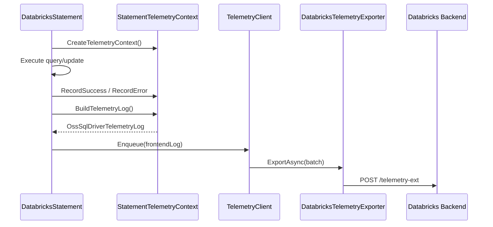
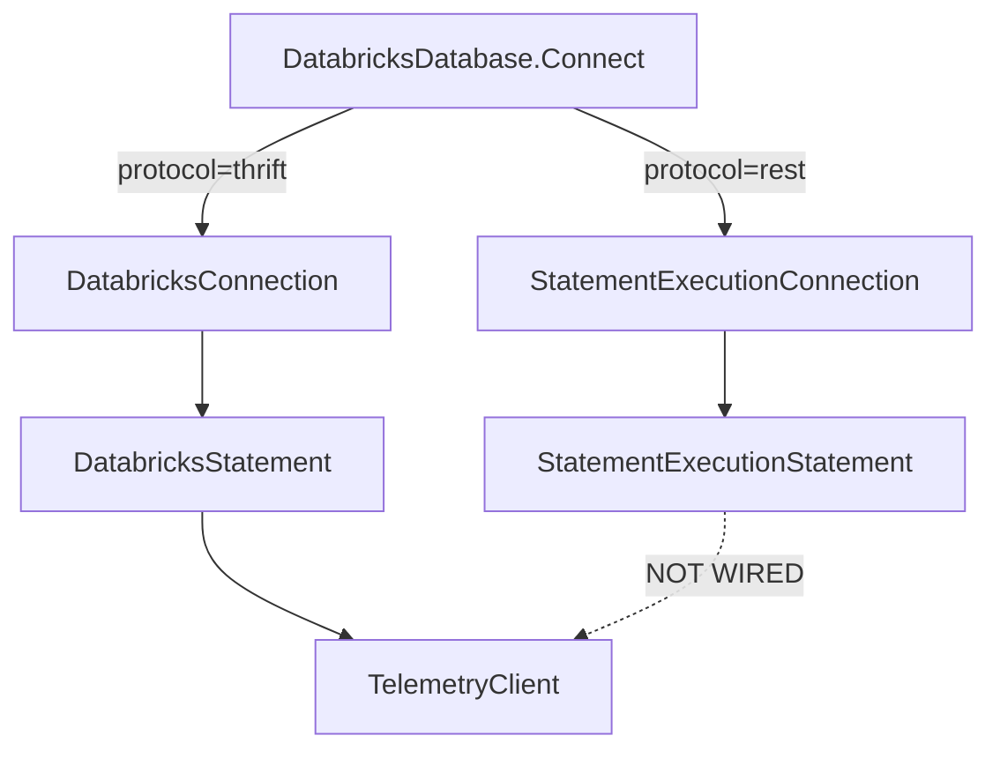
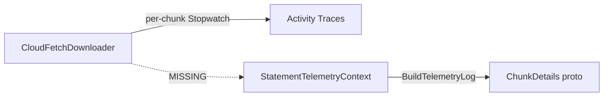
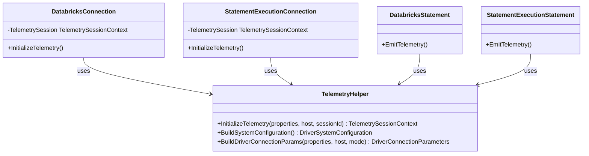
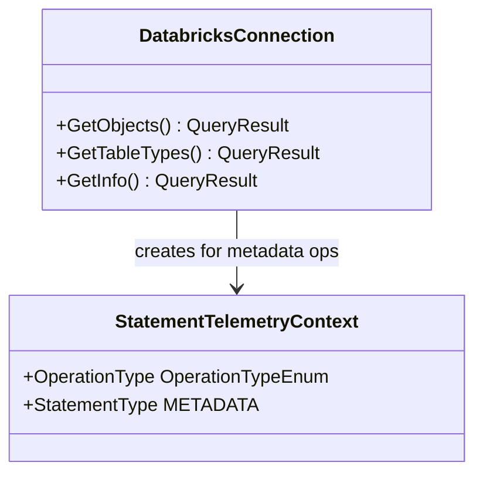
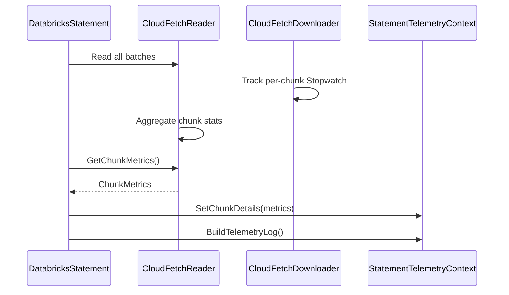
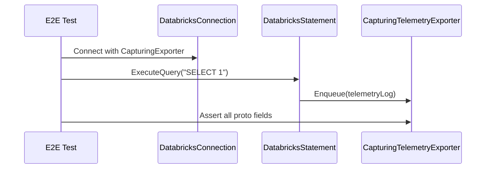

# Fix Telemetry Gaps - Design Document

## Objective

Ensure the ADBC C# driver reports **all** proto-defined telemetry fields to the Databricks backend, matching the JDBC driver's coverage. Close gaps in field population, expand coverage to metadata operations, and add E2E tests verifying every proto field.

---

## Current State

The driver has a working telemetry pipeline:



However, a gap analysis against the proto schema reveals **multiple fields that are not populated or not covered**.

### Two Connection Protocols

The driver supports two protocols selected via `adbc.databricks.protocol`:



| Aspect | Thrift (DatabricksConnection) | SEA (StatementExecutionConnection) |
|---|---|---|
| Base class | SparkHttpConnection | TracingConnection |
| Session creation | `OpenSessionWithInitialNamespace()` Thrift RPC | `CreateSessionAsync()` REST API |
| Result format | Inline Arrow batches via Thrift | ARROW_STREAM (configurable disposition) |
| CloudFetch | `ThriftResultFetcher` via `FetchResults()` | `StatementExecutionResultFetcher` via `GetResultChunkAsync()` |
| Catalog discovery | Returned in OpenSessionResp | Explicit `SELECT CURRENT_CATALOG()` |
| Telemetry | Fully wired | **ZERO telemetry** |

**Critical gap: `StatementExecutionConnection` does not create a `TelemetrySessionContext`, does not initialize a `TelemetryClient`, and `StatementExecutionStatement` does not emit any telemetry events.**

---

## Gap Analysis

### Gap 0: SEA Connection Has No Telemetry

`StatementExecutionConnection` is a completely separate class from `DatabricksConnection`. It has:
- No `InitializeTelemetry()` call
- No `TelemetrySessionContext` creation
- No `TelemetryClient` initialization
- `StatementExecutionStatement` has no telemetry context creation or `EmitTelemetry()` calls
- `DriverMode` is hardcoded to `THRIFT` in `DatabricksConnection.BuildDriverConnectionParams()` - there is no code path that ever sets `SEA`

### Proto Field Coverage Matrix (Thrift only)

#### OssSqlDriverTelemetryLog (root)

| Proto Field | Status | Gap Description |
|---|---|---|
| `session_id` | Populated | Set from SessionHandle |
| `sql_statement_id` | Populated | Set from StatementId |
| `system_configuration` | Partial | Missing `runtime_vendor`, `client_app_name` |
| `driver_connection_params` | Partial | Only 5 of 47 fields populated |
| `auth_type` | **NOT SET** | String field never populated |
| `vol_operation` | **NOT SET** | Volume operations not instrumented |
| `sql_operation` | Populated | Most sub-fields covered |
| `error_info` | Populated | `stack_trace` intentionally empty |
| `operation_latency_ms` | Populated | From stopwatch |

#### DriverSystemConfiguration (12 fields)

| Proto Field | Status | Notes |
|---|---|---|
| `driver_version` | Populated | Assembly version |
| `runtime_name` | Populated | FrameworkDescription |
| `runtime_version` | Populated | Environment.Version |
| `runtime_vendor` | **NOT SET** | Should be "Microsoft" for .NET |
| `os_name` | Populated | OSVersion.Platform |
| `os_version` | Populated | OSVersion.Version |
| `os_arch` | Populated | RuntimeInformation.OSArchitecture |
| `driver_name` | Populated | "Databricks ADBC Driver" |
| `client_app_name` | **NOT SET** | Should come from connection property or user-agent |
| `locale_name` | Populated | CultureInfo.CurrentCulture |
| `char_set_encoding` | Populated | Encoding.Default.WebName |
| `process_name` | Populated | Process name |

#### DriverConnectionParameters (47 fields)

| Proto Field | Status | Notes |
|---|---|---|
| `http_path` | Populated | |
| `mode` | Populated | Hardcoded to THRIFT |
| `host_info` | Populated | |
| `auth_mech` | Populated | PAT or OAUTH |
| `auth_flow` | Populated | TOKEN_PASSTHROUGH or CLIENT_CREDENTIALS |
| `use_proxy` | **NOT SET** | |
| `auth_scope` | **NOT SET** | |
| `use_system_proxy` | **NOT SET** | |
| `rows_fetched_per_block` | **NOT SET** | Available from batch size config |
| `socket_timeout` | **NOT SET** | Available from connection properties |
| `enable_arrow` | **NOT SET** | Always true for this driver |
| `enable_direct_results` | **NOT SET** | Available from connection config |
| `auto_commit` | **NOT SET** | Available from connection properties |
| `enable_complex_datatype_support` | **NOT SET** | Available from connection properties |
| Other 28 fields | **NOT SET** | Many are Java/JDBC-specific, N/A for C# |

#### SqlExecutionEvent (9 fields)

| Proto Field | Status | Notes |
|---|---|---|
| `statement_type` | Populated | QUERY or UPDATE |
| `is_compressed` | Populated | From LZ4 flag |
| `execution_result` | Populated | INLINE_ARROW or EXTERNAL_LINKS |
| `chunk_id` | Not applicable | For individual chunk failure events |
| `retry_count` | **NOT SET** | Should track retries |
| `chunk_details` | **NOT WIRED** | `SetChunkDetails()` exists but is never called (see below) |
| `result_latency` | Populated | First batch + consumption |
| `operation_detail` | Partial | `is_internal_call` hardcoded false |
| `java_uses_patched_arrow` | Not applicable | Java-specific |

#### ChunkDetails (5 fields) - NOT WIRED

`StatementTelemetryContext.SetChunkDetails()` is defined but **never called anywhere** in the codebase. The CloudFetch pipeline tracks per-chunk timing in `Activity` events (OpenTelemetry traces) but does not bridge the data back to the telemetry proto.

| Proto Field | Status | Notes |
|---|---|---|
| `initial_chunk_latency_millis` | **NOT WIRED** | Tracked in CloudFetchDownloader Activity events but not passed to telemetry context |
| `slowest_chunk_latency_millis` | **NOT WIRED** | Same - tracked per-file but not aggregated to context |
| `total_chunks_present` | **NOT WIRED** | Available from result link count |
| `total_chunks_iterated` | **NOT WIRED** | Available from CloudFetchReader iteration count |
| `sum_chunks_download_time_millis` | **NOT WIRED** | Tracked as `total_time_ms` in downloader summary but not passed to context |

**Current data flow (broken):**


#### OperationDetail (4 fields)

| Proto Field | Status | Notes |
|---|---|---|
| `n_operation_status_calls` | Populated | Poll count |
| `operation_status_latency_millis` | Populated | Poll latency |
| `operation_type` | Partial | Only EXECUTE_STATEMENT; missing metadata ops |
| `is_internal_call` | **Hardcoded false** | Should be true for internal queries (e.g., USE SCHEMA) |

#### WorkspaceId in TelemetrySessionContext

| Field | Status | Notes |
|---|---|---|
| `WorkspaceId` | **NOT SET** | Declared in TelemetrySessionContext but never populated during InitializeTelemetry() |

---

## Proposed Changes

### 0. Wire Telemetry into StatementExecutionConnection (SEA)

This is the highest-priority gap. SEA connections have zero telemetry coverage.

#### Alternatives Considered: Abstract Base Class vs Composition

**Option A: Abstract base class between Thrift and SEA (not feasible)**

The two protocols have deeply divergent inheritance chains:

```
Thrift Connection: TracingConnection → HiveServer2Connection → SparkConnection → SparkHttpConnection → DatabricksConnection
SEA Connection:    TracingConnection → StatementExecutionConnection

Thrift Statement:  TracingStatement → HiveServer2Statement → SparkStatement → DatabricksStatement
SEA Statement:     TracingStatement → StatementExecutionStatement
```

C# single inheritance prevents inserting a shared `DatabricksTelemetryConnection` between `TracingConnection` and both leaf classes without also inserting it between 4 intermediate Thrift layers. Additionally:
- DatabricksStatement implements `IHiveServer2Statement`; SEA doesn't
- Thrift execution inherits complex protocol/transport logic; SEA uses a REST client
- The Thrift chain lives in a separate `hiveserver2` project with its own assembly

**Option B: Shared interface with default methods (C# 8+)**

Could define `ITelemetryConnection` with default method implementations, but:
- Default interface methods can't access private/protected state
- Would still need duplicated field declarations in each class
- Awkward pattern for C# compared to Java

**Option C: Composition via TelemetryHelper (chosen)**

Extract shared telemetry logic into a static helper class. Both connection types call the same helper, each wiring it into their own lifecycle. This:
- Requires no changes to either inheritance chain
- Keeps all telemetry logic in one place (single source of truth)
- Is the standard C# pattern for sharing behavior across unrelated class hierarchies
- Doesn't affect the `hiveserver2` project at all

**Approach:** Extract shared telemetry logic so both connection types can reuse it.



**Changes required:**

#### a. Extract `TelemetryHelper` (new static/internal class)

Move `BuildSystemConfiguration()` and `BuildDriverConnectionParams()` out of `DatabricksConnection` into a shared helper so both connection types can call it.

```csharp
internal static class TelemetryHelper
{
    // Shared system config builder (OS, runtime, driver version)
    public static DriverSystemConfiguration BuildSystemConfiguration(
        string driverVersion);

    // Shared connection params builder - accepts mode parameter
    public static DriverConnectionParameters BuildDriverConnectionParams(
        IReadOnlyDictionary<string, string> properties,
        string host,
        DriverMode.Types.Type mode);

    // Shared telemetry initialization
    public static TelemetrySessionContext InitializeTelemetry(
        IReadOnlyDictionary<string, string> properties,
        string host,
        string sessionId,
        DriverMode.Types.Type mode,
        string driverVersion);
}
```

#### b. Add telemetry to `StatementExecutionConnection`

**File:** `StatementExecution/StatementExecutionConnection.cs`

- Call `TelemetryHelper.InitializeTelemetry()` after `CreateSessionAsync()` succeeds
- Set `mode = DriverMode.Types.Type.Sea`
- Store `TelemetrySessionContext` on the connection
- Release telemetry client on dispose (matching DatabricksConnection pattern)

#### c. Add telemetry to `StatementExecutionStatement`

**File:** `StatementExecution/StatementExecutionStatement.cs`

The statement-level telemetry methods (`CreateTelemetryContext()`, `RecordSuccess()`, `RecordError()`, `EmitTelemetry()`) follow the same pattern for both Thrift and SEA. Move these into `TelemetryHelper` as well:

```csharp
internal static class TelemetryHelper
{
    // ... connection-level methods from above ...

    // Shared statement telemetry methods
    public static StatementTelemetryContext? CreateTelemetryContext(
        TelemetrySessionContext? session,
        Statement.Types.Type statementType,
        Operation.Types.Type operationType,
        bool isCompressed);

    public static void RecordSuccess(
        StatementTelemetryContext ctx,
        string? statementId,
        ExecutionResult.Types.Format resultFormat);

    public static void RecordError(
        StatementTelemetryContext ctx,
        Exception ex);

    public static void EmitTelemetry(
        StatementTelemetryContext ctx,
        TelemetrySessionContext? session);
}
```

Both `DatabricksStatement` and `StatementExecutionStatement` call these shared methods, each providing their own protocol-specific values (e.g., result format, operation type).

#### d. SEA-specific field mapping

| Proto Field | SEA Value |
|---|---|
| `driver_connection_params.mode` | `DriverMode.Types.Type.Sea` |
| `execution_result` | Map from SEA result disposition (INLINE_OR_EXTERNAL_LINKS -> EXTERNAL_LINKS or INLINE_ARROW) |
| `operation_detail.operation_type` | EXECUTE_STATEMENT_ASYNC (SEA is always async) |
| `chunk_details` | From `StatementExecutionResultFetcher` chunk metrics |

### 1. Populate Missing System Configuration Fields

**File:** `DatabricksConnection.cs` - `BuildSystemConfiguration()`

```csharp
// Add to BuildSystemConfiguration()
RuntimeVendor = "Microsoft",  // .NET runtime vendor
ClientAppName = GetClientAppName(),  // From connection property or user-agent
```

**Interface:**
```csharp
private string GetClientAppName()
{
    // Check connection property first, fall back to process name
    Properties.TryGetValue("adbc.databricks.client_app_name", out string? appName);
    return appName ?? Process.GetCurrentProcess().ProcessName;
}
```

### 2. Populate auth_type on Root Log

**File:** `StatementTelemetryContext.cs` - `BuildTelemetryLog()`

Add `auth_type` string field to TelemetrySessionContext and set it during connection initialization based on the authentication method used.

```csharp
// In BuildTelemetryLog()
log.AuthType = _sessionContext.AuthType ?? string.Empty;
```

**Mapping:**
| Auth Config | auth_type String |
|---|---|
| PAT | `"pat"` |
| OAuth client_credentials | `"oauth-m2m"` |
| OAuth browser | `"oauth-u2m"` |
| Other | `"other"` |

### 3. Populate WorkspaceId

**File:** `DatabricksConnection.cs` - `InitializeTelemetry()`

Extract workspace ID from server response or connection properties. The workspace ID is available from the HTTP path (e.g., `/sql/1.0/warehouses/<id>` doesn't contain it directly, but server configuration responses may include it).

```csharp
// Parse workspace ID from server configuration or properties
TelemetrySession.WorkspaceId = ExtractWorkspaceId();
```

### 4. Expand DriverConnectionParameters Population

**File:** `DatabricksConnection.cs` - `BuildDriverConnectionParams()`

Add applicable connection parameters:

```csharp
return new DriverConnectionParameters
{
    HttpPath = httpPath ?? "",
    Mode = DriverMode.Types.Type.Thrift,
    HostInfo = new HostDetails { ... },
    AuthMech = authMech,
    AuthFlow = authFlow,
    // NEW fields:
    EnableArrow = true,  // Always true for ADBC driver
    RowsFetchedPerBlock = GetBatchSize(),
    SocketTimeout = GetSocketTimeout(),
    EnableDirectResults = true,
    EnableComplexDatatypeSupport = GetComplexTypeSupport(),
    AutoCommit = GetAutoCommit(),
};
```

### 5. Add Metadata Operation Telemetry

Currently only `ExecuteQuery()` and `ExecuteUpdate()` emit telemetry. Metadata operations (GetObjects, GetTableTypes, GetInfo, etc.) are not instrumented.

**Approach:** Override metadata methods in `DatabricksConnection` to emit telemetry with appropriate `OperationType` and `StatementType = METADATA`.



**Operation type mapping:**

| ADBC Method | Operation.Type |
|---|---|
| GetObjects (depth=Catalogs) | LIST_CATALOGS |
| GetObjects (depth=Schemas) | LIST_SCHEMAS |
| GetObjects (depth=Tables) | LIST_TABLES |
| GetObjects (depth=Columns) | LIST_COLUMNS |
| GetTableTypes | LIST_TABLE_TYPES |

### 6. Track Internal Calls

**File:** `DatabricksStatement.cs`

Mark internal calls like `USE SCHEMA` (from `SetSchema()` in DatabricksConnection) with `is_internal_call = true`.

**Approach:** Add an internal property to StatementTelemetryContext:
```csharp
public bool IsInternalCall { get; set; }
```

Set it when creating telemetry context for internal operations.

### 7. Wire ChunkDetails from CloudFetch to Telemetry

`SetChunkDetails()` exists on `StatementTelemetryContext` but is never called. The CloudFetch pipeline already tracks per-chunk timing via `Stopwatch` in `CloudFetchDownloader` but only exports it to Activity traces.

**Approach:** Aggregate chunk metrics in the CloudFetch reader and pass them to the telemetry context before telemetry is emitted.



**Changes required:**

#### a. Add `ChunkMetrics` data class

```csharp
internal sealed class ChunkMetrics
{
    public int TotalChunksPresent { get; set; }
    public int TotalChunksIterated { get; set; }
    public long InitialChunkLatencyMs { get; set; }
    public long SlowestChunkLatencyMs { get; set; }
    public long SumChunksDownloadTimeMs { get; set; }
}
```

#### b. Track metrics in `CloudFetchDownloader`

The downloader already has per-file `Stopwatch` timing. Add aggregation fields:
- Record latency of first completed chunk -> `InitialChunkLatencyMs`
- Track max latency across all chunks -> `SlowestChunkLatencyMs`
- Sum all chunk latencies -> `SumChunksDownloadTimeMs`

Expose via `GetChunkMetrics()` method.

#### c. Bridge in `CloudFetchReader` / `DatabricksCompositeReader`

- `CloudFetchReader` already tracks `_totalBytesDownloaded` - add a method to retrieve aggregated chunk metrics from its downloader
- Expose `GetChunkMetrics()` on the reader interface

#### d. Call `SetChunkDetails()` in `DatabricksStatement.EmitTelemetry()`

Before building the telemetry log, check if the result reader is a CloudFetch reader and pull chunk metrics:

```csharp
// In EmitTelemetry() or RecordSuccess()
if (reader is CloudFetchReader cfReader)
{
    var metrics = cfReader.GetChunkMetrics();
    ctx.SetChunkDetails(
        metrics.TotalChunksPresent,
        metrics.TotalChunksIterated,
        metrics.InitialChunkLatencyMs,
        metrics.SlowestChunkLatencyMs,
        metrics.SumChunksDownloadTimeMs);
}
```

**Applies to both Thrift and SEA** since both use `CloudFetchDownloader` under the hood.

### 8. Track Retry Count

**File:** `StatementTelemetryContext.cs`

Add retry count tracking. The retry count is available from the HTTP retry handler.

```csharp
public int RetryCount { get; set; }

// In BuildTelemetryLog():
sqlEvent.RetryCount = RetryCount;
```

---

## E2E Test Strategy

### Test Infrastructure

Use `CapturingTelemetryExporter` to intercept telemetry events and validate proto field values without requiring backend connectivity.



### Test Cases

#### System Configuration Tests
- `Telemetry_SystemConfig_AllFieldsPopulated` - Verify all 12 DriverSystemConfiguration fields are non-empty
- `Telemetry_SystemConfig_RuntimeVendor_IsMicrosoft` - Verify runtime_vendor is set
- `Telemetry_SystemConfig_ClientAppName_IsPopulated` - Verify client_app_name from property or default

#### Connection Parameters Tests
- `Telemetry_ConnectionParams_BasicFields` - Verify http_path, mode, host_info, auth_mech, auth_flow
- `Telemetry_ConnectionParams_ExtendedFields` - Verify enable_arrow, rows_fetched_per_block, socket_timeout
- `Telemetry_ConnectionParams_Mode_IsThrift` - Verify mode=THRIFT for Thrift connections

#### Root Log Tests
- `Telemetry_RootLog_AuthType_IsPopulated` - Verify auth_type string matches auth config
- `Telemetry_RootLog_WorkspaceId_IsSet` - Verify workspace_id is non-zero
- `Telemetry_RootLog_SessionId_MatchesConnection` - Verify session_id matches

#### SQL Execution Tests
- `Telemetry_Query_AllSqlEventFields` - Full field validation for SELECT query
- `Telemetry_Update_StatementType_IsUpdate` - Verify UPDATE statement type
- `Telemetry_Query_OperationLatency_IsPositive` - Verify timing is captured
- `Telemetry_Query_ResultLatency_FirstBatchAndConsumption` - Verify both latency fields

#### Operation Detail Tests
- `Telemetry_OperationDetail_PollCount_IsTracked` - Verify n_operation_status_calls
- `Telemetry_OperationDetail_OperationType_IsExecuteStatement` - Verify operation type
- `Telemetry_InternalCall_IsMarkedAsInternal` - Verify is_internal_call for USE SCHEMA

#### CloudFetch Chunk Details Tests
- `Telemetry_CloudFetch_ChunkDetails_AllFieldsPopulated` - Verify all 5 ChunkDetails fields are non-zero
- `Telemetry_CloudFetch_InitialChunkLatency_IsPositive` - Verify initial_chunk_latency_millis > 0
- `Telemetry_CloudFetch_SlowestChunkLatency_GteInitial` - Verify slowest >= initial
- `Telemetry_CloudFetch_SumDownloadTime_GteSlowest` - Verify sum >= slowest
- `Telemetry_CloudFetch_TotalChunksIterated_LtePresent` - Verify iterated <= present
- `Telemetry_CloudFetch_ExecutionResult_IsExternalLinks` - Verify result format
- `Telemetry_InlineResults_NoChunkDetails` - Verify chunk_details is null for inline results

#### Error Handling Tests
- `Telemetry_Error_CapturesErrorName` - Verify error_name from exception type
- `Telemetry_Error_NoStackTrace` - Verify stack_trace is empty (privacy)

#### Metadata Operation Tests
- `Telemetry_GetObjects_EmitsTelemetry` - Verify telemetry for GetObjects
- `Telemetry_GetTableTypes_EmitsTelemetry` - Verify telemetry for GetTableTypes
- `Telemetry_Metadata_OperationType_IsCorrect` - Verify LIST_CATALOGS, LIST_TABLES, etc.
- `Telemetry_Metadata_StatementType_IsMetadata` - Verify statement_type=METADATA

#### SEA (Statement Execution) Connection Tests
- `Telemetry_SEA_EmitsTelemetryOnQuery` - Verify SEA connections emit telemetry at all
- `Telemetry_SEA_Mode_IsSea` - Verify mode=SEA in connection params
- `Telemetry_SEA_SessionId_IsPopulated` - Verify session_id from REST session
- `Telemetry_SEA_OperationType_IsExecuteStatementAsync` - SEA is always async
- `Telemetry_SEA_CloudFetch_ChunkDetails` - Verify chunk metrics from SEA fetcher
- `Telemetry_SEA_ExecutionResult_MatchesDisposition` - Verify result format mapping
- `Telemetry_SEA_SystemConfig_MatchesThrift` - Same OS/runtime info regardless of protocol
- `Telemetry_SEA_ConnectionDispose_FlushesAll` - Verify cleanup on SEA connection close
- `Telemetry_SEA_Error_CapturesErrorName` - Error handling works for SEA

#### Connection Lifecycle Tests
- `Telemetry_MultipleStatements_EachEmitsSeparateLog` - Verify per-statement telemetry
- `Telemetry_ConnectionDispose_FlushesAllPending` - Verify flush on close

---

## Fields Intentionally Not Populated

The following proto fields are **not applicable** to the C# ADBC driver and will be left unset:

| Field | Reason |
|---|---|
| `java_uses_patched_arrow` | Java-specific |
| `vol_operation` (all fields) | UC Volume operations not supported in ADBC |
| `google_service_account` | GCP-specific, not applicable |
| `google_credential_file_path` | GCP-specific, not applicable |
| `ssl_trust_store_type` | Java keystore concept |
| `jwt_key_file`, `jwt_algorithm` | Not supported in C# driver |
| `discovery_mode_enabled`, `discovery_url` | Not implemented |
| `azure_workspace_resource_id`, `azure_tenant_id` | Azure-specific, may add later |
| `enable_sea_hybrid_results` | Not configurable in C# driver |
| `non_proxy_hosts`, proxy fields | Proxy not implemented |
| `chunk_id` | Per-chunk failure events, not per-statement |

---

## Implementation Priority

### Phase 1: SEA Telemetry (Highest Priority - Zero Coverage Today)
1. Extract `TelemetryHelper` from `DatabricksConnection` for shared use
2. Wire `InitializeTelemetry()` into `StatementExecutionConnection` with `mode=SEA`
3. Add `EmitTelemetry()` to `StatementExecutionStatement`
4. Wire telemetry dispose/flush into `StatementExecutionConnection.Dispose()`

### Phase 2: Missing Fields (Low Risk)
5. Populate `runtime_vendor` and `client_app_name` in DriverSystemConfiguration
6. Populate `auth_type` on root log
7. Populate additional DriverConnectionParameters (enable_arrow, rows_fetched_per_block, etc.)
8. Set `WorkspaceId` in TelemetrySessionContext

### Phase 3: ChunkDetails Wiring (Medium Risk - Crosses Component Boundaries)
9. Add `ChunkMetrics` aggregation to `CloudFetchDownloader`
10. Expose metrics via `CloudFetchReader.GetChunkMetrics()`
11. Call `SetChunkDetails()` in `DatabricksStatement.EmitTelemetry()` and `StatementExecutionStatement.EmitTelemetry()`

### Phase 4: Other Behavioral Changes (Medium Risk)
12. Track `retry_count` on SqlExecutionEvent
13. Mark internal calls with `is_internal_call = true`
14. Add metadata operation telemetry (GetObjects, GetTableTypes)

### Phase 5: E2E Test Coverage
15. E2E tests for every populated proto field (both Thrift and SEA)
16. CloudFetch chunk detail tests (requires large enough result set to trigger CloudFetch)
17. SEA-specific telemetry tests
18. Error scenario tests

---

## Configuration

No new configuration parameters are needed. All changes use existing connection properties and runtime information.

---

## Error Handling

All telemetry changes follow the existing design principle: **telemetry must never impact driver operations**. All new code paths are wrapped in try-catch blocks that silently swallow exceptions.

---

## Concurrency

No new concurrency concerns. All changes follow existing patterns:
- `TelemetrySessionContext` is created once per connection (single-threaded)
- `StatementTelemetryContext` is created once per statement execution (single-threaded within statement)
- `TelemetryClient.Enqueue()` is already thread-safe
