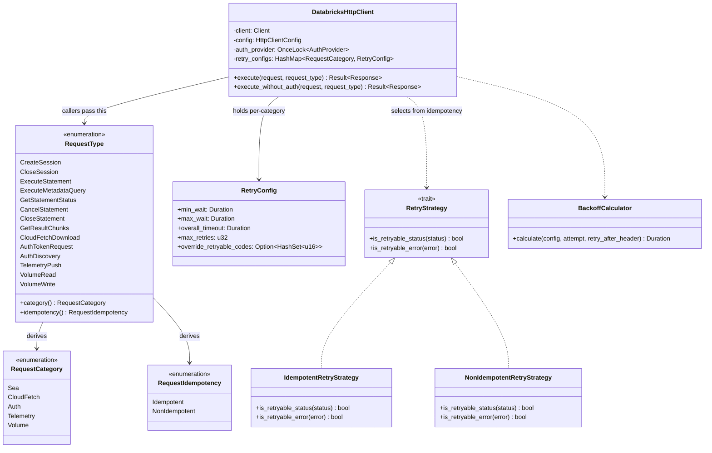
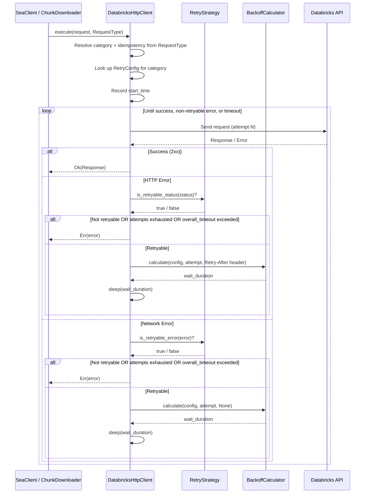
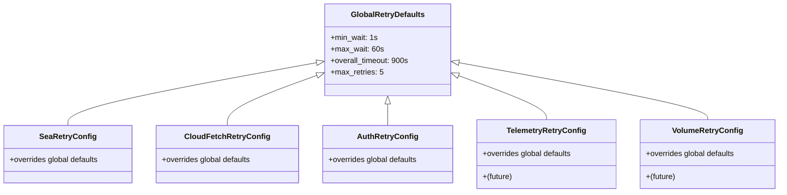
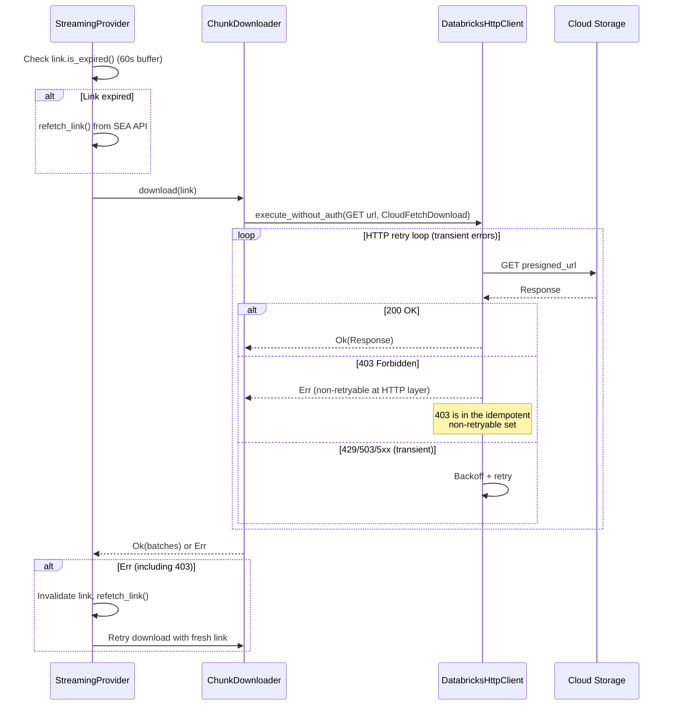

<!--
  Copyright (c) 2025 ADBC Drivers Contributors

  Licensed under the Apache License, Version 2.0 (the "License");
  you may not use this file except in compliance with the License.
  You may obtain a copy of the License at

      http://www.apache.org/licenses/LICENSE-2.0

  Unless required by applicable law or agreed to in writing, software
  distributed under the License is distributed on an "AS IS" BASIS,
  WITHOUT WARRANTIES OR CONDITIONS OF ANY KIND, either express or implied.
  See the License for the specific language governing permissions and
  limitations under the License.
-->

# PECOBLR-2091: Retry Logic Design

| Field | Value |
|-------|-------|
| **Author** | Vikrant Puppala |
| **Date** | March 25, 2026 |
| **Status** | DRAFT |
| **JIRA** | [PECOBLR-2091](https://databricks.atlassian.net/browse/PECOBLR-2091) |
| **Spec** | [DBSQL Connectors Retry Logic](~/docs/dbsql-connectors-retry-logic.md) |

## Overview

This design implements the standardized DBSQL connector retry logic in the Rust ADBC driver. The driver currently has basic retry support (exponential backoff on 429/502/503/504) but lacks idempotency-aware strategies, `Retry-After` header support, configurable parameters, jitter, cumulative timeout, and structured retry telemetry.

The goal is to align with the cross-connector retry specification while integrating cleanly with the driver's single `DatabricksHttpClient` architecture.

### Current State

The HTTP client (`client/http.rs`) retries all requests identically:
- Retries on 429, 502, 503, 504 and network errors (timeout, connect, request)
- Exponential backoff: `delay * 2^attempt` with no jitter
- Count-based only (`max_retries = 5`), no cumulative timeout
- No `Retry-After` header parsing
- No idempotency classification

### Target State

- Requests classified as **idempotent** or **non-idempotent** with distinct retry strategies
- `Retry-After` header honored, with min/max clamping
- Exponential backoff with proportional jitter (5–25% of base wait, minimum 50ms)
- Cumulative timeout (default 900s) in addition to per-attempt count
- Per-category configuration with global defaults
- Structured logging per attempt and per request summary
- CloudFetch presigned URL expiry integrated into the retry flow

## Architecture

### Component Overview



### Retry Flow



## Detailed Design

### RequestType Enum and Centralized Classification

Instead of having each caller decide the idempotency of their request, we define a `RequestType` enum that serves as the **single source of truth** for both category and idempotency mapping. Callers pass a `RequestType` to the HTTP client, which resolves everything internally.

```rust
/// Identifies the type of request being made. The HTTP client uses this
/// to look up the correct RetryConfig (from category) and select the
/// correct RetryStrategy (from idempotency).
pub enum RequestType {
    // SEA
    CreateSession,
    CloseSession,
    ExecuteStatement,
    ExecuteMetadataQuery,
    GetStatementStatus,
    CancelStatement,
    CloseStatement,
    GetResultChunks,
    // CloudFetch
    CloudFetchDownload,
    // Auth
    AuthTokenRequest,
    AuthDiscovery,
    // Future
    TelemetryPush,
    VolumeRead,
    VolumeWrite,
}

pub enum RequestCategory {
    Sea,
    CloudFetch,
    Auth,
    Telemetry,
    Volume,
}

pub enum RequestIdempotency {
    Idempotent,
    NonIdempotent,
}
```

The mapping is centralized in `RequestType`:

```rust
impl RequestType {
    pub fn category(&self) -> RequestCategory { ... }
    pub fn idempotency(&self) -> RequestIdempotency { ... }
}
```

| RequestType | Category | Idempotency | Notes |
|-------------|----------|-------------|-------|
| `CreateSession` | Sea | Idempotent | May create unused sessions, bounded by retry count |
| `CloseSession` | Sea | Idempotent | Handle already-closed |
| `ExecuteStatement` | Sea | **NonIdempotent** | User SQL may have side effects |
| `ExecuteMetadataQuery` | Sea | Idempotent | Read-only SHOW/SELECT on information_schema |
| `GetStatementStatus` | Sea | Idempotent | |
| `CancelStatement` | Sea | Idempotent | Handle already-closed |
| `CloseStatement` | Sea | Idempotent | Handle already-closed |
| `GetResultChunks` | Sea | Idempotent | |
| `CloudFetchDownload` | CloudFetch | Idempotent | See [Presigned URL Expiry](#presigned-url-expiry) |
| `AuthDiscovery` | Auth | Idempotent | OIDC endpoint discovery |
| `AuthTokenRequest` | Auth | Idempotent | Token endpoint returns fresh token |
| `TelemetryPush` | Telemetry | Idempotent | Server deduplicates (future) |
| `VolumeRead` | Volume | Idempotent | GET/LIST/SHOW (future) |
| `VolumeWrite` | Volume | **NonIdempotent** | PUT (future) |

**Why a `RequestType` enum instead of passing idempotency directly:**
- **Single source of truth** — the `RequestType -> (Category, Idempotency)` mapping lives in one place, preventing misclassification (e.g., a caller accidentally marking `ExecuteStatement` as idempotent)
- **Better logging** — the HTTP client can log the request type name (e.g., `"CreateSession"`) instead of just the HTTP method/URL
- **Simpler caller API** — callers pass one value instead of two (`RetryConfig` + `RequestIdempotency`), and the HTTP client resolves everything internally
- **Extensible** — adding a new endpoint means adding one enum variant with its mapping, not updating every call site

Metadata queries (e.g., `list_catalogs`, `list_schemas`, `list_tables`, `list_columns`) execute read-only SQL via `POST /statements/`. Despite using the same endpoint as `ExecuteStatement`, they use `ExecuteMetadataQuery` because:
- The SQL is generated internally (not user-provided)
- All metadata SQL is read-only (`SHOW CATALOGS`, `SHOW SCHEMAS`, etc.)

The `SeaClient` passes `RequestType::ExecuteMetadataQuery` for all `list_*` methods and `RequestType::ExecuteStatement` for user-initiated queries.

### Retry Strategies

#### `RetryStrategy` Trait

```rust
pub trait RetryStrategy: Send + Sync {
    /// Whether the given HTTP status code is retryable.
    fn is_retryable_status(&self, status: StatusCode) -> bool;

    /// Whether the given network/client error is retryable.
    fn is_retryable_error(&self, error: &reqwest::Error) -> bool;
}
```

#### Idempotent Strategy

Retries **everything except** known non-retryable client errors:

**Non-retryable HTTP codes:** 400, 401, 403, 404, 405, 409, 410, 411, 412, 413, 414, 415, 416

**Non-retryable errors:** None — all network errors (timeout, connect, request) are retried for idempotent requests.

**Override behavior:** If `override_retryable_codes` is set, it becomes the **exhaustive** set of retryable codes — only those codes are retried, everything else is non-retryable. This replaces the default logic entirely.

#### Non-Idempotent Strategy

Retries **only** when the request provably did not reach the server, or the server explicitly signals retry:

**Retryable HTTP codes:**
- **429** (Too Many Requests) — always retryable. Rate-limiting means the request was rejected before execution.
- **503** (Service Unavailable) — **only retryable when the server sends a `Retry-After` header**. Without it, there is ambiguity about whether the server started processing the request. Configurable via `override_retryable_codes`.

**Retryable errors (connection-level only):**
- `error.is_connect()` — connection refused, DNS failure, no route to host

**Not retried:**
- `error.is_timeout()` — request may have reached the server
- `error.is_request()` — request was partially sent
- Any other network error
- 503 **without** `Retry-After` header

This is the critical safety boundary: a non-idempotent request that may have reached the server must not be retried, as it could cause duplicate writes or side effects.

### Backoff Calculator

```rust
pub fn calculate_backoff(
    config: &RetryConfig,
    attempt: u32,
    retry_after_header: Option<&str>,
) -> Duration
```

**Logic:**

```
if Retry-After header present and parseable:
    wait = parse_retry_after(header)    // seconds value or HTTP-date
    wait = clamp(wait, config.min_wait, config.max_wait)
else:
    exp_backoff = config.min_wait * 2^(attempt - 1)
    wait = min(exp_backoff, config.max_wait)

jitter = random(5%, 25%) * wait  // proportional, minimum 50ms
return wait + jitter
```

`Retry-After` parsing supports both formats per HTTP spec:
- Seconds: `Retry-After: 120` → 120 seconds
- HTTP-date: `Retry-After: Wed, 25 Mar 2026 10:30:00 GMT` → delta from now

If parsing fails, falls back to exponential backoff.

### Retry Configuration

```rust
pub struct RetryConfig {
    /// Minimum wait time per retry (default: 1s).
    /// Clamps both exponential backoff floor and Retry-After minimum.
    pub min_wait: Duration,

    /// Maximum wait time per retry (default: 60s).
    /// Clamps both exponential backoff ceiling and Retry-After maximum.
    pub max_wait: Duration,

    /// Cumulative wall-clock timeout for all retry attempts (default: 900s).
    /// Stops retrying when total elapsed time exceeds this, even if
    /// max_retries has not been reached.
    pub overall_timeout: Duration,

    /// Maximum number of retry attempts (default: 5).
    /// A request is attempted at most max_retries + 1 times.
    pub max_retries: u32,

    /// Override the set of HTTP codes that are retryable.
    /// When set, this becomes the **exhaustive** set — only these codes are
    /// retried, regardless of the strategy's default logic. All other codes
    /// are treated as non-retryable.
    pub override_retryable_codes: Option<HashSet<u16>>,
}
```

**Defaults:**

| Parameter | Default | Spec Default |
|-----------|---------|--------------|
| `min_wait` | 1s | 1s |
| `max_wait` | 60s | 60s |
| `overall_timeout` | 900s | 900s |
| `max_retries` | 5 | — |

### Per-Category Configuration with Global Defaults

Each request category has its own `RetryConfig`, but unset fields fall back to a global default. This is achieved through a layered config model:



**ADBC connection parameters:**

| Parameter | Scope | Default |
|-----------|-------|---------|
| `databricks.retry.min_wait_ms` | Global | 1000 |
| `databricks.retry.max_wait_ms` | Global | 60000 |
| `databricks.retry.overall_timeout_ms` | Global | 900000 |
| `databricks.retry.max_retries` | Global | 5 |
| `databricks.retry.retryable_codes` | Global | (strategy default) |
| `databricks.retry.sea.min_wait_ms` | SEA | (global) |
| `databricks.retry.sea.max_wait_ms` | SEA | (global) |
| `databricks.retry.sea.overall_timeout_ms` | SEA | (global) |
| `databricks.retry.sea.max_retries` | SEA | (global) |
| `databricks.retry.sea.retryable_codes` | SEA | (global) |
| `databricks.retry.cloudfetch.min_wait_ms` | CloudFetch | (global) |
| `databricks.retry.cloudfetch.max_wait_ms` | CloudFetch | (global) |
| `databricks.retry.cloudfetch.overall_timeout_ms` | CloudFetch | (global) |
| `databricks.retry.cloudfetch.max_retries` | CloudFetch | (global) |
| `databricks.retry.cloudfetch.retryable_codes` | CloudFetch | (global) |
| `databricks.retry.auth.min_wait_ms` | Auth | (global) |
| `databricks.retry.auth.max_wait_ms` | Auth | (global) |
| `databricks.retry.auth.overall_timeout_ms` | Auth | (global) |
| `databricks.retry.auth.max_retries` | Auth | (global) |
| `databricks.retry.auth.retryable_codes` | Auth | (global) |

Category-specific parameters override global defaults when explicitly set. This allows users to, for example, set a shorter timeout for auth requests without affecting SEA retries.

**Resolution order** for each config field: category-specific → global → built-in default. For `retryable_codes`, if set at any level, it becomes the exhaustive retryable set for that category, replacing the strategy's default logic.

### Presigned URL Expiry Strategy {#presigned-url-expiry}

CloudFetch presigned URLs have server-controlled expiration times (typically minutes). The retry strategy must account for this to avoid retrying with an expired URL.

**Current behavior** (already implemented in `streaming_provider.rs`):
- Before each download attempt, check `link.is_expired()` (with 60s buffer)
- If expired, proactively refetch via `link_fetcher.refetch_link()`
- Store refreshed link for subsequent retry attempts

**Integration with the new retry framework:**

CloudFetch downloads use `execute_without_auth()` which will now accept `RetryConfig` and `RequestIdempotency::Idempotent`. However, the HTTP-level retry loop alone is insufficient for presigned URL expiry — a 403 from an expired URL should trigger a **link refresh**, not just a backoff-and-retry with the same URL.

The solution is a **two-layer retry architecture** for CloudFetch:



**Key design decisions:**

1. **403 is non-retryable at the HTTP layer** — it's in the idempotent non-retryable set (per spec). This is correct because retrying the same expired URL will always fail.

2. **Link refresh happens at the `StreamingProvider` layer** — this layer already owns link lifecycle, expiry checks, and the `ChunkLinkFetcher`. When a download fails with 403, the provider invalidates the cached link and refetches before retrying.

3. **Two independent retry budgets:**
   - **HTTP layer**: retries transient errors (429, 502, 503, 504, network errors) using the `CloudFetch` category's `RetryConfig` (resolved from `RequestType::CloudFetchDownload`)
   - **Provider layer**: retries with link refresh on 403/expiry, bounded by its own `max_retries` (from `CloudFetchConfig`)

4. **Proactive expiry check unchanged** — the existing 60-second buffer check before download continues to work, preventing most expiry-related 403s.

This separation keeps the HTTP retry layer generic (no knowledge of presigned URLs) while the provider layer handles the domain-specific concern of link expiry.

### HTTP Client Interface Changes

The `execute` and `execute_without_auth` methods gain a single `RequestType` parameter. The HTTP client resolves the `RetryConfig` (from its internal category map) and `RetryStrategy` (from the idempotency mapping) internally:

```rust
impl DatabricksHttpClient {
    /// Execute with auth and retry logic.
    /// The RequestType determines which RetryConfig and RetryStrategy to use.
    pub async fn execute(
        &self,
        request: Request,
        request_type: RequestType,
    ) -> Result<Response>;

    /// Execute without auth (CloudFetch, OAuth token endpoint).
    /// Same retry logic, just skips the Authorization header.
    pub async fn execute_without_auth(
        &self,
        request: Request,
        request_type: RequestType,
    ) -> Result<Response>;
}
```

The HTTP client holds the per-category retry configs, populated at construction from `HttpClientConfig`:

```rust
pub struct DatabricksHttpClient {
    client: Client,
    config: HttpClientConfig,
    auth_provider: OnceLock<Arc<dyn AuthProvider>>,
    retry_configs: HashMap<RequestCategory, RetryConfig>,
}
```

**Migration path:** All current callers will be updated to pass the appropriate `RequestType`. The existing `HttpClientConfig.max_retries` and `HttpClientConfig.retry_delay` fields will be removed in favor of the new `RetryConfig` system.

### SeaClient Changes

`SeaClient` no longer holds retry configs — those live in `DatabricksHttpClient`. Instead, each method simply passes the appropriate `RequestType`:

| Method | RequestType Passed |
|--------|-------------------|
| `create_session()` | `CreateSession` |
| `delete_session()` | `CloseSession` |
| `execute_statement()` | `ExecuteStatement` |
| `list_catalogs()`, `list_schemas()`, etc. | `ExecuteMetadataQuery` |
| `get_statement_status()` | `GetStatementStatus` |
| `cancel_statement()` | `CancelStatement` |
| `close_statement()` | `CloseStatement` |
| `get_result_chunks()` | `GetResultChunks` |

For metadata queries, the internal `call_execute_api` helper accepts a `RequestType` parameter. The `DatabricksClient::execute_statement` trait method is called with `RequestType::ExecuteStatement` by default, while all `list_*` metadata methods use `RequestType::ExecuteMetadataQuery`. This avoids adding an `is_idempotent` flag to the trait — the `RequestType` enum encodes both the category and the idempotency in a single value.

### Auth Retry Changes

OAuth providers (`ClientCredentialsProvider`, `AuthorizationCodeProvider`) currently call `execute_without_auth()` for token endpoint requests. These will now pass `RequestType::AuthTokenRequest` or `RequestType::AuthDiscovery`, and the HTTP client resolves the `Auth` category retry config internally.

No structural changes needed to the auth providers — they just add the `RequestType` parameter to their `execute_without_auth()` calls.

## Logging and Telemetry

### Per-Attempt Logging (DEBUG)

Each retry attempt logs:
- Request description (e.g., `POST /statements`, `GET chunk/3`)
- Attempt number (e.g., `2/6`)
- Backoff delay and source (`Retry-After: 5s` or `exponential: 4s + jitter: 312ms`)
- Error that triggered the retry (status code or error message)

```
DEBUG retry: POST /api/2.0/sql/statements attempt 2/6,
      waiting 4.312s (exponential), error: HTTP 503
```

### Per-Request Summary (DEBUG)

After all attempts complete (success or failure):
- Request description
- Total attempts
- Total elapsed time
- Final outcome (`success` or `failed`)
- Final error (if failed)

```
DEBUG retry: POST /api/2.0/sql/statements completed after 3 attempts
      in 9.7s — success
```

```
DEBUG retry: GET /api/2.0/sql/statements/abc123 failed after 6 attempts
      in 127.4s — HTTP 503 Service Unavailable
```

### Telemetry Metrics (Future)

When the telemetry system is implemented (PECOBLR-2098), retry metrics will be emitted:
- `retry.attempt_count` — histogram of attempts per request
- `retry.total_duration_ms` — histogram of total retry duration
- `retry.outcome` — counter by outcome (success_first_attempt, success_after_retry, failed)

## Edge Cases and Failure Modes

### Overall Timeout vs. Retry-After

If the server sends a `Retry-After` value that would exceed `overall_timeout`, the driver does **not** wait. It immediately returns the error. This follows Gopal's review feedback: honor `overall_timeout` as the hard ceiling.

```
remaining = overall_timeout - elapsed
if calculated_wait > remaining:
    return Err("Retry timeout exceeded")
```

### Max Retries vs. Overall Timeout

Both limits are enforced. Whichever is reached first stops retrying:
- `attempts > max_retries` → stop
- `elapsed > overall_timeout` → stop
- `elapsed + next_wait > overall_timeout` → stop (don't start a retry that will time out)

### Auth Token Refresh During Retries

OAuth tokens may expire between retry attempts. Since `auth_header()` is called fresh on each attempt (existing behavior), token refresh happens transparently. If token refresh itself fails, that error propagates as a non-retryable error.

### Concurrent Retry Storms

Multiple parallel CloudFetch downloads may all fail simultaneously (e.g., during a brief network blip). The proportional jitter (5–25% of base wait, minimum 50ms) helps spread out retry attempts. The existing `max_chunks_in_memory` backpressure limit bounds the number of concurrent retrying downloads.

### Already-Closed Resources

When retrying `close_session`, `close_statement`, or `cancel_statement`, the resource may already be closed from a previous attempt that succeeded on the server but failed on the network return path. These methods should handle "already closed" responses gracefully (not treat them as errors).

## Test Strategy

### Unit Tests

**RequestType mapping:**
- `test_request_type_category_mapping` — all variants map to expected category
- `test_request_type_idempotency_mapping` — all variants map to expected idempotency
- `test_execute_statement_is_non_idempotent`
- `test_execute_metadata_query_is_idempotent`

**Idempotent strategy:**
- `test_idempotent_strategy_retries_5xx`
- `test_idempotent_strategy_no_retry_on_400_401_403_404`
- `test_idempotent_strategy_retries_network_errors`
- `test_idempotent_strategy_override_codes`

**Non-idempotent classification:**
- `test_non_idempotent_strategy_retries_429_503`
- `test_non_idempotent_strategy_no_retry_on_timeout`
- `test_non_idempotent_strategy_retries_connect_error`
- `test_non_idempotent_strategy_no_retry_on_5xx`

**Backoff calculation:**
- `test_exponential_backoff_increases`
- `test_backoff_capped_at_max_wait`
- `test_backoff_respects_min_wait`
- `test_retry_after_header_seconds`
- `test_retry_after_header_http_date`
- `test_retry_after_clamped_to_min_max`
- `test_proportional_jitter`
- `test_jitter_minimum_50ms`

**Configuration:**
- `test_retry_config_defaults`
- `test_category_config_overrides_global`
- `test_overall_timeout_stops_retries`
- `test_max_retries_stops_retries`

### Integration Tests (with mock HTTP server)

- `test_request_succeeds_on_retry` — mock returns 503 twice, then 200
- `test_request_fails_after_max_retries` — mock returns 503 forever
- `test_request_fails_after_overall_timeout` — mock returns 503 with slow backoff
- `test_retry_after_header_honored` — mock returns 429 with Retry-After
- `test_non_idempotent_no_retry_on_500` — mock returns 500, verify single attempt
- `test_non_idempotent_retries_on_429` — mock returns 429, verify retry

### CloudFetch-Specific Tests

- `test_expired_link_triggers_refresh` — mock expired link, verify refetch before download
- `test_403_triggers_link_refresh` — mock 403 on download, verify provider-level retry with fresh link
- `test_transient_error_retried_at_http_layer` — mock 503, verify HTTP-level retry without link refresh

## Implementation Plan

| Phase | Scope | Estimated Effort |
|-------|-------|------------------|
| **1** | Core retry framework: `RequestType`, `RetryConfig`, `RetryStrategy` trait + implementations, `BackoffCalculator` with jitter + Retry-After | 2 days |
| **2** | Wire into `DatabricksHttpClient`: per-category config map, update `execute_impl`, overall timeout, structured logging | 1 day |
| **3** | Update all `SeaClient` methods to pass `RequestType`, update `ChunkDownloader` and auth providers | 1 day |
| **4** | ADBC connection parameter parsing for global + per-category retry config | 1 day |
| **5** | CloudFetch integration: align `StreamingProvider` retry with HTTP-level retry, 403 handling | 1 day |
| **6** | Tests: unit tests for RequestType mapping, strategies, backoff; integration tests with mock server | 2 days |
| **Total** | | **8 days** |

## Alternatives Considered

### Option 1: Retry middleware via `reqwest-retry` crate

**Pros:** Less custom code, well-tested crate.
**Cons:** Doesn't support idempotency-aware strategies, can't integrate `Retry-After` header with per-category config, adds external dependency. The spec requires nuanced behavior (non-idempotent strategy, overall timeout, override codes) that middleware crates don't support out of the box.

### Option 2: Retry at the `SeaClient` layer instead of HTTP layer

**Pros:** Full context about the request semantics.
**Cons:** Duplicates retry loops across every method. The HTTP client is the natural place for HTTP-level retry logic. CloudFetch and Auth also need retries, and those don't go through `SeaClient`.

### Option 3: Single retry strategy for all requests

**Pros:** Simpler implementation.
**Cons:** Violates the spec. Retrying a non-idempotent `ExecuteStatement` after a timeout could cause duplicate query execution, leading to duplicate writes or incorrect billing.

### Option 4: Callers pass `(RetryConfig, RequestIdempotency)` directly

**Pros:** HTTP client stays generic, no domain knowledge.
**Cons:** Verbose call sites (two extra params on every call), callers can misclassify requests (e.g., accidentally marking `ExecuteStatement` as idempotent), retry config must be threaded through every layer.

**Chosen approach:** `RequestType` enum passed by callers, with centralized mapping to `(RequestCategory, RequestIdempotency)` inside the HTTP client. The HTTP client holds per-category retry configs and resolves everything from the single `RequestType` value. This keeps the caller API simple, prevents misclassification, and centralizes all retry policy decisions.
